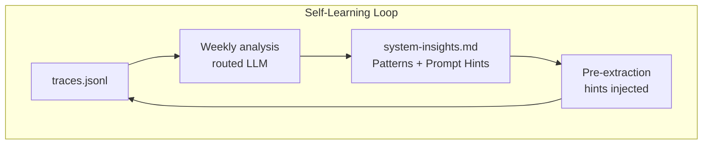
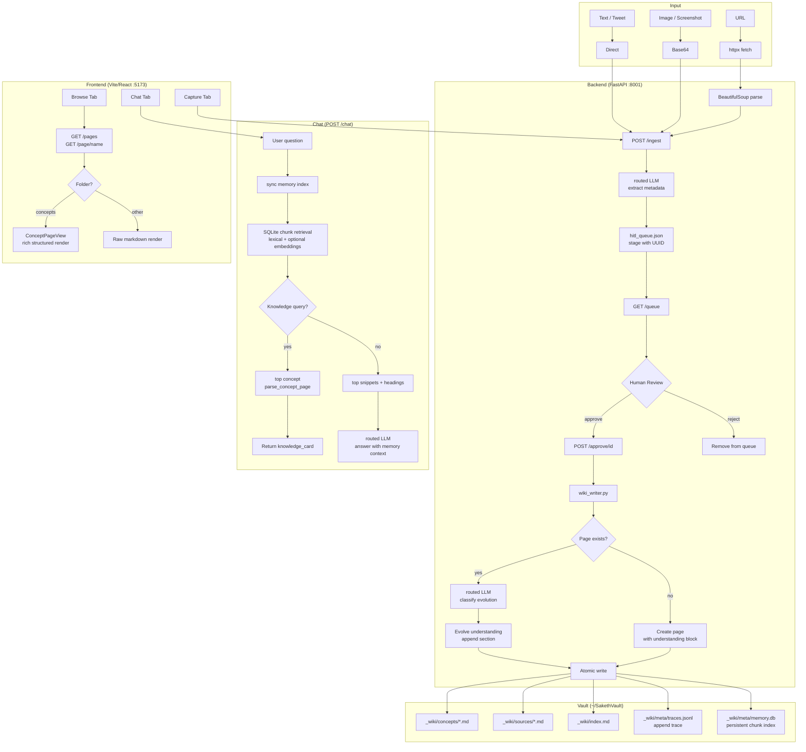
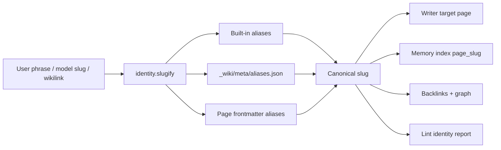

# SakethWiki — System Concepts

## Architecture Overview





---

## Data Flow: URL → Extract → HITL → Vault Write

```
1. User pastes URL in Capture tab
        ↓
2. POST /ingest { url: "..." }
        ↓
3. httpx.get(url) → BeautifulSoup → raw_text[:8000]
   (zero LLM — pure HTML parsing)
        ↓
4. Routed extraction model extracts:
   { title, key_concepts, summary[5], suggested_page,
     suggested_wikilinks, tags, diagram? }
        ↓
5. Item staged to hitl_queue.json with UUID
   Frontend shows diff-preview card
        ↓
6. Human reviews → edits if needed → Approve or Skip
   Optional: toggle "Flag for deeper research" → adds deep-dive tag
        ↓
7. POST /approve/{id} { approved: true, open_thread: false, edits?: {...} }
        ↓
8. wiki_writer.py:
   a. If page exists:
      - routed model classifies relationship:
        extends / refines / supersedes / duplicates / contradicts
      - Rewrites > Current understanding block with new synthesis
      - Updates evolution badge (🔵🟡🟠🔴⚪)
      - Updates frontmatter: understanding_version, last_evolution, entry_count
      - Appends new ## source section
      - Superseded/contradicts entries get [!warning] callout inline
   b. If new page:
      - Creates with YAML frontmatter + > Current understanding block
      - Writes first ## source section
   c. Atomic write: write to .tmp → rename to .md
        ↓
9. Source record written to _wiki/sources/{date}-{slug}.md
```

---

## Knowledge Evolution Model

Each concept page has a **living understanding block** at the top:

```markdown
> **Current understanding** 🟡
> KV-cache stores attention keys/values across tokens so inference
> doesn't recompute them — the primary reason long-context is expensive.
> *— refined by "PagedAttention paper" · 2026-04-14*
```

When new information arrives, the evolution classifier classifies the relationship:

| Type | Badge | Meaning |
|------|-------|---------|
| extends | 🔵 | Adds detail without changing existing understanding |
| refines | 🟡 | Sharpens or corrects nuance in the current understanding |
| supersedes | 🟠 | New info replaces the current understanding as more accurate |
| contradicts | 🔴 | New info conflicts — both flagged with [!warning] callout |
| duplicate | ⚪ | Already captured — write skipped entirely |

The understanding block is **rewritten** on each approval (not appended to), so it always reflects the most evolved synthesis. Source sections below it are the evidence trail.

---

## Model Assignment (Current)

| Task | Default Route | Notes |
|------|---------------|-------|
| URL fetch + parse | `httpx + BeautifulSoup` | Zero LLM — deterministic, fast, free |
| Content extraction (long/image) | Anthropic (`INGEST_EXTRACT`) | Quality-critical; multimodal-heavy |
| Evolution classification | Ollama/Qwen by default | Contract fallback to Anthropic on invalid output |
| Chat page selection | Ollama/Qwen by default | Cheap + low latency |
| Chat Q&A | Ollama/Qwen by default | Can be overridden per task |
| Lint / consolidate / knowledge gaps | Anthropic by default | Integrity-critical tasks |
| All routing/parsing | Pure Python + `llm_client` | Task-based provider routing + contract guardrails |

## Memory Substrate

The important shift is architectural, not cosmetic:

- Markdown pages remain the editable source of truth.
- A persistent SQLite index in `_wiki/meta/memory.db` stores page metadata plus chunked retrieval units.
- On each chat query, the system syncs the index against the vault, so direct file edits and page deletions become visible to retrieval without a restart.
- If `EMBED_ENABLED=true` and an embedding key is configured, each chunk also stores an embedding and retrieval blends lexical + semantic similarity. Without that explicit opt-in, the same index stays local and lexical.

**Principle:** LLM only where rule-based fails. High-volume tasks can run local; integrity-critical tasks use strict output contracts with Anthropic fallback.

---

## Identity Resolution

Aliases are resolved before concept identity reaches storage, retrieval, graph edges, and automation endpoints.



The key implementation point is that aliases are not a UI search trick. `backend/identity.py` is the shared resolver. It is used by `wiki_writer.py` before writes, by `memory_store.py` before retrieval and indexing, by `vault_reader.py` for page reads/backlinks/graph, and by API endpoints that mutate links or pages.

Built-in aliases cover high-frequency AI terms such as `retrieval augmented generation -> rag`, `key-value cache -> kv-cache`, and `agentic -> agents`. Vault-specific aliases can be added without code changes in `_wiki/meta/aliases.json`, and individual pages can declare `aliases: [...]` in frontmatter.

The system is intentionally conservative:

- If both `rag.md` and `retrieval-augmented-generation.md` exist, the memory index skips the alias page and returns `rag`.
- If only the alias page exists, reads can still fall back to it instead of making old pages unreachable.
- `/lint` and `/aliases` report duplicate/redirect candidates; they do not merge pages automatically.

Mistake to avoid: treating aliases, tags, and folders as the same problem. Aliases answer "what exact concept is this?" Tags answer "what cluster does this belong to?" Folders answer "where does it live?"

---

## Health Check & Vault Automation

The system can autonomously scan the vault for structural issues and suggest (or directly apply) fixes:

### Issues Detected

| Issue Type | Detection | Automation |
|-----------|-----------|-----------|
| **Inconsistencies** | Semantic contradictions between 2+ pages (e.g., conflicting definitions) | Auto-merge via `/consolidate` if 2-page match; manual fix + "Mark done" otherwise |
| **Missing Connections** | Page A discusses topic B but doesn't link to it (contextual gap analysis) | Auto-insert wikilink via `/add-link` |
| **Suggested Articles** | Concept mentioned but no dedicated page exists | Auto-create stub via `/create-stub` for manual fill-in |
| **Orphaned Pages** | Page exists but nothing links to it | Mark done after manual investigation |
| **Quick Wins** | Wikilink normalization, sorting by date | Auto-apply via `Apply` button |

### Health Check Workflow

```
GET /lint
  ↓
Returns: health_score (0-100), category_scores, {inconsistencies, missing_connections, suggested_articles, orphaned_pages}
  ↓
Frontend loads ackedMap from localStorage (persists across sessions)
  ↓
buildActions() generates three automation types:
  • add-link: from_page → to_page (missing connections)
  • create-stub: slug + reason (suggested articles)
  • consolidate: primary_page, duplicate_page (inconsistencies)
  ↓
User selects checkboxes → clicks "Apply"
  ↓
applySelected() calls backend endpoints:
  • POST /add-link { from_page, to_page }
  • POST /create-stub { slug, reason }
  • POST /consolidate { primary_page, duplicate_page }
  ↓
Files modified, ackedMap updated with timestamp + status badge
  ↓
Persistence: localStorage survives refresh + re-runs (content-keyed hashing)
```

### State Persistence

Health check item state persists via `ackedMap` (localStorage):
- **Key:** `_healthKey(text)` — content-based SHA1 hash (survives re-runs)
- **Value:** `{status: "applied"|"noted", timestamp, action_type}`
- **Lifecycle:** Generated on health check run → marked as "applied" or "noted" → persists across sessions

This allows items to be dismissed even if the health check re-identifies them (e.g., "I manually fixed this orphan page" → "Mark done" → badge persists).

### Automation Levels

- **Level 1 (Fully Automatic):** Quick wins + missing connections + suggested articles + 2-page inconsistencies
- **Level 2 (Semi-Automatic):** User clicks "Mark done" on items they've manually addressed
- **Level 3 (Manual Review):** Orphaned pages, non-paired inconsistencies, edge cases requiring judgment

---

## Self-Learning Trace System

### How it works

Every approve/reject event appends one JSON line to `_wiki/meta/traces.jsonl`:

```json
{
  "ts": "2026-04-15T10:00:00",
  "url": "https://x.com/...",
  "source_type": "tweet",
  "approved": true,
  "suggested_page": "learning-agent-infrastructure",
  "final_page": "harness-hill-climbing",
  "page_corrected": true,
  "evolution_type": "extends",
  "tags_suggested": ["Agentic", "MLOps"],
  "tags_final": ["Agents", "MLOps"],
  "tags_corrected": true,
  "was_duplicate": false
}
```

### Weekly analysis

Once a week (or on demand via 🧠 Learn in Browse), Claude Sonnet reads the last 100 traces and writes structured findings to `_wiki/meta/system-insights.md`:

- **Extraction Patterns** — which types of content Claude gets right/wrong
- **Tag Confusion** — tags that are frequently corrected
- **Duplicate Signals** — topics that often produce duplicates
- **Rejection Patterns** — what content keeps getting skipped
- **Prompt Hints** — specific one-line corrections auto-injected into next extraction
- **Routing Recommendations** — tag vocabulary or model changes
- **Architecture Recommendations** — larger structural changes to consider

### Pre-extraction priming

On every `/ingest`, the `## Prompt Hints` section from `system-insights.md` is read and injected into the extraction system prompt. This means corrections propagate automatically without touching any code.

### The loop

```
approve item → trace logged → weekly analysis → prompt hints written
      ↑                                                    ↓
next extraction ←────────── hints injected into prompt ───┘
```

Cost: one Sonnet call per week (~$0.10-0.30). Trace logging is zero cost (file append). Hint injection adds ~300 tokens per extraction (negligible).

---

## Key Design Decisions

### Vault in `~/` not `~/Documents/`
macOS TCC (Transparency Consent Control) blocks apps launched from the dock from reading `~/Documents/` unless Full Disk Access is granted. The vault lives at `~/SakethVault` to avoid this entirely.

### No Database, Files Only
Obsidian compatibility — vault must be readable as plain Markdown. No complex queries needed; keyword search + LLM routing covers 95% of use cases. Zero infra, git-friendly, portable.

### No Embeddings
Keyword match + LLM routing is sufficient for a personal wiki of this scale. No vector DB to run, no embedding costs, instant startup. Synonym expansion in `find_relevant_pages` covers common semantic gaps (e.g. "transformer" → finds "attention" pages).

### Living Understanding Block (not append-only)
Old design: every new source just appended a `##` section. Problem: understanding never compounded — it just stacked. New design: the `> Current understanding` block at the top is rewritten on each approval to reflect the most evolved synthesis. Source sections below it are the immutable evidence trail.

### Self-Learning via Traces (not hardcoded rules)
Rather than manually tuning the extraction prompt when it gets something wrong, every correction is logged as a trace. Weekly analysis finds patterns across corrections and writes prompt hints that auto-inject on the next ingest. This means the system improves from your behavior without requiring code changes. Inspired by Motus's "agent learning in production" thesis.

### deep-dive Tag (not a separate folder)
Old design had an `open-threads/` folder for topics to research more. Removed because it created a second concept-like object that confused the mental model. Replaced with a `deep-dive` tag on the concept page itself. The 🔍 Want more filter in Browse surfaces all flagged pages. One page type, one place.

### Atomic File Writes
Pattern: `write to path.tmp → os.rename(path.md)`. POSIX guarantees rename is atomic on the same filesystem — prevents partial writes from corrupting pages on crash.

### HITL Queue with UUID-keyed JSON
Human review before any vault write prevents junk accumulating. `hitl_queue.json` is append-only, survives process restarts, and items are removed only on explicit approve/reject.

### Packaging Is a Control Surface, Not a Capability Rewrite
When a knowledge system becomes feature-rich, interaction friction becomes the bottleneck before model quality does. Focus Mode makes `Capture → Ask` the default loop and demotes `Browse/Dashboard` to secondary actions, without removing them. This preserves compounding behavior while reducing cognitive load and startup latency for daily use.

### Clipping Is Transport, Refinement Is Value
Raw markdown clipping is now treated as transport. The value layer is refinement: dedupe, page routing, synthesis update, and trace-backed evolution. This lets Obsidian Web Clipper own ingestion speed while SakethWiki owns knowledge compounding quality.

---

## Vault File Structure

```
~/SakethVault/
└── _wiki/
    ├── concepts/           ← One .md per concept, evolves over time
    │   ├── rag.md
    │   ├── agents.md
    │   ├── kv-cache.md
    │   └── ...
    ├── sources/            ← One .md per URL ingested (never modified)
    │   ├── 2026-04-06-lilian-weng-agents.md
    │   └── ...
    ├── insights/           ← Synthesised insight pages
    ├── meta/               ← System pages
    └── index.md            ← Auto-rebuilt on every vault write
```

## Concept Page Structure

```markdown
---
title: "KV Cache"
tags: [KVCache, Inference, Attention]
entry_count: 3
last_updated: 2026-04-14
understanding_version: 2
last_evolution: 2026-04-14
---

> **Current understanding** 🟡
> KV-cache stores attention keys/values so autoregressive decoding
> doesn't recompute them — the main cost driver for long contexts.
> *— refined by "PagedAttention" · 2026-04-14*

## [Efficient Memory Management for LLM Serving](url) · 2026-04-14
- PagedAttention divides KV-cache into non-contiguous pages
- ...
**Key insight:** paging eliminates memory fragmentation in GPU KV-cache

## [Original Attention paper](url) · 2026-03-01
- ...
```
