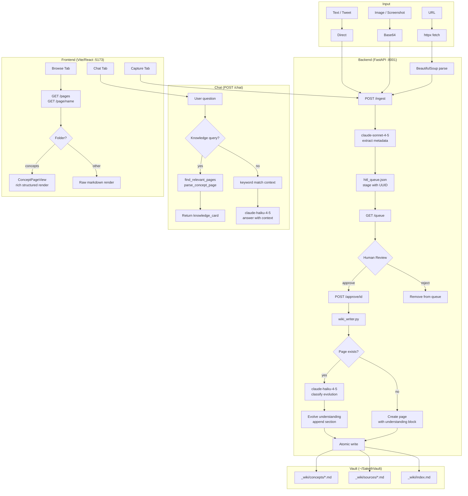

# SakethWiki — System Concepts

## Architecture Overview



---

## Data Flow: URL → Extract → HITL → Vault Write

```
1. User pastes URL in Capture tab
        ↓
2. POST /ingest { url: "..." }
        ↓
3. httpx.get(url) → BeautifulSoup → raw_text[:8000]
   (zero LLM — pure HTML parsing)
        ↓
4. claude-sonnet-4-5 extracts:
   { title, key_concepts, summary[5], suggested_page,
     suggested_wikilinks, tags, diagram? }
        ↓
5. Item staged to hitl_queue.json with UUID
   Frontend shows diff-preview card
        ↓
6. Human reviews → edits if needed → Approve or Skip
   Optional: toggle "Flag for deeper research" → adds deep-dive tag
        ↓
7. POST /approve/{id} { approved: true, open_thread: false, edits?: {...} }
        ↓
8. wiki_writer.py:
   a. If page exists:
      - claude-haiku-4-5 classifies relationship:
        extends / refines / supersedes / duplicates / contradicts
      - Rewrites > Current understanding block with new synthesis
      - Updates evolution badge (🔵🟡🟠🔴⚪)
      - Updates frontmatter: understanding_version, last_evolution, entry_count
      - Appends new ## source section
      - Superseded/contradicts entries get [!warning] callout inline
   b. If new page:
      - Creates with YAML frontmatter + > Current understanding block
      - Writes first ## source section
   c. Atomic write: write to .tmp → rename to .md
        ↓
9. Source record written to _wiki/sources/{date}-{slug}.md
```

---

## Knowledge Evolution Model

Each concept page has a **living understanding block** at the top:

```markdown
> **Current understanding** 🟡
> KV-cache stores attention keys/values across tokens so inference
> doesn't recompute them — the primary reason long-context is expensive.
> *— refined by "PagedAttention paper" · 2026-04-14*
```

When new information arrives, Haiku classifies the relationship:

| Type | Badge | Meaning |
|------|-------|---------|
| extends | 🔵 | Adds detail without changing existing understanding |
| refines | 🟡 | Sharpens or corrects nuance in the current understanding |
| supersedes | 🟠 | New info replaces the current understanding as more accurate |
| contradicts | 🔴 | New info conflicts — both flagged with [!warning] callout |
| duplicate | ⚪ | Already captured — write skipped entirely |

The understanding block is **rewritten** on each approval (not appended to), so it always reflects the most evolved synthesis. Source sections below it are the evidence trail.

---

## Model Assignment

| Task | Model | Rationale |
|------|-------|-----------|
| URL fetch + parse | httpx + BeautifulSoup | Zero LLM — deterministic, fast, free |
| Content extraction | claude-sonnet-4-5 | Strong reasoning for concept ID, tag classification, diagram generation |
| Evolution classification | claude-haiku-4-5 | Fast binary classification per approval — cheap, low-latency |
| Wiki section formatting | claude-haiku-4-5 | Template-filling — fast + cheap, quality sufficient |
| Understanding synthesis | claude-haiku-4-5 | Short synthesis from existing + new bullets |
| Chat Q&A | claude-haiku-4-5 | Speed matters; context pre-filtered by keyword match |
| All routing/parsing | Pure Python | Zero LLM — regex + string ops are deterministic |

**Principle:** LLM only where rule-based fails. Every LLM call has a defined, narrow scope.

---

## Key Design Decisions

### Vault in `~/` not `~/Documents/`
macOS TCC (Transparency Consent Control) blocks apps launched from the dock from reading `~/Documents/` unless Full Disk Access is granted. The vault lives at `~/SakethVault` to avoid this entirely.

### No Database, Files Only
Obsidian compatibility — vault must be readable as plain Markdown. No complex queries needed; keyword search + LLM routing covers 95% of use cases. Zero infra, git-friendly, portable.

### No Embeddings
Keyword match + LLM routing is sufficient for a personal wiki of this scale. No vector DB to run, no embedding costs, instant startup. Synonym expansion in `find_relevant_pages` covers common semantic gaps (e.g. "transformer" → finds "attention" pages).

### Living Understanding Block (not append-only)
Old design: every new source just appended a `##` section. Problem: understanding never compounded — it just stacked. New design: the `> Current understanding` block at the top is rewritten on each approval to reflect the most evolved synthesis. Source sections below it are the immutable evidence trail.

### deep-dive Tag (not a separate folder)
Old design had an `open-threads/` folder for topics to research more. Removed because it created a second concept-like object that confused the mental model. Replaced with a `deep-dive` tag on the concept page itself. The 🔍 Want more filter in Browse surfaces all flagged pages. One page type, one place.

### Atomic File Writes
Pattern: `write to path.tmp → os.rename(path.md)`. POSIX guarantees rename is atomic on the same filesystem — prevents partial writes from corrupting pages on crash.

### HITL Queue with UUID-keyed JSON
Human review before any vault write prevents junk accumulating. `hitl_queue.json` is append-only, survives process restarts, and items are removed only on explicit approve/reject.

---

## Vault File Structure

```
~/SakethVault/
└── _wiki/
    ├── concepts/           ← One .md per concept, evolves over time
    │   ├── rag.md
    │   ├── agents.md
    │   ├── kv-cache.md
    │   └── ...
    ├── sources/            ← One .md per URL ingested (never modified)
    │   ├── 2026-04-06-lilian-weng-agents.md
    │   └── ...
    ├── insights/           ← Synthesised insight pages
    ├── meta/               ← System pages
    └── index.md            ← Auto-rebuilt on every vault write
```

## Concept Page Structure

```markdown
---
title: "KV Cache"
tags: [KVCache, Inference, Attention]
entry_count: 3
last_updated: 2026-04-14
understanding_version: 2
last_evolution: 2026-04-14
---

> **Current understanding** 🟡
> KV-cache stores attention keys/values so autoregressive decoding
> doesn't recompute them — the main cost driver for long contexts.
> *— refined by "PagedAttention" · 2026-04-14*

## [Efficient Memory Management for LLM Serving](url) · 2026-04-14
- PagedAttention divides KV-cache into non-contiguous pages
- ...
**Key insight:** paging eliminates memory fragmentation in GPU KV-cache

## [Original Attention paper](url) · 2026-03-01
- ...
```
