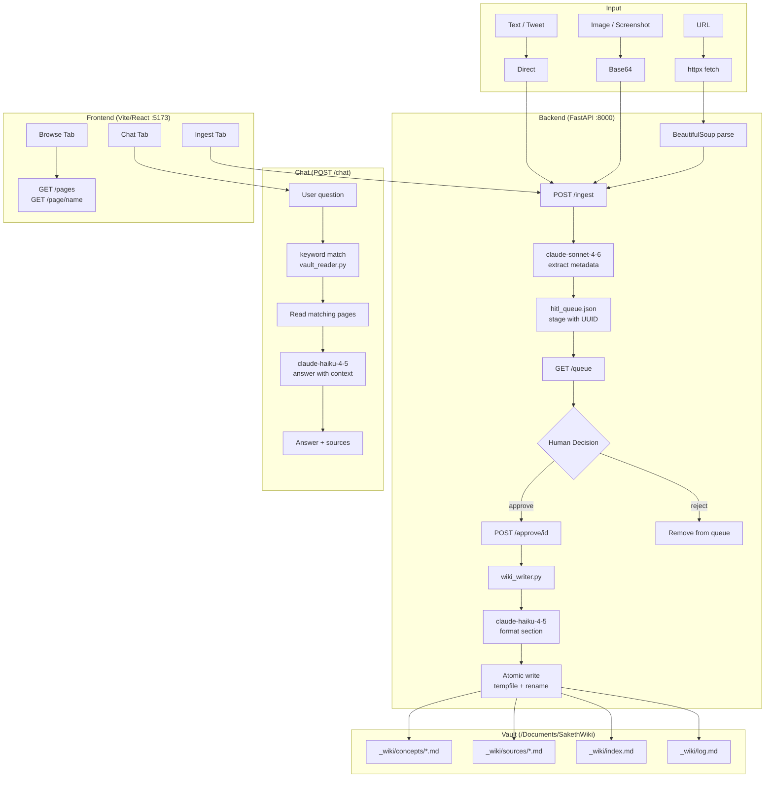

# SakethWiki — System Concepts

## Architecture Overview



## Data Flow: URL → Extract → HITL → Vault Write

```
1. User pastes URL in frontend
        ↓
2. POST /ingest { url: "..." }
        ↓
3. httpx.get(url) → BeautifulSoup → raw_text[:8000]
   (zero LLM here — pure HTML parsing)
        ↓
4. claude-sonnet-4-6 extracts:
   { title, key_concepts, summary[3], suggested_page,
     suggested_wikilinks, tags }
        ↓
5. Item staged to hitl_queue.json with UUID
   Response: diff_preview card shown in frontend
        ↓
6. Human sees preview → clicks Approve or Skip
        ↓
7. POST /approve/{id} { approved: true }
        ↓
8. wiki_writer.py:
   a. claude-haiku-4-5 formats Obsidian section markdown
   b. If page exists → append new ## section + update frontmatter
   c. If page new    → create with full YAML frontmatter
   d. Atomic write: write to .tmp → rename to .md
   e. Update _wiki/index.md (rebuilt from disk)
   f. Append to _wiki/log.md
        ↓
9. Source record written to _wiki/sources/{date}-{slug}.md
```

## Model Assignment Table

| Task | Model | Rationale |
|------|-------|-----------|
| URL fetch + parse | httpx + BeautifulSoup | Zero LLM — deterministic, fast, free |
| Content extraction | claude-sonnet-4-6 | Needs strong reasoning for concept identification and tag classification |
| Wiki section formatting | claude-haiku-4-5-20251001 | Structured template task — fast + cheap, quality sufficient |
| Chat Q&A | claude-haiku-4-5-20251001 | Speed matters for chat UX; context already pre-filtered by keyword match |
| All routing/parsing | Pure Python | Zero LLM — regex + string ops are deterministic and auditable |

**Token efficiency principle:** LLM only where rule-based fails. URL fetch is always rule-based. Extraction requires semantic understanding (Sonnet). Formatting is template-filling (Haiku). Chat uses pre-filtered context to minimize tokens.

## Key Design Decisions & Tradeoffs

### No Database, Files Only
- **Why:** Obsidian compatibility — vault must be readable as plain Markdown files
- **Tradeoff:** No complex queries; mitigated by index.md + keyword search
- **Benefit:** Zero infra, survives restarts, git-friendly, portable

### No Embeddings
- **Why:** Overkill for a personal wiki; keyword match + LLM routing is 90% as good
- **Tradeoff:** Can miss semantic matches (e.g. "KV cache" vs "key-value cache")
- **Benefit:** No vector DB to run, no embedding costs, instant startup

### HITL Queue with UUID-keyed JSON
- **Why:** Human review before any write — prevents junk accumulating in vault
- **How:** hitl_queue.json is append-only list; survives process restarts
- **Atomic:** queue writes use tempfile + rename to prevent corruption

### Atomic File Writes (tempfile + rename)
- **Why:** Prevents partial writes from corrupting vault pages
- **Pattern:** `write to path.tmp → os.rename(path.tmp, path.md)`
- **POSIX guarantee:** rename is atomic on same filesystem

### Always Append, Never Overwrite
- **Why:** Each concept page compounds — every new source adds a new `##` section
- **How:** wiki_writer reads existing content, appends section, rewrites atomically
- **Frontmatter:** `entry_count` and `last_updated` are updated in-place via regex

### Claude-assigned tags from fixed vocabulary
- **Why:** Prevents tag sprawl; forces consistency; enables filtering
- **Vocab:** RAG, Agents, Serving, MLOps, LLM, Inference, VectorDB,
             Attention, KVCache, Quantization, FineTuning, Embeddings, Agentic

## Vault File Structure

```
/Users/sakethv7/Documents/SakethWiki/
├── _wiki/
│   ├── concepts/           ← One .md per concept (appended to over time)
│   │   ├── rag.md
│   │   ├── agents.md
│   │   ├── kv-cache.md
│   │   └── ...
│   ├── sources/            ← One .md per URL ingested (full record, never modified)
│   │   ├── 2026-04-06-lilian-weng-agents.md
│   │   └── ...
│   ├── index.md            ← Auto-rebuilt on every write (table of all pages)
│   └── log.md              ← Append-only operation log
```

## Concept Page Lifecycle

```
First ingest for a concept:
  → Create page with frontmatter (entry_count: 1)
  → Write first ## section

Subsequent ingests for same concept:
  → Read existing page
  → Update frontmatter: last_updated, entry_count += 1, add source URL
  → Append new ## section at bottom
  → Atomic rewrite
```

## Mobile Access via Tailscale

Frontend is served from `localhost:5173` and backend from `localhost:8000`.
On the same Tailscale network, replace `localhost` with your Mac's Tailscale IP (e.g. `100.x.y.z`).
The frontend's `API` constant in `App.jsx` needs to be updated to your Tailscale IP for iPhone access.
