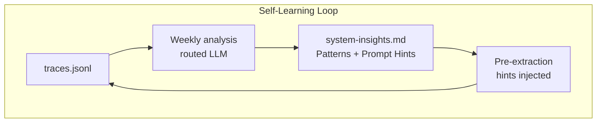
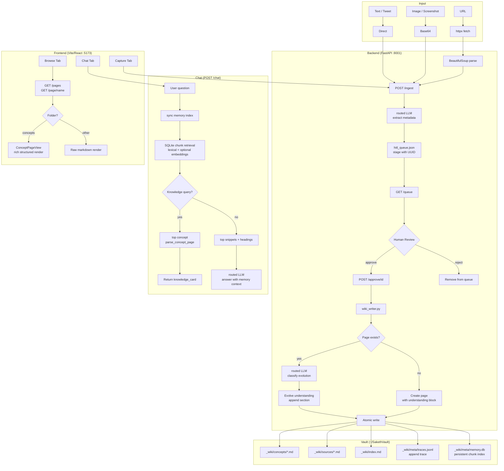
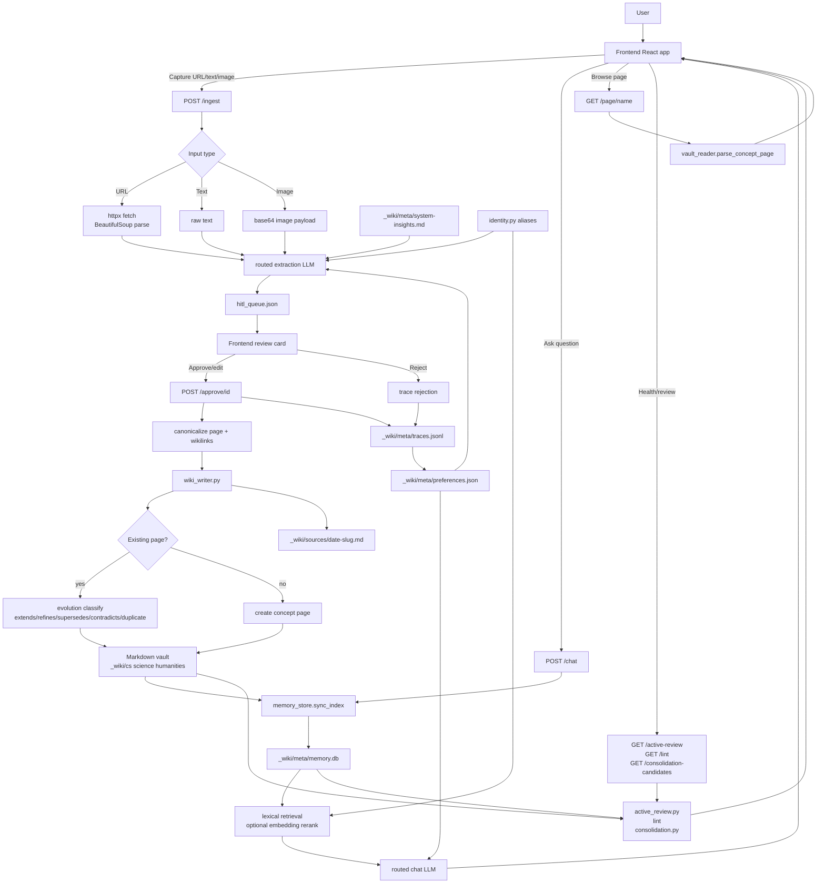
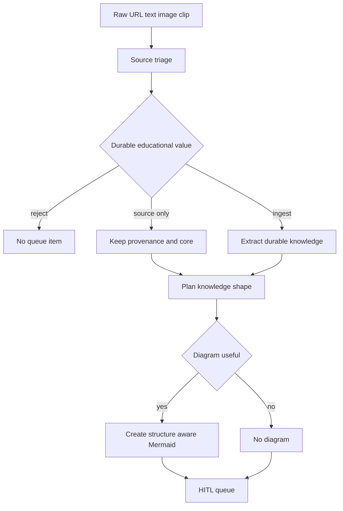
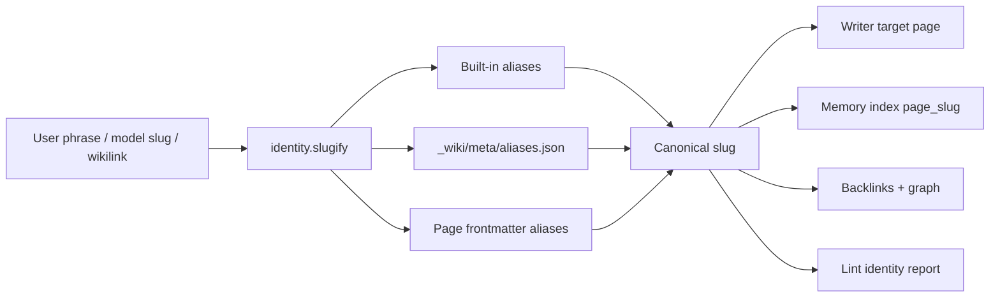
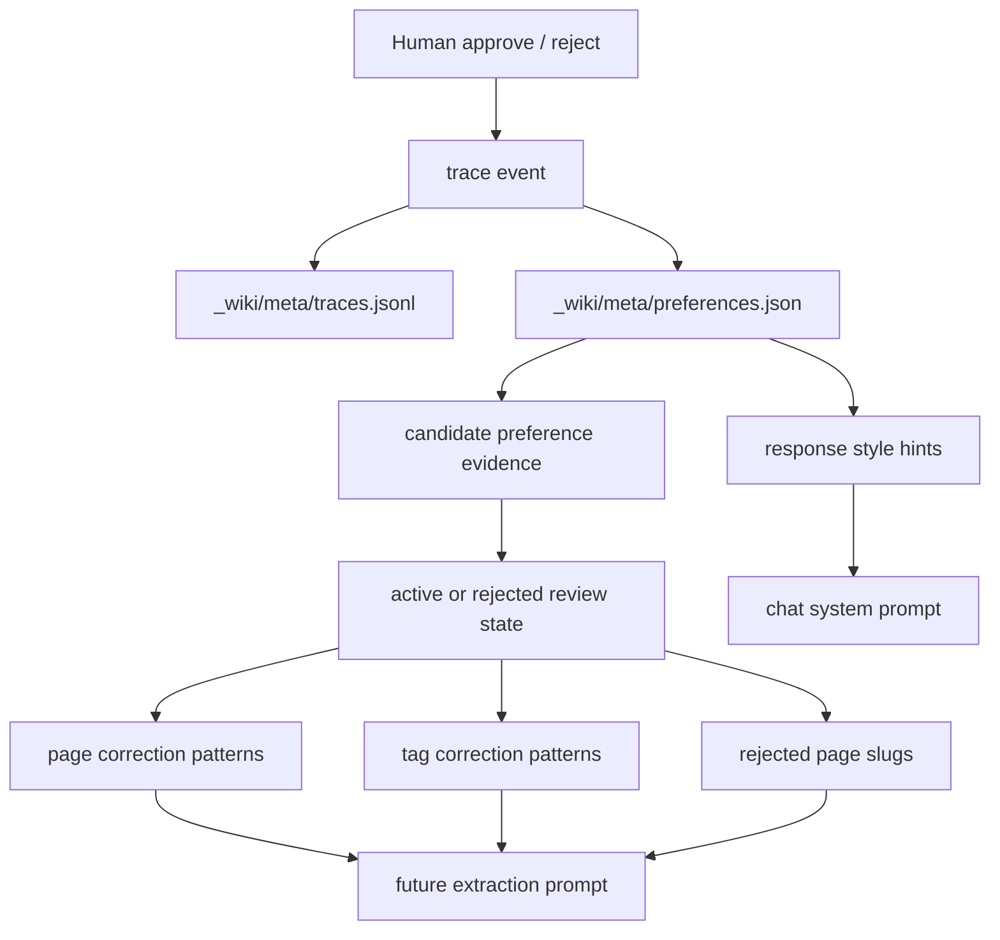
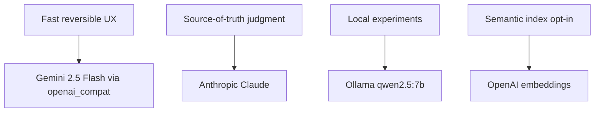

# SakethWiki — System Concepts

## Architecture Overview


```mermaid
graph TB
    subgraph SelfLearning["Self-Learning Loop"]
        SL1[traces.jsonl] --> SL2[Weekly analysis\nrouted LLM]
        SL2 --> SL3[system-insights.md\nPatterns + Prompt Hints]
        SL3 --> SL4[Pre-extraction\nhints injected]
        SL4 --> SL1
    end
```


```mermaid
graph TB
    subgraph Input
        A[URL] --> B[httpx fetch]
        C[Text / Tweet] --> D[Direct]
        E[Image / Screenshot] --> F[Base64]
    end

    subgraph Backend["Backend (FastAPI :8001)"]
        B --> G[BeautifulSoup parse]
        D --> H
        F --> H
        G --> H[POST /ingest]
        H --> I[routed LLM\nextract metadata]
        I --> J[hitl_queue.json\nstage with UUID]
        J --> K[GET /queue]
        K --> L{Human Review}
        L -- approve --> M[POST /approve/id]
        L -- reject --> N[Remove from queue]
        M --> O[wiki_writer.py]
        O --> P{Page exists?}
        P -- yes --> Q[routed LLM\nclassify evolution]
        P -- no --> R[Create page\nwith understanding block]
        Q --> S[Evolve understanding\nappend section]
        S --> T[Atomic write]
        R --> T
    end

    subgraph Vault["Vault (~/SakethVault)"]
        T --> U[_wiki/concepts/*.md]
        T --> V[_wiki/sources/*.md]
        T --> W[_wiki/index.md]
        T --> TR[_wiki/meta/traces.jsonl\nappend trace]
        T --> MM[_wiki/meta/memory.db\npersistent chunk index]
    end

    subgraph Chat["Chat (POST /chat)"]
        X[User question] --> MX[sync memory index]
        MX --> MY[SQLite chunk retrieval\nlexical + optional embeddings]
        MY --> Y{Knowledge query?}
        Y -- yes --> Z[top concept\nparse_concept_page]
        Y -- no --> AA[top snippets + headings]
        Z --> AB[Return knowledge_card]
        AA --> AC[routed LLM\nanswer with memory context]
    end

    subgraph Frontend["Frontend (Vite/React :5173)"]
        CA[Capture Tab] --> H
        CB[Chat Tab] --> X
        CC[Browse Tab] --> CD[GET /pages\nGET /page/name]
        CD --> CE{Folder?}
        CE -- concepts --> CF[ConceptPageView\nrich structured render]
        CE -- other --> CG[Raw markdown render]
    end
```

---

## Whole System Flow

SakethWiki has two main user journeys: capture new knowledge and query existing memory. Everything else exists to improve those loops over time.


```mermaid
flowchart TD
    U[User] --> FE[Frontend React app]

    FE -->|Capture URL/text/image| ING[POST /ingest]
    FE -->|Ask question| CHAT[POST /chat]
    FE -->|Browse page| PAGE[GET /page/name]
    FE -->|Health/review| REVIEW[GET /active-review\nGET /lint\nGET /consolidation-candidates]

    ING --> FETCH{Input type}
    FETCH -->|URL| HTML[httpx fetch\nBeautifulSoup parse]
    FETCH -->|Text| RAW[raw text]
    FETCH -->|Image| IMG[base64 image payload]
    HTML --> EXTRACT[routed extraction LLM]
    RAW --> EXTRACT
    IMG --> EXTRACT

    PREF[_wiki/meta/preferences.json] --> EXTRACT
    INSIGHTS[_wiki/meta/system-insights.md] --> EXTRACT
    ALIAS[identity.py aliases] --> EXTRACT

    EXTRACT --> QUEUE[hitl_queue.json]
    QUEUE --> FE_REVIEW[Frontend review card]
    FE_REVIEW -->|Approve/edit| APPROVE[POST /approve/id]
    FE_REVIEW -->|Reject| REJECT[trace rejection]

    APPROVE --> CANON[canonicalize page + wikilinks]
    CANON --> WRITE[wiki_writer.py]
    WRITE --> EVOLVE{Existing page?}
    EVOLVE -->|yes| CLASSIFY[evolution classify\nextends/refines/supersedes/contradicts/duplicate]
    EVOLVE -->|no| CREATE[create concept page]
    CLASSIFY --> VAULT[Markdown vault\n_wiki/cs science humanities]
    CREATE --> VAULT
    WRITE --> SOURCE[_wiki/sources/date-slug.md]
    APPROVE --> TRACE[_wiki/meta/traces.jsonl]
    REJECT --> TRACE
    TRACE --> PREF

    CHAT --> SYNC[memory_store.sync_index]
    VAULT --> SYNC
    SYNC --> DB[_wiki/meta/memory.db]
    DB --> RETRIEVE[lexical retrieval\noptional embedding rerank]
    ALIAS --> RETRIEVE
    RETRIEVE --> ANSWER[routed chat LLM]
    PREF --> ANSWER
    ANSWER --> FE

    PAGE --> PARSE[vault_reader.parse_concept_page]
    PARSE --> FE

    REVIEW --> REVIEWER[active_review.py\nlint\nconsolidation.py]
    VAULT --> REVIEWER
    DB --> REVIEWER
    REVIEWER --> FE
```

### Capture Path

The Capture tab sends URL, text, or images to `POST /ingest`. URL ingestion uses deterministic fetching and HTML parsing before any model call. Image ingestion keeps the base64 images in the extraction request even when companion text exists, because the vision path can read slide structure and turn data-flow diagrams into Mermaid with fewer source tokens than OCR-heavy text reconstruction. The extractor then receives four kinds of context: source content, existing page hints, learned prompt hints from `system-insights.md`, and durable correction patterns from `preferences.json`.

Latency is part of the capture contract. Ingest records stage timings for URL fetch, vault-page lookup, slicing, image uncertainty extraction, web gap search, vision extraction, text extraction, and queue staging. Image asset saving records its own caption/write timings. These events flow into Operations telemetry so a slow `Processing...` state can be diagnosed as model latency, image captioning, search, storage, or queue overhead.

Usage cost is part of the same operations contract. Each LLM call logs provider/model route, effective fallback route, input/output tokens, cache tokens when exposed, estimated dollar cost, and cost per token. Provider token counts are preferred; missing usage is estimated from character counts and marked as estimated. Pricing is configurable because model pricing drifts faster than architecture.

Image asset captioning is optional and must not dominate cost or reliability. Large image payloads skip the separate `IMAGE_CAPTION` model call and use deterministic filenames; the full image still goes through the main vision extraction path where it can recover slide structure and diagrams.

The Dashboard is a learning-health surface, not a raw activity vanity chart. It separates approved events, rejected/skipped events, approval rate, concepts touched, and genuinely new concepts. Approval rate is `approved / (approved + rejected)` ingest decisions for the period; it measures curation selectivity, not model accuracy. The 30-day cards answer "what passed curation recently?" while the 112-day heatmap answers "when did approved learning happen?" Recent reads are age-limited so stale page opens do not masquerade as current study behavior.

Dashboard can surface a compact Operations health layer, but only as summary signals: LLM spend, token volume, ingest p95 latency, recent operation errors, contract-risk task, slowest ingest stage, and pending system actions. The detailed route/task traces stay in Operations. These values are labeled with their runtime-log date range because they do not share the Dashboard learning window unless the Operations backend later adds time-windowed telemetry. Historical token and cost rows may be estimated from character counts when provider usage was not logged.

Action queues are approval surfaces, not debug dumps. A useful action card must explain the proposed change, why it appeared, what evidence triggered it, what the eval gate checked, and what approval will actually mutate. A green eval state means "the safety predicate passed"; it is not enough by itself to justify approval.

Operations commands must expose side effects in the label area. Safety evals and inference reports are read-only report writers. The trace critic proposes action cards. The system loop is the only header command allowed to auto-apply low-risk runtime changes, so it needs the strongest visual treatment and side-effect copy.

Operations command results need a visible cause-and-effect trail. A finished command should leave a Last operation summary and route the user to the evidence surface it produced: evals to Evals, telemetry reports to Reports, and action-producing critic/system-loop runs to Queue.

Usage observability should prefer human billing units over raw math notation. Dollars per token is mathematically precise but easy to misread; dollars per million tokens is the product unit. Estimated cost must be visible because historical rows often infer tokens from character counts.

Brain/executor agent architecture separates judgment from mutation. A high-reasoning brain model should produce plans, invariants, and acceptance checks. The executor should own repository inspection, edits, tests, commits, and rollback discipline. The boundary is a handoff document, not free-form chat, so the executor can be audited against the plan without inheriting every exploratory thought.

Ingestion is now a curation contract before it is a summary contract. The extractor must decide `source_verdict`, `educational_core`, `discarded_context`, `knowledge_shape`, and `diagram_plan` before producing bullets. `ingest` means the source has durable educational signal. `source_only` means the source is mostly event, social, or provenance context, so only the transferable core should enter the page. `reject` means the source has no durable value for this wiki and should return a 400 instead of polluting the queue.


```mermaid
flowchart TD
    A[Raw URL text image clip] --> B[Source triage]
    B --> C{Durable educational value}
    C -->|reject| R[No queue item]
    C -->|source only| S[Keep provenance and core]
    C -->|ingest| K[Extract durable knowledge]
    S --> P[Plan knowledge shape]
    K --> P
    P --> D{Diagram useful}
    D -->|yes| V[Create structure aware Mermaid]
    D -->|no| N[No diagram]
    V --> Q[HITL queue]
    N --> Q
```

The extractor does not write the vault directly. It stages a queue item in `hitl_queue.json`. The frontend shows the diff card so the human can approve, reject, or edit page slug, tags, summary, wikilinks, diagram, and curation metadata.

Approval writes through `wiki_writer.py`. Before writing, identity resolution canonicalizes the target page and wikilinks. If the page exists, evolution classification decides whether the new source extends, refines, supersedes, contradicts, or duplicates current understanding. If the page is new, the writer creates frontmatter and a current-understanding block. The source record is also written under `_wiki/sources/`.

After approval or rejection, a trace goes to `_wiki/meta/traces.jsonl`. That trace includes curation metadata, so the system loop can learn whether the agent kept educational signal, dropped event context, and chose a useful diagram plan. The same trace updates `_wiki/meta/preferences.json`, so repeated corrections shape future extraction without contaminating concept pages.

Manual eval runs can add a bounded curation judge on top of deterministic replay. The deterministic layer checks whether traces carry the curation contract. The judge layer samples recent curation traces and scores whether the kept core is actually transferable knowledge, whether discarded context is correctly excluded, and whether the diagram plan is justified. Judge failures can stage page-review actions and prompt-hint evidence for the system loop; they do not rewrite notes directly.

### Query Path

The Chat tab sends the user question to `POST /chat`. The backend syncs `_wiki/meta/memory.db` against Markdown first, so direct file edits and deletes are visible without restarting. Retrieval is local lexical by default. If `EMBED_ENABLED=true`, embeddings can rerank or supplement results, but they do not replace the local index.

Identity resolution expands aliases before retrieval. A query like "retrieval augmented generation" can land on `rag`. The chat answer receives retrieved snippets, current understanding, source page names, wiki index context, and chat-style preferences. If the query asks "what do I know about X?", the response can include a structured knowledge card from `parse_concept_page`.

Chat answers now have a typed note loop through `POST /chat-notes`. The user can attach `correction`, `contradiction`, `example`, or `nuance` to an answer and the pages it read. These notes append `event_type: chat_note` rows to `_wiki/meta/traces.jsonl` and `chat_note` rows to context telemetry. They are candidate evidence for shaping concept pages and future answers; they do not directly mutate Markdown because raw note capture is not the same as durable knowledge.

### Browse Path

The Browse tab calls `GET /pages` and `GET /page/{name}`. `vault_reader.py` searches the vault folders, resolves aliases, parses frontmatter, extracts the current-understanding block, source sections, related wikilinks, diagrams, maturity, and backlinks. Concept pages render as structured views; non-concept Markdown can still render as raw content.

### Maintenance Path

Maintenance is split into three safety levels.

Active review is deterministic. `/active-review` ranks weak, stale, orphaned, thin, or conflicting pages using maturity, backlinks, read/update signals, entry count, word count, and warning markers. This tells you what to inspect next.

Health check linting can call an LLM for higher-level inconsistencies and gaps, then combines that with deterministic link and identity audits. It should report issues before applying changes.

Consolidation is conservative. `/consolidation-candidates` only proposes duplicate candidates. `/consolidate` is the destructive path and now has a safety gate; weak pairs require `force=true`.

Evals are split by responsibility. Wiki/content evals check preference replay, retrieval cases, and ingestion curation. System-level evals check runtime gates: trace schema integrity, chat/context telemetry visibility, dropped retrieved chunks, low source coverage, LLM task errors, and pending system actions. Operations shows the system gates and recent system action trace stream before the older wiki-quality eval report, because system health decides whether runtime edits are justified.

### Feedback Loops

There are three feedback loops:

- Trace loop: approvals/rejections write `traces.jsonl`, and weekly analysis turns patterns into `system-insights.md` prompt hints.
- Preference loop: the same traces update `preferences.json`, which biases future page/tag choices and chat style.
- Memory loop: Markdown writes resync into `memory.db`, which improves future chat retrieval.
- Chat-note loop: corrections, contradictions, examples, and nuance from chat write typed trace and telemetry evidence, making visible how the user is shaping answers before any concept page is patched.
- System-eval loop: telemetry, traces, and action candidates are evaluated separately from wiki content so runtime edits are justified by system evidence, not by vague cleanup instincts.

Mistake to avoid: thinking of this as a RAG app with a wiki attached. The Markdown vault is the source of truth. Retrieval, preferences, review queues, and consolidation are derived systems around it.

---

## Data Flow: URL → Extract → HITL → Vault Write

```
1. User pastes URL in Capture tab
        ↓
2. POST /ingest { url: "..." }
        ↓
3. httpx.get(url) → BeautifulSoup → raw_text[:8000]
   (zero LLM — pure HTML parsing)
        ↓
4. Routed extraction model extracts:
   { title, key_concepts, summary[5], suggested_page,
     suggested_wikilinks, tags, diagram? }
        ↓
5. Item staged to hitl_queue.json with UUID
   Frontend shows diff-preview card
        ↓
6. Human reviews → edits if needed → Approve or Skip
   Optional: toggle "Flag for deeper research" → adds deep-dive tag
        ↓
7. POST /approve/{id} { approved: true, open_thread: false, edits?: {...} }
        ↓
8. wiki_writer.py:
   a. If page exists:
      - routed model classifies relationship:
        extends / refines / supersedes / duplicates / contradicts
      - Rewrites > Current understanding block with new synthesis
      - Updates evolution badge (🔵🟡🟠🔴⚪)
      - Updates frontmatter: understanding_version, last_evolution, entry_count
      - Appends new ## source section
      - Superseded/contradicts entries get [!warning] callout inline
   b. If new page:
      - Creates with YAML frontmatter + > Current understanding block
      - Writes first ## source section
   c. Atomic write: write to .tmp → rename to .md
        ↓
9. Source record written to _wiki/sources/{date}-{slug}.md
```

---

## Knowledge Evolution Model

Each concept page has a **living understanding block** at the top:

```markdown
> **Current understanding** 🟡
> KV-cache stores attention keys/values across tokens so inference
> doesn't recompute them — the primary reason long-context is expensive.
> *— refined by "PagedAttention paper" · 2026-04-14*
```

When new information arrives, the evolution classifier classifies the relationship:

| Type | Badge | Meaning |
|------|-------|---------|
| extends | 🔵 | Adds detail without changing existing understanding |
| refines | 🟡 | Sharpens or corrects nuance in the current understanding |
| supersedes | 🟠 | New info replaces the current understanding as more accurate |
| contradicts | 🔴 | New info conflicts — both flagged with [!warning] callout |
| duplicate | ⚪ | Already captured — write skipped entirely |

The understanding block is **rewritten** on each approval (not appended to), so it always reflects the most evolved synthesis. Source sections below it are the evidence trail.

---

## Model Assignment (Current)

| Task | Default Route | Notes |
|------|---------------|-------|
| URL fetch + parse | `httpx + BeautifulSoup` | Zero LLM — deterministic, fast, free |
| Content extraction (long/image) | Anthropic (`INGEST_EXTRACT`) | Quality-critical; multimodal-heavy |
| Evolution classification | Ollama/Qwen by default | Contract fallback to Anthropic on invalid output |
| Chat page selection | Ollama/Qwen by default | Cheap + low latency |
| Chat Q&A | Ollama/Qwen by default | Can be overridden per task |
| Lint / consolidate / knowledge gaps | Anthropic by default | Integrity-critical tasks |
| All routing/parsing | Pure Python + `llm_client` | Task-based provider routing + contract guardrails |

## Memory Substrate

The important shift is architectural, not cosmetic:

- Markdown pages remain the editable source of truth.
- A persistent SQLite index in `_wiki/meta/memory.db` stores page metadata plus chunked retrieval units.
- On each chat query, the system syncs the index against the vault, so direct file edits and page deletions become visible to retrieval without a restart.
- If `EMBED_ENABLED=true` and an embedding key is configured, each chunk also stores an embedding and retrieval blends lexical + semantic similarity. Without that explicit opt-in, the same index stays local and lexical.

**Principle:** LLM only where rule-based fails. High-volume tasks can run local; integrity-critical tasks use strict output contracts with Anthropic fallback.

---

## Identity Resolution

Aliases are resolved before concept identity reaches storage, retrieval, graph edges, and automation endpoints.


```mermaid
graph LR
    A[User phrase / model slug / wikilink] --> B[identity.slugify]
    B --> C[Built-in aliases]
    B --> D[_wiki/meta/aliases.json]
    B --> E[Page frontmatter aliases]
    C --> F[Canonical slug]
    D --> F
    E --> F
    F --> G[Writer target page]
    F --> H[Memory index page_slug]
    F --> I[Backlinks + graph]
    F --> J[Lint identity report]
```

The key implementation point is that aliases are not a UI search trick. `backend/identity.py` is the shared resolver. It is used by `wiki_writer.py` before writes, by `memory_store.py` before retrieval and indexing, by `vault_reader.py` for page reads/backlinks/graph, and by API endpoints that mutate links or pages.

Built-in aliases cover high-frequency AI terms such as `retrieval augmented generation -> rag`, `key-value cache -> kv-cache`, and `agentic -> agents`. Vault-specific aliases can be added without code changes in `_wiki/meta/aliases.json`, and individual pages can declare `aliases: [...]` in frontmatter.

The system is intentionally conservative:

- If both `rag.md` and `retrieval-augmented-generation.md` exist, the memory index skips the alias page and returns `rag`.
- If only the alias page exists, reads can still fall back to it instead of making old pages unreachable.
- `/lint` and `/aliases` report duplicate/redirect candidates; they do not merge pages automatically.

Mistake to avoid: treating aliases, tags, and folders as the same problem. Aliases answer "what exact concept is this?" Tags answer "what cluster does this belong to?" Folders answer "where does it live?"

---

## Preference Memory

Preference memory stores correction behavior separately from concept content.


```mermaid
graph TD
    A[Human approve / reject] --> B[trace event]
    B --> C[_wiki/meta/traces.jsonl]
    B --> D[_wiki/meta/preferences.json]
    D --> E[candidate preference evidence]
    E --> F[active or rejected review state]
    F --> G[page correction patterns]
    F --> H[tag correction patterns]
    F --> I[rejected page slugs]
    D --> L[response style hints]
    G --> J[future extraction prompt]
    H --> J
    I --> J
    L --> K[chat system prompt]
```

`preferences.json` is not knowledge. It records reviewed or repeated user behavior such as "when the extractor suggests X page, Saketh keeps moving it to Y", "this tag gets corrected to that tag", and "this suggested page was rejected". One-off corrections stay as candidates. A correction starts shaping extraction only after repeated evidence or explicit review approval.

Implementation points:

- Approval traces update preference memory deterministically in `backend/preference_memory.py`.
- Extraction receives only active/stable preference hints alongside `system-insights.md` prompt hints.
- Chat receives response-style preferences such as starting with the answer and being direct.
- `/preferences` exposes the durable preference state and pending review candidates.
- `/preferences/review` can mark a candidate `active`, `candidate`, or `rejected`.

Mistake to avoid: using an LLM to infer preferences from vibes. Preferences should come from observed corrections first. LLM synthesis can summarize them later, but the raw memory should remain auditable.

## LLM Routing Channels

SakethWiki uses task routing, not one fixed model per feature.


```mermaid
flowchart TD
    A[Fast reversible UX] --> B[Gemini 2.5 Flash via openai_compat]
    C[Source-of-truth judgment] --> D[Anthropic Claude]
    E[Local experiments] --> F[Ollama qwen2.5:7b]
    G[Semantic index opt-in] --> I[OpenAI embeddings]
```

Gemini is the default route for fast chat, rewrite, expand, and normal capture. Claude is pinned for linting, consolidation, knowledge-gap analysis, and evolution classification because those tasks can affect durable vault state. Ollama remains useful for local experiments, but it should not judge source-of-truth memory yet. Embeddings stay explicit with `EMBED_ENABLED=false` by default; the Markdown vault and SQLite lexical index remain the stable base.

---

## Active Review Queue

The review queue is a prioritization system, not just a stale-page list.

```mermaid
graph LR
    A[Concept pages] --> B[active_review.py]
    C[Backlinks] --> B
    D[reads.jsonl] --> B
    E[frontmatter maturity] --> B
    F[conflict markers] --> B
    B --> G[priority score]
    G --> H[/active-review]
    G --> I[/review-queue]
```

Signals:

- Low or missing `understanding_maturity`
- No backlinks or only one backlink
- No recent read/update signal
- Single-entry or thin pages
- Conflict markers such as `[!warning]`, `CONTRADICTION`, or `contradicts`

This is deterministic because review selection should be explainable. Each item returns a score, priority, reasons, raw signals, and a suggested action. LLMs can help rewrite or synthesize a page after selection, but they should not be required to decide which pages need attention.

Mistake to avoid: reviewing old pages just because they are old. A mature, well-linked old page can be stable. A new orphaned low-maturity page can be more urgent.

---

## Conservative Consolidation

Consolidation has two separate phases:

```mermaid
graph LR
    A[Vault pages] --> B[consolidation.py candidate scan]
    B --> C{High confidence?}
    C -- yes --> D[/consolidation-candidates safe_auto=true]
    C -- no --> E[Report only]
    D --> F[/consolidate confirmation]
    F --> G[LLM merge + source delete]
```

The candidate scanner is deterministic and non-mutating. It uses identity aliases first, then slug similarity plus concept-text token overlap. The destructive `/consolidate` endpoint now has a safety gate: high-confidence pairs can proceed; weak pairs require `force=true` as an explicit manual override.

Safe consolidation signals:

- An alias page resolves to an existing canonical page.
- Slugs are highly similar and concept text overlaps strongly.

Unsafe consolidation signals:

- Only vague semantic overlap.
- Shared tags but different concepts.
- Similar subject area without matching identity.

Mistake to avoid: using consolidation as cleanup for every inconsistency. Contradictions usually need review, not merging. Merge only when the pages are actually duplicate identities.

---

## Health Check & Vault Automation

The system can autonomously scan the vault for structural issues and suggest (or directly apply) fixes:

### Issues Detected

| Issue Type | Detection | Automation |
|-----------|-----------|-----------|
| **Inconsistencies** | Semantic contradictions between 2+ pages (e.g., conflicting definitions) | Auto-merge via `/consolidate` if 2-page match; manual fix + "Mark done" otherwise |
| **Missing Connections** | Page A discusses topic B but doesn't link to it (contextual gap analysis) | Auto-insert wikilink via `/add-link` |
| **Suggested Articles** | Concept mentioned but no dedicated page exists | Auto-create stub via `/create-stub` for manual fill-in |
| **Orphaned Pages** | Page exists but nothing links to it | Mark done after manual investigation |
| **Quick Wins** | Wikilink normalization, sorting by date | Auto-apply via `Apply` button |

### Health Check Workflow

```
GET /lint
  ↓
Returns: health_score (0-100), category_scores, {inconsistencies, missing_connections, suggested_articles, orphaned_pages}
  ↓
Frontend loads ackedMap from localStorage (persists across sessions)
  ↓
buildActions() generates three automation types:
  • add-link: from_page → to_page (missing connections)
  • create-stub: slug + reason (suggested articles)
  • consolidate: primary_page, duplicate_page (inconsistencies)
  ↓
User selects checkboxes → clicks "Apply"
  ↓
applySelected() calls backend endpoints:
  • POST /add-link { from_page, to_page }
  • POST /create-stub { slug, reason }
  • POST /consolidate { primary_page, duplicate_page }
  ↓
Files modified, ackedMap updated with timestamp + status badge
  ↓
Persistence: localStorage survives refresh + re-runs (content-keyed hashing)
```

### State Persistence

Health check item state persists via `ackedMap` (localStorage):
- **Key:** `_healthKey(text)` — content-based SHA1 hash (survives re-runs)
- **Value:** `{status: "applied"|"noted", timestamp, action_type}`
- **Lifecycle:** Generated on health check run → marked as "applied" or "noted" → persists across sessions

This allows items to be dismissed even if the health check re-identifies them (e.g., "I manually fixed this orphan page" → "Mark done" → badge persists).

### Automation Levels

- **Level 1 (Fully Automatic):** Quick wins + missing connections + suggested articles + 2-page inconsistencies
- **Level 2 (Semi-Automatic):** User clicks "Mark done" on items they've manually addressed
- **Level 3 (Manual Review):** Orphaned pages, non-paired inconsistencies, edge cases requiring judgment

---

## Self-Learning Trace System

### How it works

Every approve/reject event appends one JSON line to `_wiki/meta/traces.jsonl`:

```json
{
  "ts": "2026-04-15T10:00:00",
  "url": "https://x.com/...",
  "source_type": "tweet",
  "approved": true,
  "suggested_page": "learning-agent-infrastructure",
  "final_page": "harness-hill-climbing",
  "page_corrected": true,
  "evolution_type": "extends",
  "tags_suggested": ["Agentic", "MLOps"],
  "tags_final": ["Agents", "MLOps"],
  "tags_corrected": true,
  "was_duplicate": false
}
```

### Weekly analysis

Once a week (or on demand via 🧠 Learn in Browse), Claude Sonnet reads the last 100 traces and writes structured findings to `_wiki/meta/system-insights.md`:

- **Extraction Patterns** — which types of content Claude gets right/wrong
- **Tag Confusion** — tags that are frequently corrected
- **Duplicate Signals** — topics that often produce duplicates
- **Rejection Patterns** — what content keeps getting skipped
- **Prompt Hints** — specific one-line corrections auto-injected into next extraction
- **Routing Recommendations** — tag vocabulary or model changes
- **Architecture Recommendations** — larger structural changes to consider

### Pre-extraction priming

On every `/ingest`, the `## Prompt Hints` section from `system-insights.md` is read and injected into the extraction system prompt. This means corrections propagate automatically without touching any code.

### The loop

```
approve item → trace logged → weekly analysis → prompt hints written
      ↑                                                    ↓
next extraction ←────────── hints injected into prompt ───┘
```

Cost: one Sonnet call per week (~$0.10-0.30). Trace logging is zero cost (file append). Hint injection adds ~300 tokens per extraction (negligible).

---

## Key Design Decisions

### Vault in `~/` not `~/Documents/`
macOS TCC (Transparency Consent Control) blocks apps launched from the dock from reading `~/Documents/` unless Full Disk Access is granted. The vault lives at `~/SakethVault` to avoid this entirely.

### No Database, Files Only
Obsidian compatibility — vault must be readable as plain Markdown. No complex queries needed; keyword search + LLM routing covers 95% of use cases. Zero infra, git-friendly, portable.

### No Embeddings
Keyword match + LLM routing is sufficient for a personal wiki of this scale. No vector DB to run, no embedding costs, instant startup. Synonym expansion in `find_relevant_pages` covers common semantic gaps (e.g. "transformer" → finds "attention" pages).

### Living Understanding Block (not append-only)
Old design: every new source just appended a `##` section. Problem: understanding never compounded — it just stacked. New design: the `> Current understanding` block at the top is rewritten on each approval to reflect the most evolved synthesis. Source sections below it are the immutable evidence trail.

### Self-Learning via Traces (not hardcoded rules)
Rather than manually tuning the extraction prompt when it gets something wrong, every correction is logged as a trace. Weekly analysis finds patterns across corrections and writes prompt hints that auto-inject on the next ingest. This means the system improves from your behavior without requiring code changes. Inspired by Motus's "agent learning in production" thesis.

### deep-dive Tag (not a separate folder)
Old design had an `open-threads/` folder for topics to research more. Removed because it created a second concept-like object that confused the mental model. Replaced with a `deep-dive` tag on the concept page itself. The 🔍 Want more filter in Browse surfaces all flagged pages. One page type, one place.

### Atomic File Writes
Pattern: `write to path.tmp → os.rename(path.md)`. POSIX guarantees rename is atomic on the same filesystem — prevents partial writes from corrupting pages on crash.

### HITL Queue with UUID-keyed JSON
Human review before any vault write prevents junk accumulating. `hitl_queue.json` is append-only, survives process restarts, and items are removed only on explicit approve/reject.

### Packaging Is a Control Surface, Not a Capability Rewrite
When a knowledge system becomes feature-rich, interaction friction becomes the bottleneck before model quality does. Focus Mode makes `Capture → Ask` the default loop and demotes `Browse/Dashboard` to secondary actions, without removing them. This preserves compounding behavior while reducing cognitive load and startup latency for daily use.

### Clipping Is Transport, Refinement Is Value
Raw markdown clipping is now treated as transport. The value layer is refinement: dedupe, source triage, page routing, synthesis update, diagram planning, and trace-backed evolution. This lets Obsidian Web Clipper own ingestion speed while SakethWiki owns knowledge compounding quality.

---

## Vault File Structure

```
~/SakethVault/
└── _wiki/
    ├── concepts/           ← One .md per concept, evolves over time
    │   ├── rag.md
    │   ├── agents.md
    │   ├── kv-cache.md
    │   └── ...
    ├── sources/            ← One .md per URL ingested (never modified)
    │   ├── 2026-04-06-lilian-weng-agents.md
    │   └── ...
    ├── insights/           ← Synthesised insight pages
    ├── meta/               ← System pages
    └── index.md            ← Auto-rebuilt on every vault write
```

## Concept Page Structure

```markdown
---
title: "KV Cache"
tags: [KVCache, Inference, Attention]
entry_count: 3
last_updated: 2026-04-14
understanding_version: 2
last_evolution: 2026-04-14
---

> **Current understanding** 🟡
> KV-cache stores attention keys/values so autoregressive decoding
> doesn't recompute them — the main cost driver for long contexts.
> *— refined by "PagedAttention" · 2026-04-14*

## [Efficient Memory Management for LLM Serving](url) · 2026-04-14
- PagedAttention divides KV-cache into non-contiguous pages
- ...
**Key insight:** paging eliminates memory fragmentation in GPU KV-cache

## [Original Attention paper](url) · 2026-03-01
- ...
```
