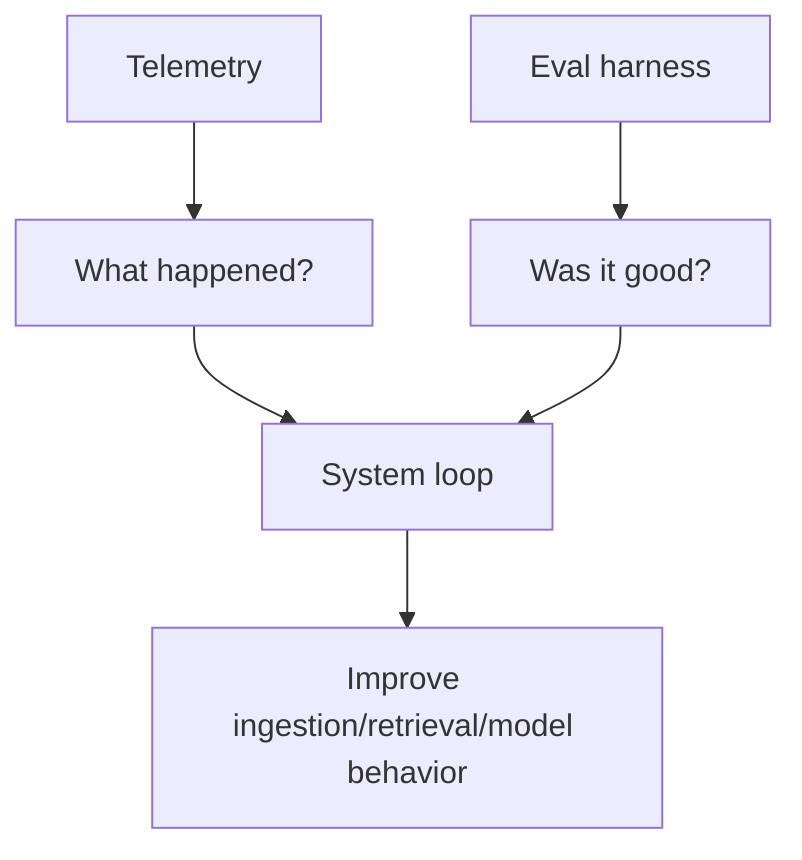
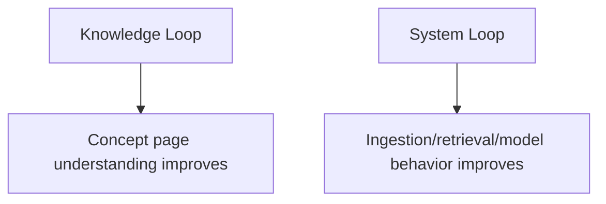
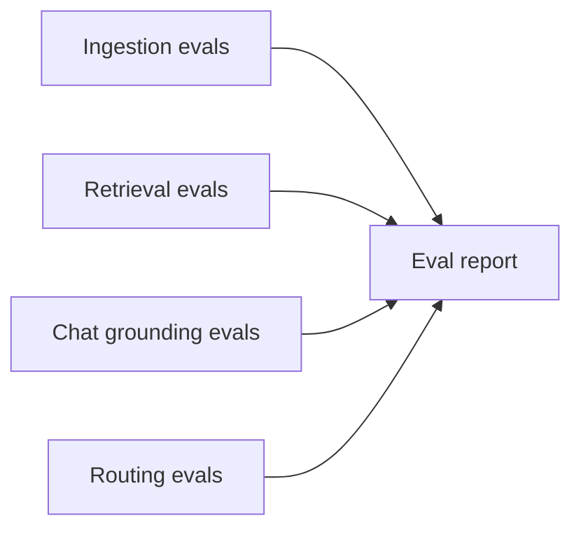
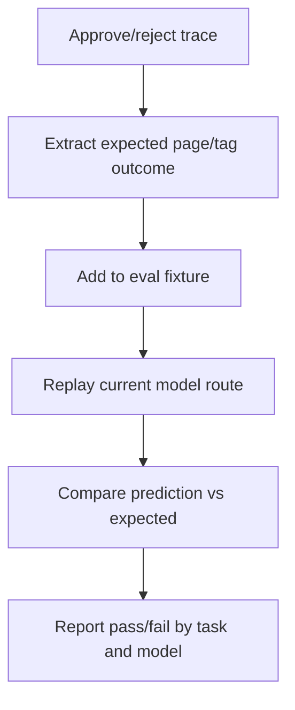
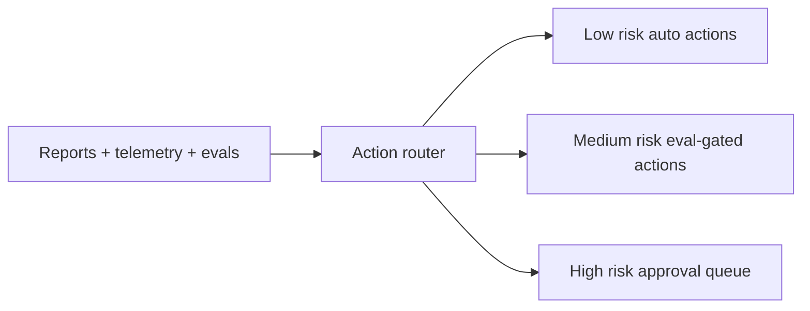

# SakethWiki Evals and System Loops Report

## Answer

The items discussed are not all "a tiny eval harness" by themselves. They split into two layers.

Telemetry records what happened. An eval harness replays or scores behavior against expected outcomes. The system loop uses both to improve routing, prompts, retrieval, preferences, and review priority.



## Two Separate Loops

SakethWiki should keep the knowledge loop and system loop separate.



The knowledge loop updates concept pages. It answers: "What do I now understand about KV cache, agents, inference, or hardware systems?"

The system loop updates SakethWiki itself. It answers: "Why did extraction create the wrong page? Why did chat miss the right note? Which model should handle this task? Which pages need review?"

Mixing these loops is dangerous. A model should not rewrite system behavior just because one note changed. A knowledge correction may become a system preference only after repeated evidence or explicit approval.

## What A Tiny Eval Harness Means

A tiny eval harness is a replayable test set for model-facing behavior.

For SakethWiki, it should start with four eval types:



Ingestion evals check whether a known URL/text/image maps to the expected page, tags, links, and summary structure.

Retrieval evals check whether a query returns the expected page in top-k results.

Chat grounding evals check whether answers cite or use the right memory context instead of hallucinating.

Routing evals compare providers and models on the same tasks using latency, contract success, and quality checks.

The first harness can be small: 10 to 20 handpicked examples from real traces. It does not need a large benchmark to be useful.

## How Traces Become Evals

Current traces already contain useful supervision:

```text
suggested_page -> final_page
tags_suggested -> tags_final
approved -> true/false
evolution_type
was_duplicate
source_type
```

Those traces can generate eval candidates.



This is why evals are not only "post-task." They can be online or offline.

Online evals come from real usage after the task. Human edits, approvals, rejects, and chat corrections become evidence.

Offline evals happen before changing the system. The same examples are replayed against a new prompt, model, retrieval strategy, or routing policy. If the new setup fails more cases, do not deploy it.

## Loops SakethWiki Should Add

The page-routing loop should learn repeated corrections. If `agentic-ai` keeps getting changed to `agents`, the system should prefer `agents` for similar content.

The tag loop should learn repeated tag corrections. If `Agentic` keeps becoming `Agents`, the extractor should stop suggesting `Agentic` for tool-use and orchestration content.

The retrieval-miss loop should catch cases where chat answers poorly even though the right page exists. Fixes can include aliases, improved chunking, embeddings, better query expansion, or better top-k selection.

The source-quality loop should learn what gets rejected. If noisy tweets are rejected often and primary docs are approved often, ingestion should flag weak sources or ask for review before promoting them.

The model-routing loop should learn route strengths. If Gemini succeeds on short text but fails on screenshots, route screenshots to a stronger vision model. If Claude is only needed for contradiction classification, keep it there.

The review-priority loop should bring risky pages back sooner. Pages with contradictions, low maturity, many edits, duplicate risk, or repeated retrieval misses should appear earlier in active review.

## What To Build First

Build telemetry before heavy eval automation.

Step one is `llm_call_logs.jsonl`. This makes each model call observable.

Step two is a small eval fixture file, probably under `backend/evals/fixtures/`. It should contain real examples with expected outputs.

Step three is a replay command:

```text
python backend/evals/run_eval.py --suite ingest
python backend/evals/run_eval.py --suite retrieval
python backend/evals/run_eval.py --suite chat
python backend/evals/run_eval.py --suite routing
```

Step four is an eval report written to `_wiki/meta/eval-reports/YYYY-MM-DD.md`.

The first report should be simple:

```text
ingest_page_accuracy: 14/20
tag_overlap_avg: 0.72
retrieval_top1: 8/12
retrieval_top3: 11/12
json_contract_success: 19/20
median_latency_ms_by_task:
  ingest_extract: 1420
  chat_answer: 980
fallback_rate_by_task:
  ingest_extract: 0.05
```

## Current Implementation Status

The first eval and system-loop layer now exists.

`backend/eval_harness.py` runs deterministic replay evals from approved traces plus optional curated cases in `_wiki/meta/eval-cases.json`.

The current suites cover:

```text
preference_replay
retrieval_top1_top3
candidate_gates
```

Candidate gates now check more than "does this sound reasonable." For context-budget changes, the harness replays recent budget evidence and requires projected improvement before applying. For alias, exclusion, review, and consolidation actions, it validates the handler schema before application.

`backend/system_loop.py` routes findings into action candidates:



Supported handlers now include:

```text
increase_chat_context_budget
increase_ingest_source_budget
set_runtime_route_override
disable_runtime_route_override
add_alias
exclude_eval_case
queue_page_review
create_consolidation_candidate
```

The LLM trace critic is deliberately bounded. It can classify good/noisy traces and propose action candidates, but it cannot directly change routing, aliases, budgets, or pages. The deterministic router validates the proposed schema and risk bucket first.

The next serious layer is higher-quality curated eval cases and deeper A/B replay for prompts/routes, not more autonomy.

## FactoryMind Transfer

FactoryMind needs the same loop pattern, but the stakes are higher.

SakethWiki can tolerate a bad tag. FactoryMind cannot tolerate an unsafe diagnosis or control suggestion. The eval harness there should be incident-based and replayable.

FactoryMind eval cases should eventually include:

```text
sensor window
machine state
operator note
manual sections retrieved
expected fault candidates
expected safe next action
unsafe actions to reject
post-action outcome
```

The loop should optimize for grounded diagnosis, safe action selection, low-latency escalation, and operator trust. This is where SakethWiki's current architecture becomes useful practice: separate source of truth, retrieval substrate, human review, traces, telemetry, and eval replay.
