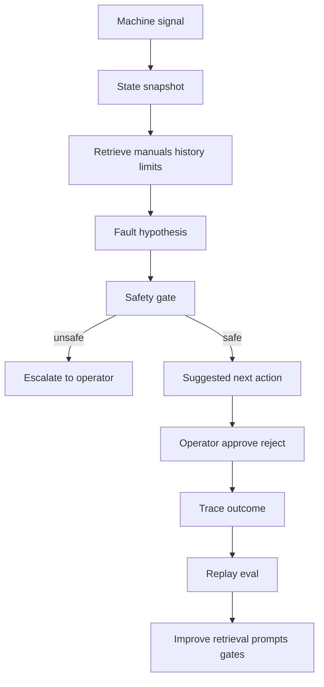
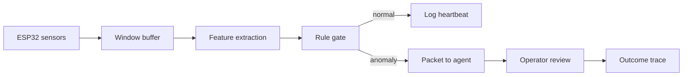

# FactoryMind Transfer Notes

This file is the running bridge from SakethWiki work into FactoryMind: hardware plus agentic AI for industrial machines. Add to it whenever SakethWiki, job work, or another project produces a reusable control-loop, telemetry, retrieval, eval, or human-approval idea that would make ESP32 or machine-agent work faster later.

The mistake to avoid is copying chat-app patterns into hardware. FactoryMind should be designed as an auditable control system. The agent is not the product by itself; the loop around sensor state, retrieval, diagnosis, safety checks, operator approval, and post-action outcome is the product.

## Current Transferable Pattern



SakethWiki is useful practice because it separates durable knowledge from system behavior. The same split should exist in FactoryMind:

Knowledge loop: improves machine manuals, fault libraries, maintenance procedures, operator notes, and known-good troubleshooting playbooks.

System loop: improves retrieval, routing, sensor-window selection, safety gates, latency budgets, eval cases, and escalation policy.

Telemetry answers what happened. Evals answer whether the system behaved well. The control loop decides what may change.

## What We Learned From SakethWiki

### 1. Curation before summarization

SakethWiki ingestion now separates durable educational signal from event/social context before writing notes. The FactoryMind equivalent is to separate machine-relevant signal from incidental context before diagnosis.

For ESP32 or machine logs, do not dump raw telemetry into an agent and ask for an answer. First classify:

- useful signal: sensor deltas, threshold crossings, state transitions, vibration/temperature/current anomalies, operator notes tied to time
- context only: shift timing, UI noise, repeated logs, unrelated machine events
- reject: corrupted windows, missing timestamps, unsupported machine mode, unsafe uncertainty

FactoryMind implication: build a `signal_verdict` contract before any fault diagnosis.

```json
{
  "signal_verdict": "diagnose | context_only | reject",
  "useful_signal": [],
  "discarded_context": [],
  "machine_state_shape": "steady_state | transient | startup | shutdown | fault",
  "diagnosis_plan": {
    "needed": true,
    "reason": "current spike followed by temperature rise"
  }
}
```

### 2. Diagrams should come from structure, not decoration

SakethWiki diagrams were weak when they were generated from summary bullets. Better diagrams require a shape decision first: taxonomy, mechanism, architecture, argument, or case study.

FactoryMind equivalent:

- topology diagram: machine components and sensor placement
- timing diagram: signal sequence around a fault
- state machine: idle, startup, running, fault, cooldown
- decision tree: safe next-action selection
- no diagram: when the signal is too weak or the structure is fake

For hardware work, a missing diagram is better than a fake one. A fake diagram can create unsafe confidence.

### 3. Manual evals can use bounded judges, but automatic loops should stay conservative

SakethWiki now uses deterministic evals by default and an optional bounded LLM judge for curation quality during manual eval runs. That is the right pattern for FactoryMind.

FactoryMind should not let an LLM judge directly rewrite safety policy or control logic. Use it to flag suspect traces, propose eval cases, and suggest prompt/gate improvements. Deterministic checks should own the final gate.

FactoryMind eval cases should look like incidents:

```text
machine_id
sensor_window_id
machine_state
operator_note
retrieved_manual_sections
expected_fault_candidates
expected_safe_next_action
unsafe_actions_to_reject
operator_accepted_or_rejected
post_action_outcome
```

### 4. Trace schema is the product memory

SakethWiki traces now include curation metadata, summary snapshots, key concepts, diagram plans, and approval outcomes. FactoryMind traces need richer physical-world evidence.

Minimum FactoryMind trace fields:

```text
machine_id
firmware_version
sensor_window_id
timestamp_range
raw_signal_summary
machine_state
fault_type_candidate
retrieved_manual_sections
model_route
latency_ms
confidence
safety_gate_triggered
tool_or_action_proposed
operator_approved
operator_note
post_action_machine_state
incident_closed
```

The trace should be replayable. If the same sensor window is replayed later, the system should be able to compare old and new diagnosis behavior.

## ESP32 Starting Point

For early ESP32 work, do not begin with a broad autonomous agent. Begin with a small deterministic signal loop:



The first useful FactoryMind prototype should probably collect one machine-like signal stream, create fixed windows, extract simple features, flag anomalies with deterministic thresholds, and store traces. The LLM/agent layer should enter after the trace format exists.

## Backlog

- Define a FactoryMind trace JSON schema.
- Build an ESP32 sensor-window logger with timestamps and firmware version.
- Create a small replay harness that can rerun stored windows against current diagnosis logic.
- Add a safety-gate layer before any suggested action reaches an operator.
- Maintain a manual incident set as the first eval suite.
- Keep LLM judges proposal-only; use deterministic checks for safety-critical gates.
