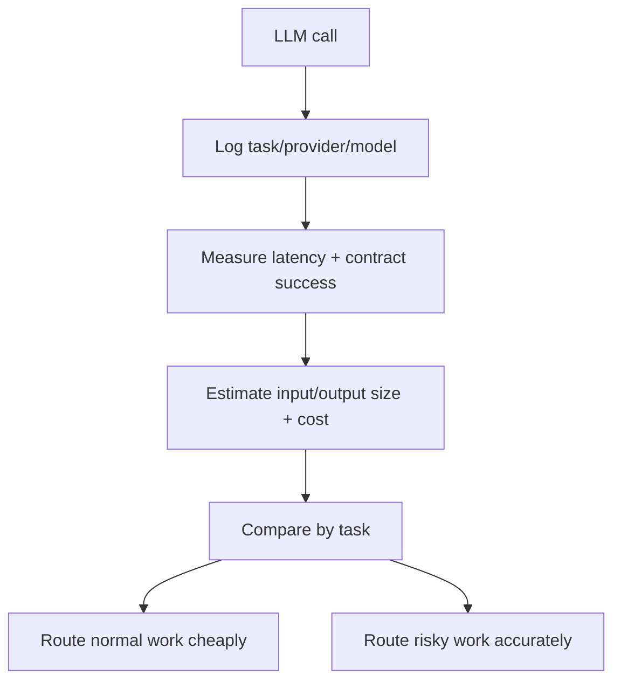

# SakethWiki Inference Engineering Report

## Answer

SakethWiki already has the beginning of inference engineering: task-based model routing, structured output contracts, fallback policy, prompt caching, explicit output token caps, lexical retrieval, optional embeddings, and conservative human review before durable writes.

The missing layer is measurement. Without per-task telemetry, routing is still mostly engineering judgment. With telemetry, routing becomes an optimization problem.



## What We Already Have

SakethWiki has task-aware inference through `backend/llm_client.py`. Each model call declares a task such as `ingest_extract`, `chat_answer`, `evolution_classify`, `lint_scan`, or `knowledge_gaps`. Environment variables can route these tasks to different providers or models without changing application code.

Critical tasks have fallback protection. If a cheaper or faster provider fails the contract, important paths can fall back to Anthropic. This matters because some tasks affect durable vault state, while others are low-risk conversational paths.

Structured output validation already exists for JSON-producing tasks. This catches empty responses, malformed JSON, and missing required keys before bad output can silently enter the system.

Prompt caching exists for Anthropic calls. The reason is simple: stable system prompts repeat across many calls. If the provider can cache the repeated instruction block, repeated calls can be cheaper and sometimes faster. This helps recurring tasks such as extraction, linting, analysis, and rewrite flows.

Output token budgets already exist because every `llm_client.complete(...)` call passes `max_tokens`. That bounds response size, but it is not yet full token engineering.

The memory layer is also inference-relevant. `backend/memory_store.py` keeps Markdown as source of truth, then builds a SQLite chunk index with lexical search and optional embeddings. This keeps retrieval local and explainable by default.

## What Is Missing

The missing layer is per-task telemetry.

Every LLM call should produce one operational log line with fields like:

```json
{
  "ts": "2026-07-05T17:20:00",
  "task": "ingest_extract",
  "provider": "openai_compat",
  "model": "gemini-2.5-flash",
  "duration_ms": 1320,
  "input_chars": 6412,
  "output_chars": 1180,
  "max_tokens": 1200,
  "expect_json": true,
  "contract_ok": true,
  "fallback_used": false,
  "error": null
}
```

This should go to `_wiki/meta/llm_call_logs.jsonl` or another meta log. It should not be mixed into concept pages.

Full token engineering should add input-size awareness. Today SakethWiki trims source text and retrieved context in several places, but it does not report what was lost. The system should be able to say:

```text
ingest_extract saw 43% of source text: 5,000 / 11,600 chars
chat_answer used 6 retrieved chunks and dropped 7 due to context budget
lint_scan capped each page at 1,200 chars
```

That reporting matters because model failures often look like reasoning failures when they are actually context failures.

Latency tracking is also missing. Timeouts exist, but timeouts only answer "did it finish?" They do not answer "which model is fastest enough for this task?" The system should know median, p95, failure rate, and fallback rate by task/provider/model.

Cost tracking is approximate but useful. Exact provider billing can be added later. A first pass can estimate cost from character counts or token estimates. The goal is not perfect accounting. The goal is to compare model routes.

## What We Do Not Need Yet

KV-cache engineering is not a near-term SakethWiki priority. KV-cache matters when we control the serving layer through local or hosted inference infrastructure. With Anthropic, Gemini, Qwen, or OpenAI-compatible APIs, most serving internals are provider-controlled. Prompt caching is the API-level feature that matters more right now.

Batching is not urgent for the interactive app. It becomes useful for bulk embedding generation, inbox processing, or large replay eval runs.

Serving-layer control is not necessary for current SakethWiki unless the goals become offline operation, privacy, high-volume ingestion, or local model experimentation. It will matter more for FactoryMind because industrial settings care about latency, edge deployment, privacy, uptime, and hardware constraints.

## Recommended SakethWiki Improvements

First, add `llm_call_logs.jsonl`. This is the smallest high-leverage improvement. It should wrap `llm_client.complete(...)` and record task, provider, model, duration, input/output size, contract status, fallback status, and error class.

Second, add context-budget reporting. Extraction responses should include source coverage. Chat responses should record retrieved chunks seen, chunks used, and chunks dropped. Linting should record page caps.

Third, add a simple telemetry dashboard or endpoint. It should answer:

```text
Which task is slowest?
Which model route fails contracts most often?
Which tasks use fallback most often?
Which prompts are near context limits?
Which routes are cheap but unreliable?
```

Fourth, use telemetry to tune routing. If Gemini works well for short text extraction but fails on image-heavy extraction, route image-heavy extraction to Claude. If chat answer quality is equal across models, use the cheaper/faster route.

## Current Implementation Status

This layer now exists in product code.

Runtime telemetry is written under `_wiki/meta/`:

```text
llm_call_logs.jsonl
context_budget_logs.jsonl
system_actions.jsonl
reports/inference-YYYY-MM-DD.md
```

`backend/llm_client.py` logs task, provider, model, latency, input/output size, JSON contract status, fallback use, and errors for each model call.

`backend/main.py` logs source coverage during ingestion and dropped retrieved context during chat. Runtime settings can now adjust `chat_context_budget` and `ingest_source_budget` after action candidates pass gates.

`ANALYZE_TRACES` is now an integrity route in config because Gemini Flash repeatedly failed its JSON contract in observed telemetry.

Operations UI exposes the telemetry, errors, reports, evals, and action queue. Reports can be opened directly from the app instead of only being written to disk.

The remaining improvement is cost estimation. We log character counts today; exact or approximate dollar cost per task/provider/model should be added once pricing tables are represented in config.

## FactoryMind Transfer

The FactoryMind version of this is stricter. Industrial agents cannot rely on "the answer looked good." The system must log the machine state, sensor window, tool/action selected, operator approval, latency, confidence, and post-action outcome.

For FactoryMind, inference telemetry should eventually include:

```text
machine_id
sensor_window_id
fault_type_candidate
model_route
retrieved_manual_sections
tool/action proposed
operator accepted/rejected
latency_ms
post_action_machine_state
safety_gate_triggered
```

That is the bridge from SakethWiki to hardware AI: every model call becomes part of an auditable control loop, not a chat event.
