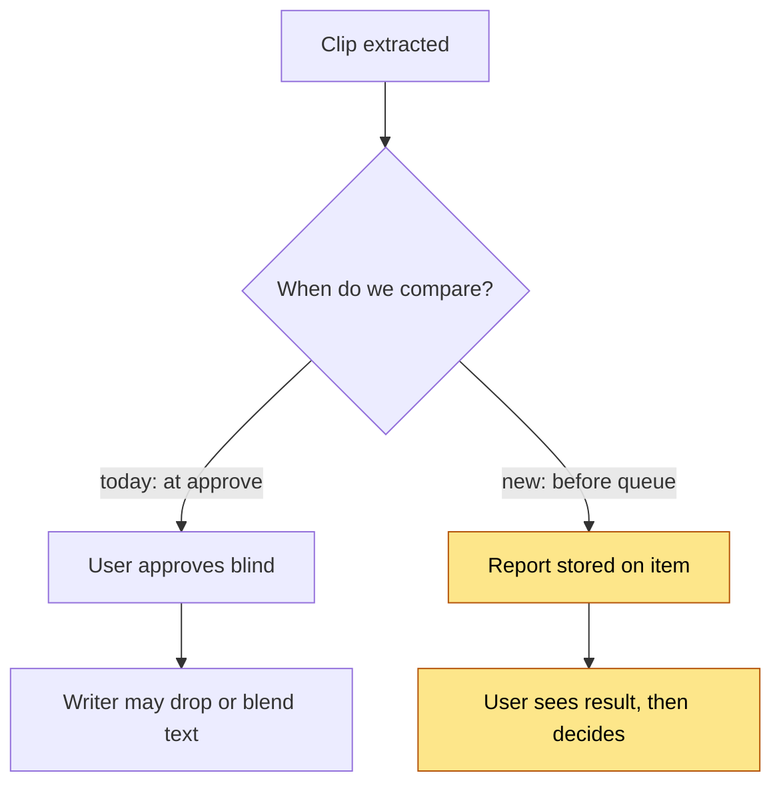
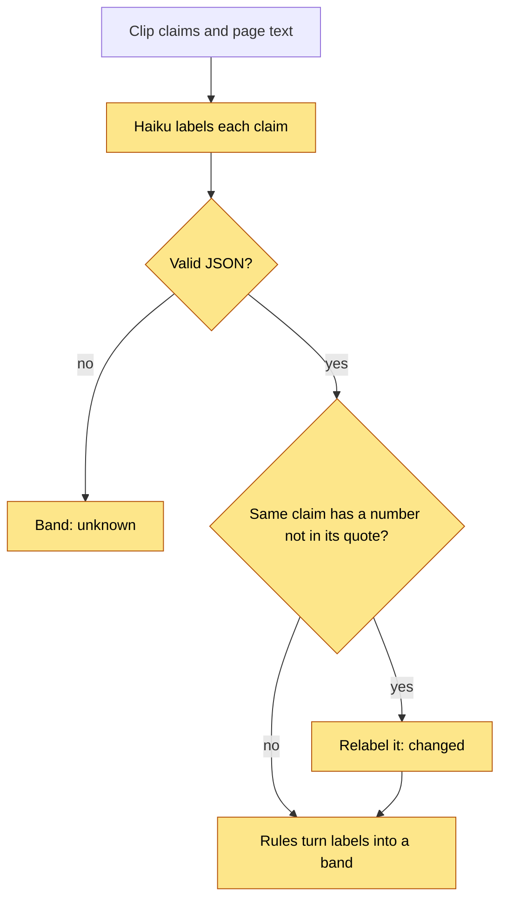
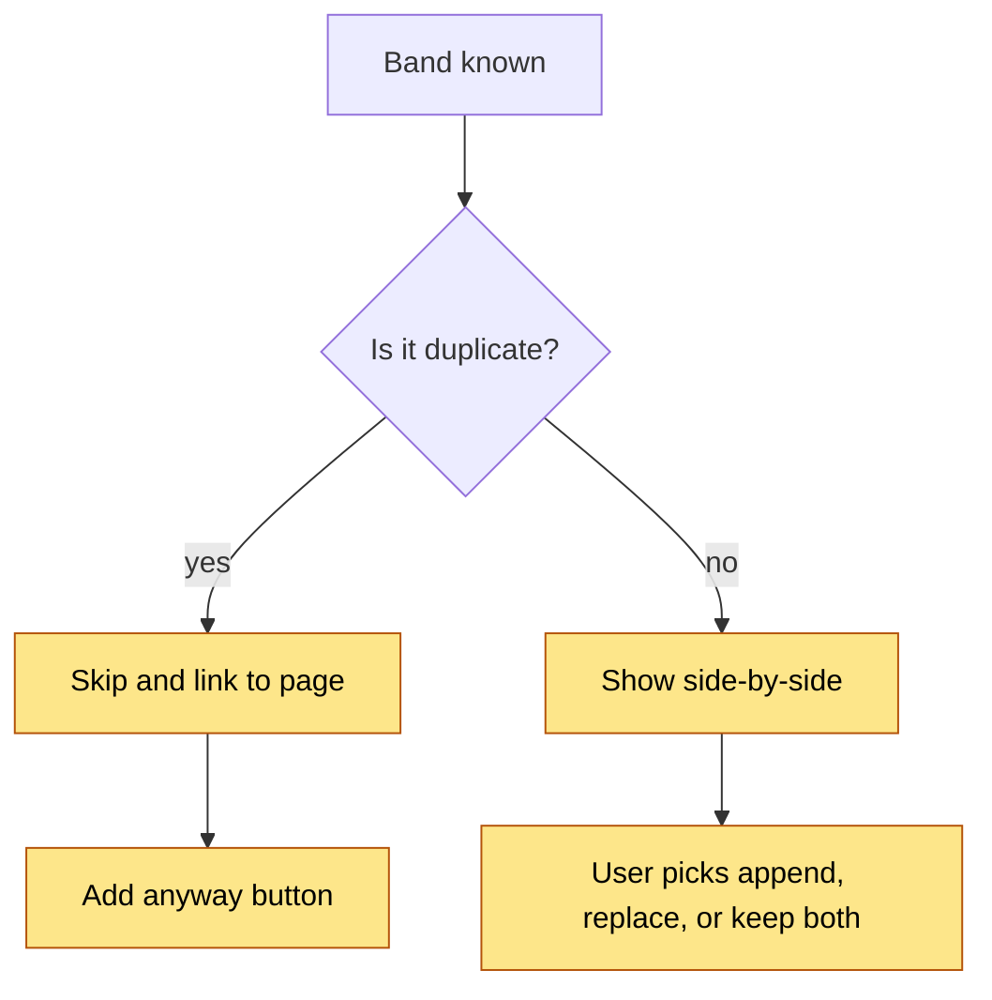
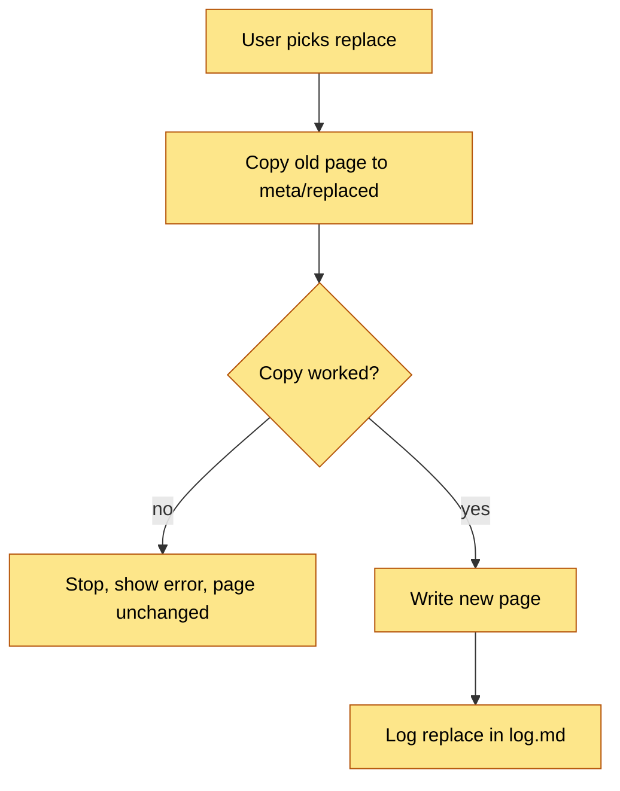
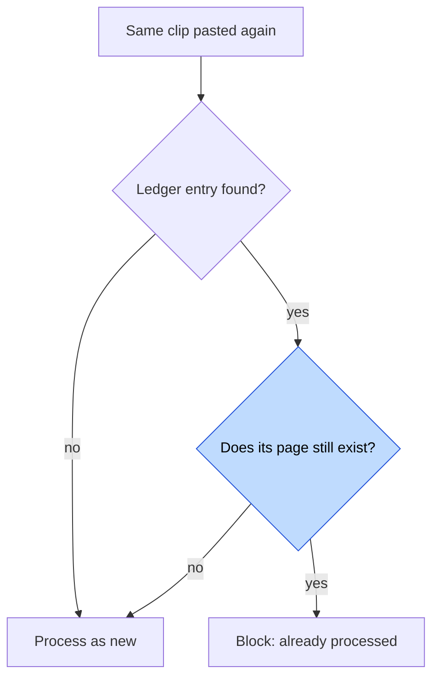
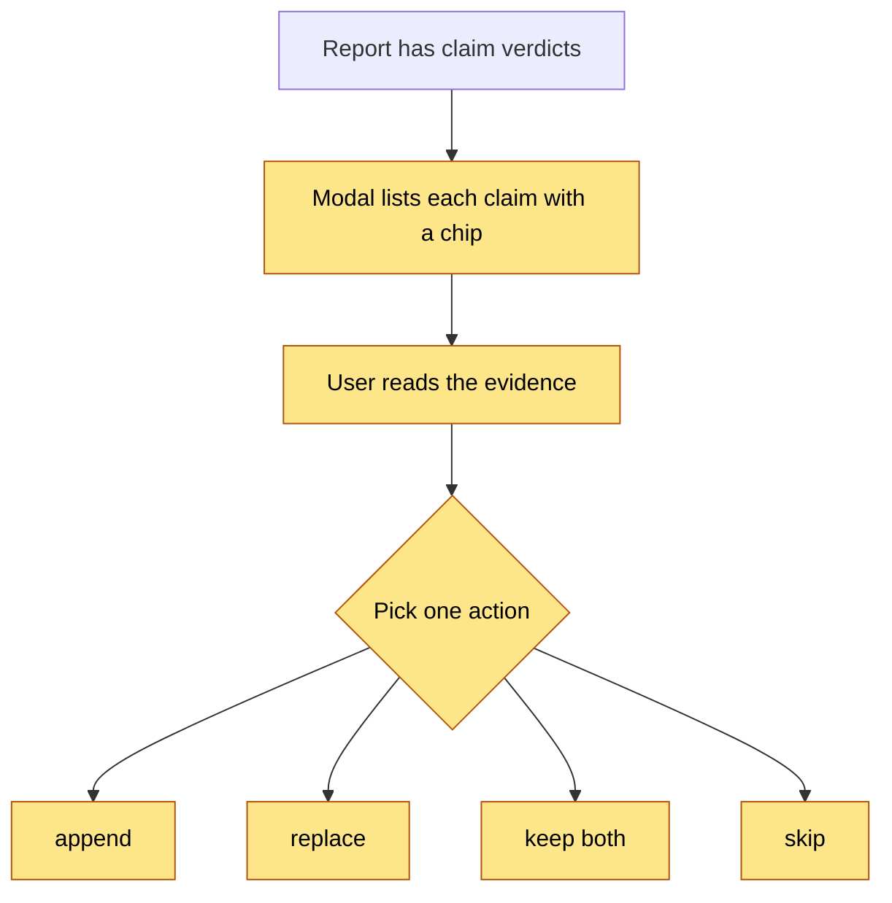
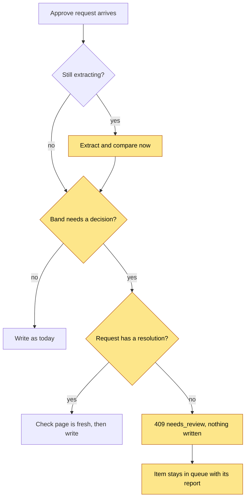

# Capture Conflict Review — Decisions

Each ADR lists what was given up. A decision with no downside is not finished.

## ADR 1 — Compare at capture time, not at approve time

### Visual Level

Level 3 for this change: [HTML explainer](../visuals/capture-conflict-review-flow.html). It covers the whole feature, so the other ADRs do not repeat it. Level 4 (narrated video) was skipped at the owner's request: the explainer page already shows the flow.

Yellow steps are new. The comparison moves ahead of the decision.

**Context.** `wiki_writer._analyze_evolution` already classifies a clip against its page (extends, refines, supersedes, duplicates, contradicts). It runs inside the approve call. The result is not shown first. A "duplicates" result drops the clip with no prompt.

**Options.** (a) Keep it at approve time and show a confirm dialog. (b) Run it when extraction finishes and store the result on the queue item. (c) Run it when you open the item.

**Choice.** (b). The queue can show a band badge on every row without extra clicks. The cost is paid once, in the background, not while you wait on a button.

**Consequences.** The report can go stale if a page changes before approval. `/approve` compares a page hash and asks for a refresh. The old approve-time classifier stays only as a fallback for items without a report.

**Given up.** Extraction takes a few seconds longer. A stored report can be wrong if the vault changes.

## ADR 2 — Bands come from a claim-level diff plus plain rules

### Visual Level

Yellow steps are all new. The LLM only labels claims. Code checks the numbers and picks the band.

**Context.** A similarity score cannot find a conflict. Two clips on parallel scans score high even when one says 204 s and the other says 90 s. `consolidation.py` scores page pairs this way, and that is right for finding merge candidates. It is not right for judging a new fact.

**Options.** (a) Score only: jaccard plus slug similarity. (b) Ask the LLM for a band directly. (c) Ask the LLM for a label per claim, then derive the band with fixed rules.

**Choice.** (c). Per-claim labels are `same`, `new`, `changed`, `conflicts`. Rules: any `changed` or `conflicts` gives `conflict`. Else any `new` gives `overlap`. Else all `same` gives `duplicate`. This is easy to test and the UI can show the labels as evidence. Two code checks guard the labels. A `same` claim needs an exact quote from the page, or it becomes `new`. A `same` claim whose numbers are not all in that quote becomes `changed`.

**Amendment after calibration (2026-10-06).** The first draft of this ADR had a token-overlap gate: if 90% of the clip's terms were on the page, call it `duplicate` with no LLM call. The calibration run showed that this marks a clip with one doubled number as a duplicate. 10 of 10 constructed conflicts were skipped. That is the exact failure this feature must prevent. The gate is removed. Token overlap now only picks the target page. The cost is one Haiku call for clips that really are duplicates.

**Consequences.** The band is explainable: you can point at the claim that caused it. The one threshold left is the 0.35 minimum overlap for a target page that the extractor did not name. The gate-only run puts 10 distinct pairs at 0.19 to 0.29 and 10 overlap pairs at 0.56 to 0.75, so 0.35 sits in the gap.

**Given up.** An extra Haiku call on every clip with a close page. Claim extraction can split or merge claims differently from run to run, so the same pair may get a different count of claims.

## ADR 3 — No automatic merge. Only `duplicate` acts alone, and only to skip

### Visual Level

Yellow steps are new. Everything except the duplicate skip waits for you.

**Context.** You asked whether the app should merge similar clips and leave different ones behind. Your first ingest was partly wrong. An automatic merge would copy that error into a page with the new text. You would find out later, if at all.

**Options.** (a) Auto-merge overlap, ask on conflict. (b) Ask for everything except duplicate. (c) Ask for everything.

**Choice.** (b). `duplicate` skips because the page already holds every claim, so nothing is lost. The skip shows a notice, links the page, and offers "Add anyway". A clip that is "too different" becomes a new page. It is never dropped.

**Consequences.** `overlap` clips need one click. This is the price of never changing a trusted page silently.

**Given up.** The fully hands-off flow you described. If review feels slow after a trial, a later ADR can add auto-append for `overlap` with a high recommendation score. That needs calibration data first.

## ADR 4 — `replace` archives the old page first

### Visual Level

Yellow steps are all new.

**Context.** When a clip contradicts a page and the clip is right, you need to overwrite the page. Overwrite with no copy is the failure mode you want to avoid.

**Options.** (a) Overwrite in place. (b) Archive then overwrite. (c) Use git history in the vault.

**Choice.** (b). The old page goes to `_wiki/meta/replaced/<slug>-<timestamp>.md`. The vault is not a git repo, so (c) is not available.

**Consequences.** Archived pages are not indexed or linked. They stay on disk until you delete them.

**Given up.** Disk space. Backlinks to the old page keep pointing at the new page, which may surprise you.

## ADR 5 — Treat the processed-clips ledger as a cache of the vault

### Visual Level

Blue marks the changed step. This fix ships in PR 7.

**Context.** The ledger is a second record of what is in the wiki. When you delete a page, the ledger disagrees with the vault.

**Choice.** An entry blocks only while its `file_written` page exists. This is PR 7. After this feature, the `duplicate` band covers repeated clips by content, so the ledger matters less.

**Consequences.** If the ledger and the vault disagree, the vault wins.

**Given up.** One file-exists check per matching ledger entry. Entries with no `file_written` still block.

## ADR 6 — Show claims, decide per page

### Visual Level

Yellow steps are all new.

**Context.** The best control is per-claim: keep claim 2, drop claim 3. That needs an editor for page text and a way to write a partial section.

**Choice.** Show per-claim evidence. Take one action per clip. If one claim is wrong, you can edit the clip text in the existing review editor before approving.

**Consequences.** A clip with 5 good claims and 1 bad claim needs an edit step.

**Given up.** Fine control. Revisit if you hit this often.

## ADR 7 — The server refuses a blind approve when the band needs a decision

### Visual Level

Yellow steps are new. Before this ADR, the "no" branch of the resolution question wrote the clip with the old approve-time classifier.

**Context.** ADR 3 says only `duplicate` may act without you. The review screen enforces that in the UI. Three server paths still bypass it. (1) `POST /approve/{id}` with no `resolution` uses the old classifier, which can drop a clip as "duplicates" or blend it into a page. (2) Approving an item that has not finished extracting extracts and writes with no comparison. (3) `/ingest-direct`, used only by the "Save now" button on a Share Sheet item that is still extracting, writes straight to the wiki.

**Options.** (a) Leave them: they need a deliberate click or an API call. (b) Close each path on its own. (c) One server rule: a clip whose band is `duplicate`, `overlap` or `conflict` is never written without a `resolution`. Paths 2 and 3 compare first, so the rule applies to them.

**Choice.** (c). `_decide_queue_item` returns 409 `needs_review` when the item's report needs a decision and the request has no `resolution`. For an item that was still extracting, the comparison runs first and the item is saved back to the queue with its report. `/ingest-direct` compares after extraction. A `distinct` or `unknown` clip is written as before. An `overlap` or `conflict` clip goes to the queue for review and the response says `needs_review`. A `duplicate` clip is not written and the response is the duplicate notice.

**Consequences.** "Save now" still saves in one click for a clip on a new topic. Every other clip waits for you. The 409 body carries the band and target page, so a caller can show a clear message.

**Given up.** "Save now" no longer always saves. Any automation that approved blind through the API gets 409 for clips that overlap or conflict. Items captured before this feature have no report and are not affected.

## Open questions

1. **Labels to correct.** `calibration_pairs.json` holds 40 pairs with proposed labels (10 each: duplicate, conflict, overlap, distinct). Open it, fix any `label` that is wrong, and set `reviewed` to true. Then run `python backend/calibrate_compare.py`. The 10 conflict pairs are constructed (one number doubled). The 10 overlap pairs are weak labels: they are real clips against a related page, and some may be duplicate or conflict.
2. **Call sites.** Built: the report is attached in `/ingest`, `/ingest-markdown` (and inbox clip staging), and the `/queue-url` background extraction, through one helper (`_attach_report`). The two remaining paths (`/ingest-direct` and approve-time extraction) were closed by ADR 7: `/ingest-direct` compares after extraction, and approve-time extraction compares before it writes. `docs/capture-queue` would reduce the paths to one worker if it is built.
3. **Contradiction with the code.** `wiki_writer._analyze_evolution` can still drop a clip as "duplicates" at approve time, even after you chose `append`. This design passes your resolution into the writer so the writer does not re-judge. Confirm that is the right behavior.
4. **Explainer ladder.** Level 3 is built. Level 4 (video) is skipped at the owner's request.
5. **Ledger removal.** Should the ledger be deleted after this ships? Not decided here.
6. **Hazards found during the build (not changed here).** `wiki_writer.py` reloads `.env` at import and overwrites a `VAULT_PATH` that is already set. A test or script that sets its own vault path can still write to the real vault. Also `test_e2e.py` leaves items in the real `hitl_queue.json`. Both are outside this change. They need their own fix.
