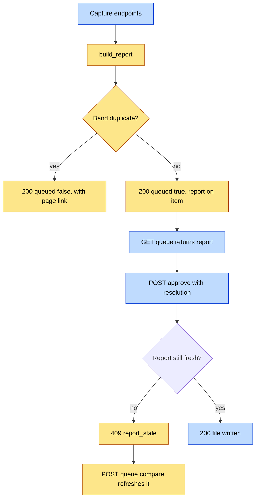

# Capture Conflict Review — API Contracts

## Visual Level



Yellow steps are new. Blue steps are existing endpoints with new fields. The only new route is `POST /queue/{id}/compare`.

## Module: `backend/capture_compare.py` (new)

```python
def build_report(item: dict) -> dict:
    """Return a ConflictReport for an extracted item. Never raises.
    Reads the vault. Writes nothing."""

def page_hash(slug: str) -> str:
    """sha256 of the page file bytes. Empty string if the page does not exist."""
```

## Schema: `ConflictReport`

Stored as `item["conflict_report"]`.

| Field | Type | Meaning |
|---|---|---|
| `band` | `"duplicate" \| "overlap" \| "conflict" \| "distinct" \| "unknown"` | Result of the rules |
| `target_page` | `str \| null` | Slug of the closest page. Null when band is `distinct` |
| `target_hash` | `str` | `page_hash` at compare time |
| `match_score` | `float` | Token overlap of clip and target, 0 to 1 |
| `claims` | `list[ClaimVerdict]` | Empty for the cheap-gate duplicate and for `distinct` |
| `recommended` | `"append" \| "replace" \| "keep_both" \| null` | Hint for the UI. Never applied automatically |
| `reason` | `str` | One sentence for the UI |
| `error` | `str \| null` | Set when band is `unknown` |
| `built_at` | `str` | ISO timestamp |

`ClaimVerdict`:

| Field | Type | Meaning |
|---|---|---|
| `claim` | `str` | Clip claim text |
| `verdict` | `"same" \| "new" \| "changed" \| "conflicts"` | Relation to the page |
| `page_quote` | `str \| null` | Matching page text. Required for `same`, `changed`, `conflicts`. Null for `new` |

Recommendation rules: `overlap` gives `append`. `conflict` gives `null`. `distinct` and `unknown` give `keep_both` when a target exists, else `null`.

Invariants: `band` follows the rule table in `logic_flow.md`. `claims` is non-empty when band is `overlap` or `conflict`. `page_quote` is a substring of the page text.

## Changed endpoints

### `POST /ingest-markdown`, `POST /ingest`, `POST /queue-url`

New optional request field: `force: bool = false`. When true, the duplicate gate is skipped.

New response for the duplicate band (HTTP 200):

```json
{
  "queued": false,
  "reason": "duplicate",
  "page": "dynamodb-parallel-scan-throughput",
  "matches": [{"claim": "...", "page_quote": "..."}]
}
```

For all other bands the response is unchanged, and the queue item carries `conflict_report`.

The old 409 "Clip already processed" stays for exact signature matches (PR 7 rules). Its body adds `"page": "<slug>"` so the UI can link to it.

### `GET /queue`

Each item adds `conflict_report` (ConflictReport or absent for items captured before this change).

### `POST /approve/{item_id}`

`ApproveRequest` gains one field.

```python
class ApproveRequest(BaseModel):
    approved: bool
    resolution: Optional[Literal["append", "replace", "keep_both"]] = None
    ...  # existing fields unchanged
```

Rules:

- `approved: false` is skip. `resolution` is ignored.
- `resolution` omitted: current behavior (approve-time classification). Kept for items with no report.
- `resolution` set and the item has a report: the target hash is checked first.

Responses:

| Status | Body | When |
|---|---|---|
| 200 | existing success body plus `"resolution": "<value>"` and `"archived": "<path>"` for `replace` | Written |
| 404 | existing | Item not found |
| 409 | `{"error": "report_stale", "target_page": "..."}` | Target hash changed since the report |
| 422 | standard | Unknown `resolution` value |
| 500 | `{"error": "archive_failed", ...}` | `replace` copy failed. Page unchanged |

## New endpoint

### `POST /queue/{item_id}/compare`

Rebuilds the report for one item. No body.

| Status | Body |
|---|---|
| 200 | `{"conflict_report": ConflictReport}` |
| 404 | Item not found |

Idempotent. Safe to call repeatedly. It does one Haiku call at most.

## Writer contract (`wiki_writer.write_approved`)

`write_approved(item)` reads `item["resolution"]` (set by `_decide_queue_item` from the request).

| `resolution` | Behavior | Returns |
|---|---|---|
| `append` | `_evolve_page` with `evolution_type` from the report. Never `duplicates` | relative path |
| `replace` | Copy old page to `_wiki/meta/replaced/<slug>-<UTC timestamp>.md`, then `_create_page` | relative path |
| `keep_both` | New slug `<slug>-N`, `_create_page`, mutual "Related" wikilink | relative path of the new page |
| unset | Current behavior | unchanged |

Errors: `replace` raises `ArchiveError` before any write if the copy fails.

## Frontend contracts

- `QueueSection` row: shows a `BandBadge` when `conflict_report` exists. Colors: duplicate gray, overlap blue, conflict amber, distinct green, unknown stone.
- `ConflictReviewModal({ item, onClose, onResolved })`: reads `item.conflict_report`, fetches the target page from the existing `/page/{name}` endpoint, renders claims, and calls `/approve/{id}`. On 409 it calls `/queue/{id}/compare` and re-renders.
- `IngestTab` duplicate notice: renders when a capture response has `queued: false`. Shows page link and "Add anyway" (resubmits with `force: true`).

## Tests required before merge

1. Rule table: every verdict combination gives the right band.
2. Cheap gate: identical text gives `duplicate` with zero LLM calls.
3. LLM failure gives `unknown` and the item still queues.
4. `replace` with a failing copy leaves the page byte-identical.
5. `approve` with a stale hash returns 409 and writes nothing.
6. `append` with a "duplicates" classifier result still writes the clip.
7. Calibration set: precision and recall of `duplicate` and `conflict` on labeled pairs (see ADR open question 1).
