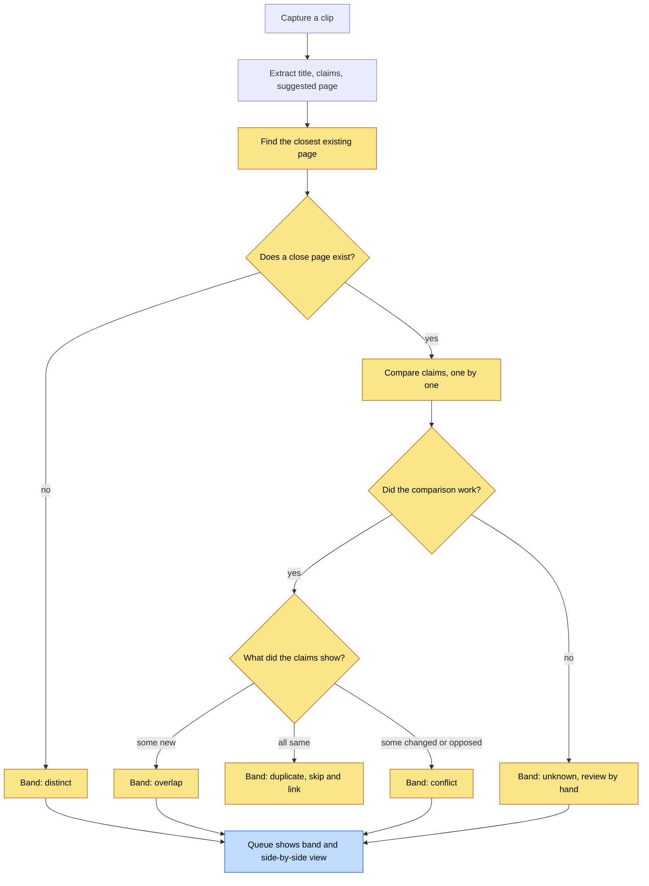

# Capture Conflict Review — Architecture

## Visual Level



Yellow steps are new. Blue steps change an existing screen. Today a clip goes from "Extract" straight to the queue, and the page comparison happens only after you press Approve. With this change, the comparison runs first and you see the result before you decide.

## Status

Implemented on branch `capture-conflict-review` (PR 8). The design was approved on 2026-10-06. Changes made during the build are marked in `adr.md` (ADR 2 amendment).

Explainer: [HTML page](../visuals/capture-conflict-review-flow.html) with a "today" lane and a "with this change" lane. A narrated video was dropped on 2026-10-06 at the owner's request.

## Complexity tier

**Single-process tool.** The app is one FastAPI process, one React page, and a folder of Markdown files. This change adds one Python module and one React component to that process. It adds no service, no database, and no queue broker. A larger tier is not needed. The work is one extra LLM call per clip and one new screen.

## Problem

Two failures showed up in real use.

1. You deleted a wiki page, pasted the same clip again, and got "Clip already processed". The processed-clips ledger still held the old entry. The ledger fix is in PR 7. It does not change the bigger problem below.
2. A clip on a topic that already has a page is compared with that page only at approve time. At that point the app may drop the clip silently ("duplicates") or merge it into the page. You never see what conflicts. Your first ingest was partly wrong, so a wrong page can absorb new text without a warning.

## Goal

Before you approve a clip, show how it relates to the closest existing page. Sort the result into four bands. Let you pick the action. Never delete or overwrite text without a way back.

## Terms

- **Claim**: one factual statement from the clip or the page, for example "a parallel scan with 8 segments finished in 204 s".
- **Band**: the label for how a clip relates to the closest page. The four bands are `duplicate`, `overlap`, `conflict`, `distinct`. A fifth value, `unknown`, means the comparison failed.
- **Conflict report**: the stored result of the comparison. It holds the band, the target page, and one verdict per claim.
- **Target page**: the existing page that the clip would join. The extractor suggests it. This change also checks for other similar pages.

## Components and data flow

```text
extraction finishes (4 call sites: /ingest, /ingest-markdown, /queue-url, clip staging)
  -> capture_compare.build_report(item)              [new module, backend/]
       1. pick target page  (suggested slug via identity.resolve_slug,
                             else best token-overlap page from vault_reader)
       2. claim diff        (one Haiku call: each clip claim vs page text;
                             a number in a "same" claim must be in the quote)
       3. derive band       (plain rules over claim verdicts, no LLM)
  -> item["conflict_report"] stored in hitl_queue.json
  -> GET /queue returns it
  -> QueueSection shows band badge; ConflictReviewModal shows side-by-side
  -> POST /approve/{id} with resolution = append | replace | keep_both
     (or reject = skip)
  -> wiki_writer applies the chosen resolution
```

The Markdown vault stays the only source of truth. The queue file stays derived state. `build_report` reads the vault and never writes to it.

## Boundaries

| Part | Owns | Must not |
|---|---|---|
| `capture_compare.py` | Target choice, claim diff, band rules | Write to the vault or the queue |
| `main.py` | When to call it, storing the report, resolution endpoint | Decide bands |
| `wiki_writer.py` | Applying `append`, `replace`, `keep_both` | Drop a clip the user chose to keep |
| `App.jsx` | Showing the report, collecting the user's choice | Compute bands |

## The four bands

| Band | Meaning | Default action |
|---|---|---|
| `duplicate` | Every clip claim is already on the page | Skip the clip. Show a notice with a link to the page and an "Add anyway" button. |
| `overlap` | Same topic. The clip adds claims and changes none | Show side-by-side. Recommend `append`. |
| `conflict` | At least one claim changes or opposes a page claim | Show side-by-side with the claims highlighted. No default. You choose. |
| `distinct` | No close page, or the clip covers a different topic | Queue as a new page. No extra step. |
| `unknown` | The comparison failed | Queue as normal. Show "Could not compare". Offer `keep_both`. |

Only `duplicate` acts without you, and that action only skips and links. The clip text stays in the capture notice until you dismiss it, so you can add it anyway.

## Key tradeoffs

- **No automatic merge.** A merge changes a page you already trust. Similarity scores cannot tell "same fact" from "same topic, different numbers". See ADR 3.
- **Claim-level display, page-level decision.** You see each claim's verdict. You pick one action for the whole clip. Per-claim choices need an editor and are out of scope. See ADR 6.
- **One extra Haiku call per clip that has a close page.** It adds a few seconds to extraction and a small cost. There is no cheap shortcut for duplicates. See ADR 2: a token-overlap shortcut hid changed numbers.

## Failure modes

| Failure | Result |
|---|---|
| Haiku call fails or returns bad JSON | Band `unknown`. Clip still queues. Nothing is dropped. |
| Clip arrives by Share Sheet (`/queue-url`) and is a duplicate | It stays in the queue with the "Already in wiki" badge. Nobody is waiting on a response, so it cannot show the capture notice. |
| Target page deleted between compare and approve | `resolution` falls back to `keep_both` behavior: write a new page. |
| Vault has no pages | Band `distinct` for every clip. |
| Report is old (page edited after compare) | `/approve` re-checks the page hash. If it changed, the UI asks you to refresh the report. |

## Out of scope

Per-claim merge editing. Automatic merge of any band. Cross-page merges of existing pages (the existing Consolidate tool keeps that job). Embedding search. Changing the processed-clips ledger beyond PR 7.

## Open questions

See `adr.md`, section "Open questions". They are kept in one place.
