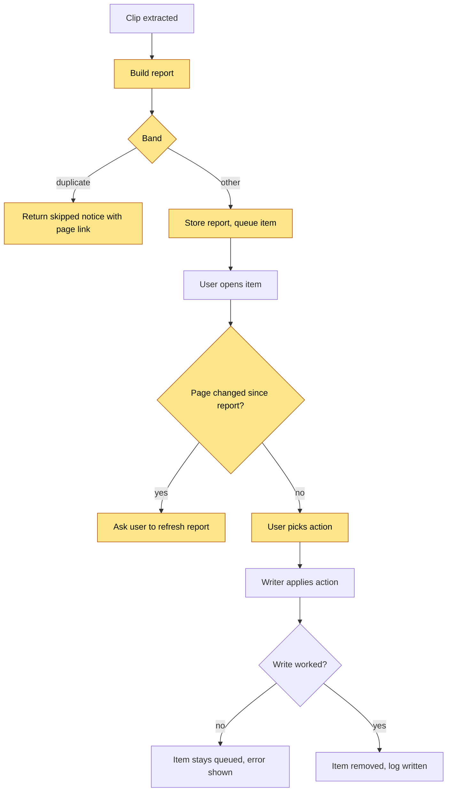

# Capture Conflict Review — Logic Flow

## Visual Level



Yellow steps are new or changed. The write step and the queue already exist. The failure paths are the stale-report check and the failed write.

## Path 1 — Build the report (after extraction)

Input: an extracted item with `summary`, `key_concepts`, `suggested_page`, `title`.

1. Resolve the target. Call `identity.resolve_slug(suggested_page)`. If that page exists, it is the target. If not, score every page by token overlap with the clip text. Take the best page if its score is 0.20 or more. If none, the band is `distinct`. Stop.
2. Read the target page. Cap the text at 6,000 characters. Strip frontmatter.
3. Cheap gate. If token overlap between the clip text and the page text is 0.90 or more, the band is `duplicate`. Stop. No LLM call.
4. Claim diff. Send the clip claims and the page text to Haiku. Ask for JSON: one verdict per clip claim, with a short page quote when the verdict is `same`, `changed`, or `conflicts`.
5. Validate the JSON. If it fails, retry once through `llm_client`. If it still fails, the band is `unknown`. Stop.
6. Derive the band with fixed rules.

| Verdicts present | Band |
|---|---|
| any `changed` or `conflicts` | `conflict` |
| else any `new` | `overlap` |
| else all `same` | `duplicate` |

7. Store the report on the item with the target's content hash and a timestamp.

The function never raises to the caller. An unexpected error gives band `unknown` and a logged warning.

## Path 2 — Duplicate band at capture time

When the band is `duplicate`, the endpoint does not queue the item. It returns HTTP 200 with `queued: false`, `reason: "duplicate"`, the page slug, and the matched quotes. The Capture screen shows a notice. It replaces the red "Clip already processed" error. The notice has an "Add anyway" button. That button resubmits with `force: true`. A forced clip skips the duplicate gate and goes through the full report.

## Path 3 — Review and resolve

1. `GET /queue` returns items with `conflict_report`.
2. The row shows a band badge. Click opens `ConflictReviewModal`.
3. The modal shows the page excerpt on the left and the clip on the right. A claim list shows one chip per claim. `conflict` claims show the page quote beside the clip claim.
4. The user picks one action.

| Action | Meaning |
|---|---|
| `append` | Add the clip to the target page as a new section. The writer updates the "Current understanding" block. |
| `replace` | Archive the target page, then write the clip as the page. |
| `keep_both` | Write the clip as a new page with a new slug. Link both pages. |
| `skip` | Reject the item. Same as today's Reject. |

5. The UI calls `POST /approve/{id}` with `resolution` (or `approved: false` for skip).

## Path 4 — Apply the resolution

Inside `_decide_queue_item`, before the write:

1. If `resolution` is set and the item has a report, compare the target page hash with the report's hash. On a mismatch, return HTTP 409 `report_stale`. The UI offers "Refresh report", which calls `POST /queue/{id}/compare`.
2. Call the writer with the resolution.
   - `append`: use the existing `_evolve_page` path. Take `evolution_type` from the report (`extends` for overlap, `refines` or `supersedes` for conflict). Never use `duplicates` here, because you chose to add the clip.
   - `replace`: copy the old page to `_wiki/meta/replaced/<slug>-<timestamp>.md`. If the copy fails, stop and leave the page unchanged. Then write the new page with `_create_page`.
   - `keep_both`: pick `<slug>-2` (then `-3` and so on) until the path is free. Write with `_create_page`. Add a "Related" wikilink in both pages.
3. Remove the item from the queue, write the trace, and record the clip in the ledger. These steps exist today.

## State transitions of a queue item

```text
extracting -> reported (band set) -> approved (removed)
                  |                      
                  +-> rejected (removed)
                  +-> stale (page changed) -> reported (after refresh)
extracting -> failed (existing behavior)
```

## Failure and retry behavior

| Step | Failure | Behavior |
|---|---|---|
| Report build | LLM error or bad JSON | One retry. Then band `unknown`. Item queues. |
| Report build | Page unreadable | Band `unknown`. |
| Resolve | Report stale | 409. UI asks for refresh. No write. |
| `replace` | Archive copy fails | Stop. Page unchanged. Error shown. |
| Any write | Exception | Item stays in the queue. Error shown. Same as today. |
| Duplicate notice | User ignores it | Nothing is lost. The clip text is still in the capture box until the user clears it. |

There is no automatic retry after the first. The user can press "Refresh report" at any time.

## Invariants

1. Only `duplicate` acts without the user, and it only skips.
2. No resolution deletes text without a copy in `meta/replaced`.
3. `build_report` never writes to the vault or the queue file.
4. A clip is never dropped for a reason the user cannot see.
