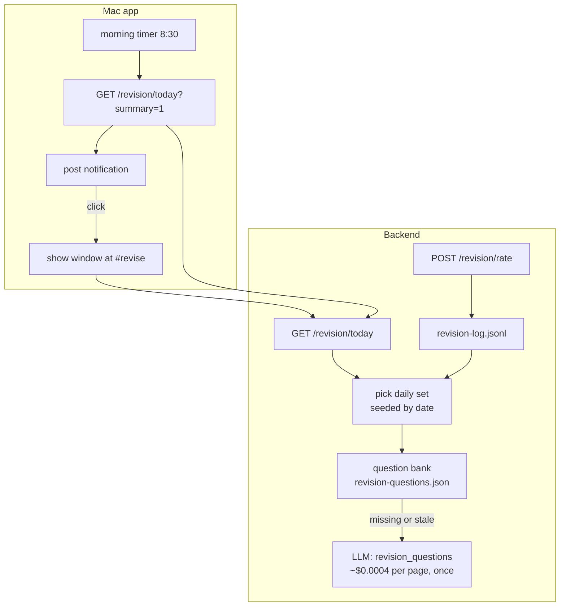

# Daily Revision — Architecture

## Plain summary

| | Before | Change | Fixes |
|---|---|---|---|
| Interview tab | You type a question and get an answer from your wiki, with optional grading. Used once, ever. | Replaced by a **Revise** tab: about 5 questions a day about pages you captured this week, weeks ago, and months ago. You recall, reveal the answer, and mark it "knew it", "shaky" or "forgot". | Captured pages get revisited on a schedule, instead of being saved and never read. |
| Topic of the day | Nothing. | One page a day, favouring weak or long-unread pages, at the top of the Dashboard with a "Deep dive" button. | A daily nudge to go deeper on one thing. |
| Reaching you | You had to open the app. | A Mac notification each morning: "Topic of the day: X · 5 revision questions ready". Clicking it opens the Revise tab. | Revision happens even on days you wouldn't have opened the app. |

## Purpose

SakethWiki's loop is capture → understand → recall. The dashboard shows the
recall half is weak: 73 approvals against 18 page reads in 30 days. This
change adds **scheduled recall**: the wiki picks what to revisit, asks you
about it, and adjusts based on how well you remembered.

It replaces Interview rather than adding a tab. Interview answered questions
you typed; revision asks you questions. That is the one useful idea Interview
had (testing yourself from memory), turned into a daily habit.

## Terms

- **Active recall.** Answering from memory before seeing the answer. It builds
  memory far better than rereading. This is why each item hides its answer
  until you've tried.
- **Spaced repetition.** Revisiting something after growing gaps: soon if you
  forgot it, later if you knew it. Here it is kept deliberately simple: the
  next date depends only on your last rating (see logic_flow.md).
- **Bucket.** Which age group a page falls in by its `date:` (first-captured)
  frontmatter: *this week* (≤ 7 days), *weeks ago* (8–45 days), *months ago*
  (≥ 46 days). The buckets are contiguous, so every page belongs to one. Mixing
  buckets means you revisit old knowledge, not only what's fresh. On the vault
  as of 2026-09-29: 14 / 53 / 143 eligible pages.
- **Daily set.** The questions for one calendar day. It is picked with a random
  generator seeded by the date. **Seeded** means the same input always gives
  the same output: the set changes every day but stays the same all day, and
  reopening the app doesn't reshuffle it.
- **Question bank.** Up to 3 question-and-answer pairs per page, written once by
  an LLM from that page and cached. Regenerated only when the page's content
  changes.

## Complexity tier

**Single-process web app plus the existing native wrapper.** No new service,
queue or database. New state is two small files in `_wiki/meta/`. The morning
timer lives in the Mac app, which already stays running after its window
closes. This is the smallest shape that can post a clickable Mac notification;
see ADR-2 for why the backend can't do it.

## Components

| Component | File | Change |
|---|---|---|
| Revision logic | `backend/revision.py` (new) | Bucketing, the seeded daily pick, topic of the day, spacing, question bank. Pure functions plus two small JSON files. |
| API | `backend/main.py` | `GET /revision/today`, `POST /revision/rate`. Remove `/interview` and its verifier and grader. |
| LLM task | `revision_questions` | New task name, routed like any other (default Gemini 2.5 Flash). |
| Frontend | `frontend/src/App.jsx` | `ReviseTab` replaces `InterviewTab`. Topic-of-the-day card on the Dashboard. Open the Revise tab when the URL hash is `#revise`. |
| Mac app | `macapp/main.swift` | Ask for notification permission once. A timer checks each morning, fetches today's summary and posts a notification. A click shows the window on `#revise`. |

## Data flow



*Caption: the Mac app only schedules and notifies. All choices about what to
revise happen in the backend. The LLM runs only when a picked page has no
cached questions, or its content changed.*

## What the daily set looks like

```
Revise · Tue 30 Sep                         3 of 5 done
┌─────────────────────────────────────────────────────┐
│ a few months ago · kv-cache                           │
│ Why does the KV-cache make decoding memory-bound       │
│ rather than compute-bound?                             │
│                                  [ Show answer ]       │
└─────────────────────────────────────────────────────┘
   after reveal:  answer (from your page) · open page
                  [ Forgot ]  [ Shaky ]  [ Knew it ]
```

*Caption: one card at a time. The answer is hidden until you ask for it, and
your rating decides when the page comes back.*

## Cost

The question bank is filled lazily: only pages that are actually picked get
questions. About 5 pages a day at about $0.0004 each (Gemini 2.5 Flash, one
page in, about 300 tokens out) is about $0.002 a day. Covering the whole vault
would cost about $0.10 once. Questions are reused until the page changes.

## What stays the same

- Chat is untouched.
- The Markdown vault is not written by this feature. Ratings and questions go
  to `_wiki/meta/`, not into pages.
- Read logging: opening a page from a revision card logs a read the normal way,
  through Browse.

## Out of scope

- Grading free-text answers with an LLM. You rate yourself (see ADR-3).
- Notifications on phone or email.
- A full spaced-repetition algorithm such as SM-2 (see ADR-4).

## Open questions

1. **Can an ad-hoc-signed app post notifications?** The Mac app is signed with
   `codesign --sign -`. macOS allows local notifications for such apps in most
   cases, but the permission prompt and delivery must be checked on this
   machine before anything else is built. If it fails, the fallback is
   `osascript -e 'display notification'` from the backend. That works
   unsigned, but it shows as coming from "Script Editor" and clicking it
   won't open SakethWiki.
2. **Notification time.** 8:30 local is a placeholder. What time do you want?
3. **The "questions asked" tile** counts chat plus interview questions. Once
   Interview is gone, should the dashboard show "revised" (ratings in 30 days)
   as its own tile, or add it to that count?
4. **If the app isn't running at 8:30,** should it notify on the next launch
   that day (this plan), or skip that day?
5. **Pages with little content.** Stubs with no summary and one short section
   make poor questions. This plan skips pages under 400 characters of body.
   Is that threshold right?

## Build notes (2026-09-29)

- **Answered with defaults:** notify at 08:30; if the app wasn't running then,
  notify on the next launch that day; skip pages under 400 characters; the
  dashboard shows "revised" as a fifth tile, separate from chat questions.
- **Gemini 2.5 Flash reasoning eats `max_tokens`.** At 800, every first call
  came back as 29–152 visible tokens of cut-off JSON. `max_tokens` is 3000;
  measured cost is about $0.0007 per page.
- **Set stability bug, fixed before release.** Rating a card excluded that
  page as "rated recently" and reshuffled today's set. Only ratings from
  before today now affect the pick. A test covers it.
- **Retry storm guard.** A page whose question generation fails isn't retried
  for 10 minutes, even though the UI polls every 3 s.
- **The `#revise` link is cleared** after the frontend handles it, so the next
  day's notification (same hash) still switches tabs.
- `/queue-gap` and its `GapQueueRequest` were removed with Interview; nothing
  else used them.
- Pre-existing dead code noticed, not touched: `FocusHomeCard` and
  `FOCUS_PRIMARY_TABS` / `FOCUS_SECONDARY_TABS` in `App.jsx` are unused.
