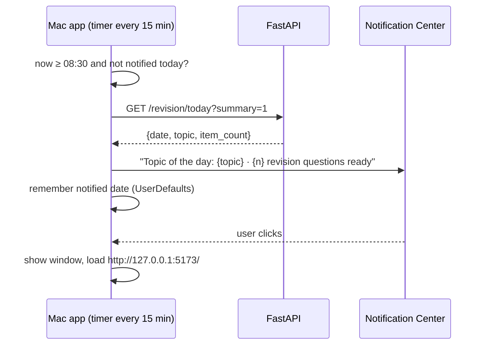

# Daily Revision — Logic Flow

## 1. Picking the daily set (`revision.pick_daily_set(day)`)

Inputs: every concept page (`slug`, `date:` frontmatter, body length), the
rating log, and `day` (local date).

```
rng      = Random(seed = day.isoformat())
eligible = pages with ≥ 400 chars of body          (stubs make poor questions)
due      = eligible pages whose next_due ≤ day      (from the rating log)
recent   = eligible, age ≤ 7 days,  not rated in the last 2 days
weeks    = eligible, age 8–45 days
months   = eligible, age ≥ 46 days             (contiguous: every page has a bucket)

set  = rng.sample(due, ≤ 2)                         due items first
set += rng.sample(recent − set, 1)
set += rng.sample(weeks  − set, 1)
set += rng.sample(months − set, fill to 5)
if still < 5: fill from any eligible page, via rng
```

`age` = `day − date:`. A page without a `date:` falls back to its file mtime.
All sampling goes through the one seeded `rng`, so the result is the same for
a given day and vault state.

## 2. Topic of the day (`revision.topic_of_the_day(day)`)

```
rng        = Random(seed = "topic:" + day.isoformat())
candidates = eligible pages not in today's set
weight(p)  = (100 − maturity(p)) + min(days_since_read(p), 90)
topic      = rng.choices(candidates, weights)[0]
```

Weak and long-unread pages are more likely, but never certain, so a strong
page can still come up. The "why" line shown with it is built from the
biggest term, e.g. "not read in 74 days" or "maturity 21".

## 3. Question bank (`revision.questions_for(slug)`)

```
content = read page
key     = sha256(content)
bank    = revision-questions.json[slug]
if bank and bank.content_sha == key: return bank.questions
questions = llm_client.complete(task="revision_questions",
                                expect_json=True,
                                required_json_keys=["questions"])
           # 2–3 {question, answer} pairs, grounded only in the page,
           # answers ≤ 3 sentences, questions that test understanding
           # ("why", "when", "trade-off"), not recall of wording
save revision-questions.json[slug] = {content_sha: key, questions, generated_at}
```

Today's item uses question index `rng.randrange(len(questions))` from the
day's seed, so the same page asks a different question on another day.

**Failure:** if the LLM call fails or breaks the JSON contract, that item is
returned with `question: null` and `status: "unavailable"`. The frontend skips
it, and it is retried next time `/revision/today` is called. One page never
blocks the rest.

## 4. `GET /revision/today`

```
day    = local today
set    = pick_daily_set(day)
topic  = topic_of_the_day(day)
items  = for each page in set: cached questions if present,
         otherwise status "preparing"
start a background thread that fills missing banks for today's pages
return { date, topic, items, ready: all items have a question }
```

With `?summary=1` (used by the Mac app) it returns only
`{date, topic, item_count}` and skips question details, so the notification
doesn't wait on the LLM.

The frontend polls every 3 s while `ready` is false, the same pattern the
capture queue uses.

## 5. Rating (`POST /revision/rate`)

```
append {ts, day, slug, rating} to revision-log.jsonl
next_due = day + interval(rating, previous interval)
            forgot → 1 day
            shaky  → 3 days
            knew   → previous knew interval × 2 (first time: 7), capped at 60
return { next_due }
```

The last rating per page wins. Its `next_due` feeds the `due` list in step 1.

## 6. The morning notification (Mac app)



*Caption: a coarse timer rather than an exact 8:30 alarm, so a Mac that was
asleep at 8:30 still notifies soon after waking. Remembering the date makes
sure it notifies at most once a day.*

Failure: if the backend is unreachable, the app tries again on the next tick.
It never notifies with empty content.

## 7. Removing Interview

1. Delete `POST /interview`, `_run_verifier`, `_run_grader` and
   `InterviewRequest` from `main.py`.
2. Delete `InterviewTab` and its localStorage helper. The tab entry becomes
   `{ id: "revise", label: "Revise" }`.
3. The Interview section's retrieval helper is shared with Chat, so it is kept.
4. Update the README task list (`INTERVIEW_VERIFY`, `INTERVIEW_GRADE` → removed;
   `REVISION_QUESTIONS` → added).
5. Old `interview_context` telemetry rows stay in the log. `_recall_stats`
   still counts them for past windows.
