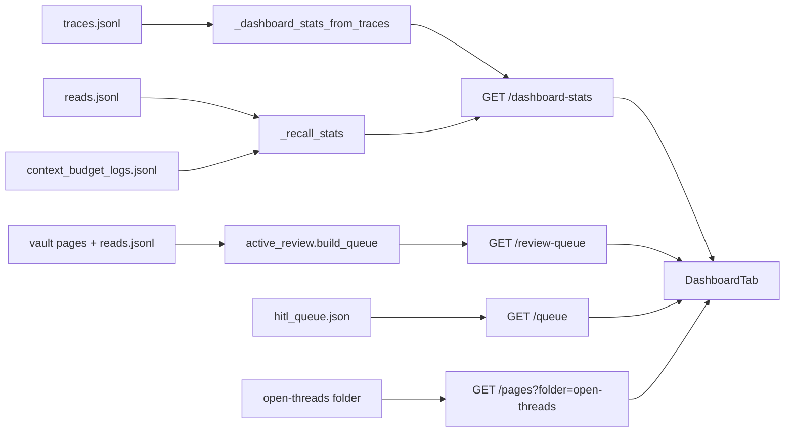

# Dashboard Refocus — Architecture

## Purpose of this change

SakethWiki's loop is **capture → understand → recall**. You capture a source,
the system turns it into a concept page, and later you come back to that page,
by reading it or by asking Chat a question it answers.

Today the Dashboard tab measures only the first step. Every number on it counts
approvals: approved entries, concepts touched, new concepts, approval rate, the
heatmap, and top tags. The live vault shows why that is misleading:

| Signal | Value (as of 2026-09-28) |
|---|---|
| Entries approved into the vault | 246 |
| Page reads ever logged | 34 |
| Chat questions in the last 30 days | 24 |
| Interview sessions ever | 1 |

The vault is mostly written and rarely read. A dashboard that only shows the
writing hides the thing most worth fixing.

This change makes the Dashboard answer two questions instead of one:

1. **Is the vault compounding?** Put capture and recall side by side.
2. **What should I do next?** Show a short, ranked list of pages that need
   attention, each with a suggested action.

It removes widgets that describe the past without leading to a decision.

## Complexity tier

**Single-process web app**, unchanged. One FastAPI backend, one React frontend,
a Markdown vault, and JSONL log files next to it. This change edits one
endpoint, deletes one endpoint, and rewrites one React component. It adds no
new service, store, or background job. Anything bigger would be wrong for a
single-user tool.

## Terms

- **Trace**: one line in `_wiki/meta/traces.jsonl`, written when you approve or
  reject a queue item. Capture metrics come from traces.
- **Read event**: one line in `_wiki/meta/reads.jsonl`, written by
  `POST /log-read` when you close a page in Browse. It records the page and how
  long it was open.
- **Context event**: one line in `_wiki/meta/context_budget_logs.jsonl`, written
  by `telemetry.log_context_event()`. Chat writes one `chat_context` event per
  question, and Interview writes one `interview_context` event per question. We
  count these as "questions asked". This file is plain telemetry and is **not**
  part of the `ENABLE_OPS` Operations subsystem.
- **Review queue**: `GET /review-queue`, backed by `active_review.build_queue()`.
  It ranks pages by deterministic signals: conflict markers, maturity, missing
  backlinks, staleness, and thin content. It gives each page a priority
  (high/medium/low), a list of reasons, and one suggested action.

## Components touched

| Component | File | Change |
|---|---|---|
| Dashboard stats | `backend/main.py` `_dashboard_stats_from_traces`, `GET /dashboard-stats` | Add a `recall` block: pages read and questions asked in the period. |
| Review-due endpoint | `backend/main.py` `GET /review-due` | **Delete.** It duplicates `/review-queue`, and it is broken (see below). |
| Dashboard tab | `frontend/src/App.jsx` `DashboardTab` | New layout, described below. |
| Review-due widget | `frontend/src/App.jsx` `ReviewDueSection` | Replaced by a "Next up" widget reading `/review-queue`. |
| Recently Read widget | `frontend/src/App.jsx` `RecentlyRead` | **Delete.** Replaced by the read-count tile. |

### Why `/review-due` goes

`/review-due` treats a page as due when it has not been read in 30 days and its
maturity is under 70. It builds its last-read map from `entry.get("page")` and
`entry.get("timestamp")`. But `/log-read` writes the keys `concept` and `ts`.
The keys never match, so **every read is ignored**, every page counts as "never
read", and the widget reported 200 of 202 pages as due.

`active_review._last_read_map()` already accepts both key spellings, and its
ranking uses more signals. Fixing `/review-due` would leave two review systems
that disagree. Deleting it leaves one.

## New Dashboard layout

```
┌──────────────────────────────────────────────────────────┐
│ Waiting: [3 in queue →Capture]  [7 open threads →Browse] │  only if non-zero
├──────────────────────────────────────────────────────────┤
│ Next up                                   61 high priority│
│  agent-cli-integration   no backlinks · add backlinks or… │
│  …up to 5 rows, click opens the page                      │
├──────────────┬──────────────┬──────────────┬──────────────┤
│ 73 approved  │ 9 pages read │ 24 questions │ 48% approval │
│    30d       │    30d       │   asked 30d  │   rate 30d   │
├──────────────┴──────────────┴──────────────┴──────────────┤
│ Approved ingestion activity (heatmap, unchanged)          │
└──────────────────────────────────────────────────────────┘
```

*Caption: the tab now reads top to bottom as "what's waiting on me", "what to
fix next", "am I only writing or also recalling", then the long-run habit view.*

### What is removed and why

| Removed | Reason |
|---|---|
| Top tags | Describes what you captured. It never changes what you do next. |
| Recently Read list | Five page names with timestamps. The read-count tile carries the useful part. |
| "Concepts touched" tile | Tracks the "approved" tile almost one-for-one. |
| "New concepts 7d" tile | Another capture-side count. The slot goes to a recall metric. |
| Due for review (`/review-due`) | Broken and duplicated. Replaced by Next up. |

(Removed in the previous step, already live: Velocity/Rejected row, the
approval-rate footnote, System health, and source chips.)

## Data flow



*Caption: the tab makes four read-only calls in parallel. Only
`/dashboard-stats` changes. The other three endpoints already exist and are
reused as they are.*

## What stays exactly as it is

- The Markdown vault and every write path. This change only reads.
- `traces.jsonl`, `reads.jsonl`, and the telemetry file formats.
- `/review-queue`, `/queue`, `/pages`, and the Browse tab's own review UI.
- The heatmap and how it is computed.
- The Operations tab and the `ENABLE_OPS` gate.

## Out of scope

- A reads row on the heatmap (see open questions).
- Fixing why reads are rarely logged. Only closing a page in Browse writes a
  read event. That is a product question, not a dashboard one.
- Deleting `GET /recent-reads`, which becomes unused (see open questions).

## Open questions

1. **Read logging coverage.** Only Browse logs reads. Pages opened from a Chat
   citation or from "Open saved page" after an approval may not log anything.
   The "pages read" tile could undercount. I have not traced every path that
   opens a page. Should that be checked before shipping, or is an undercount
   acceptable for a first version?
2. **`/recent-reads` becomes dead code** once `RecentlyRead` is removed. Delete
   it in this change, or leave it?
3. **Unused response fields.** `top_tags`, `top_sources`, `learning_velocity`,
   and `unique_concepts` will have no UI consumer. This plan keeps them (see
   ADR-3). Confirm that's what you want.
4. **Heatmap reads overlay.** Showing reads next to captures on the heatmap
   would make the ratio visible over time. Worth a follow-up?
