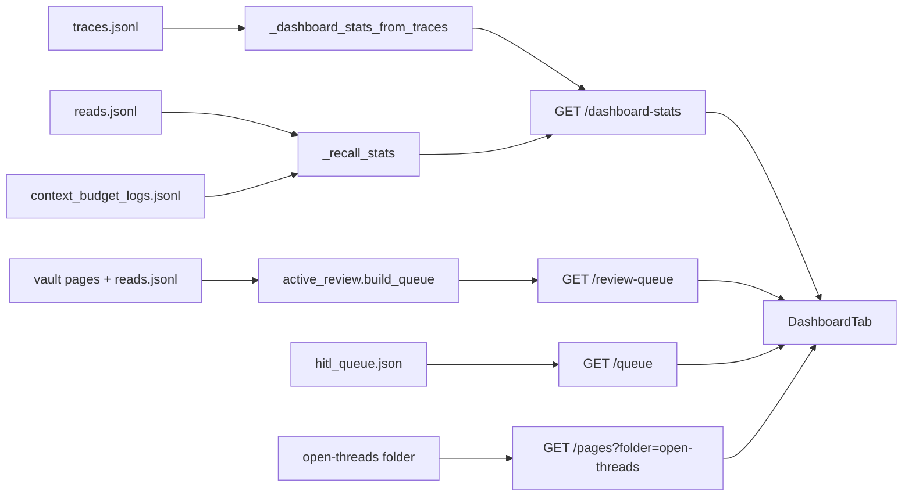

# Dashboard Refocus — Architecture

## Purpose of this change

SakethWiki's loop is **capture → understand → recall**. You capture a source,
the system turns it into a concept page, and later you come back to that page,
by reading it or by asking Chat a question it answers.

Today the Dashboard tab measures only the first step. Every number on it counts
approvals: approved entries, concepts touched, new concepts, approval rate, the
heatmap, and top tags. The live vault shows why that is misleading:

| Signal | Value (as of 2026-09-28) |
|---|---|
| Entries approved into the vault | 246 |
| Page reads ever logged | 34 |
| Chat questions in the last 30 days | 24 |
| Interview sessions ever | 1 |

The vault is mostly written and rarely read. A dashboard that only shows the
writing hides the thing most worth fixing.

This change makes the Dashboard answer two questions instead of one:

1. **Is the vault compounding?** Put capture and recall side by side.
2. **What should I do next?** Show a short, ranked list of pages that need
   attention, each with a suggested action.

It removes widgets that describe the past without leading to a decision.

## Complexity tier

**Single-process web app**, unchanged. One FastAPI backend, one React frontend,
a Markdown vault, and JSONL log files next to it. This change edits one
endpoint, deletes one endpoint, and rewrites one React component. It adds no
new service, store, or background job. Anything bigger would be wrong for a
single-user tool.

## Terms

- **Trace**: one line in `_wiki/meta/traces.jsonl`, written when you approve or
  reject a queue item. Capture metrics come from traces.
- **Read event**: one line in `_wiki/meta/reads.jsonl`, written by
  `POST /log-read` when you close a page in Browse. It records the page and how
  long it was open.
- **Context event**: one line in `_wiki/meta/context_budget_logs.jsonl`, written
  by `telemetry.log_context_event()`. Chat writes one `chat_context` event per
  question, and Interview writes one `interview_context` event per question. We
  count these as "questions asked". This file is plain telemetry and is **not**
  part of the `ENABLE_OPS` Operations subsystem.
- **Review queue**: `GET /review-queue`, backed by `active_review.build_queue()`.
  It ranks pages by deterministic signals: conflict markers, maturity, missing
  backlinks, staleness, and thin content. It gives each page a priority
  (high/medium/low), a list of reasons, and one suggested action.

## Components touched

| Component | File | Change |
|---|---|---|
| Dashboard stats | `backend/main.py` `_dashboard_stats_from_traces`, `GET /dashboard-stats` | Add a `recall` block: pages read and questions asked in the period. |
| Review-due endpoint | `backend/main.py` `GET /review-due` | **Delete.** It duplicates `/review-queue`, and it is broken (see below). |
| Dashboard tab | `frontend/src/App.jsx` `DashboardTab` | New layout, described below. |
| Review-due widget | `frontend/src/App.jsx` `ReviewDueSection` | Replaced by a "Next up" widget reading `/review-queue`. |
| Recently Read widget | `frontend/src/App.jsx` `RecentlyRead` | **Delete.** Replaced by the read-count tile. |

### Why `/review-due` goes

`/review-due` treats a page as due when it has not been read in 30 days and its
maturity is under 70. It builds its last-read map from `entry.get("page")` and
`entry.get("timestamp")`. But `/log-read` writes the keys `concept` and `ts`.
The keys never match, so **every read is ignored**, every page counts as "never
read", and the widget reported 200 of 202 pages as due.

`active_review._last_read_map()` already accepts both key spellings, and its
ranking uses more signals. Fixing `/review-due` would leave two review systems
that disagree. Deleting it leaves one.

## New Dashboard layout

```
┌──────────────────────────────────────────────────────────┐
│ Waiting: [3 in queue →Capture]  [7 open threads →Browse] │  only if non-zero
├──────────────────────────────────────────────────────────┤
│ Next up                                   61 high priority│
│  agent-cli-integration   no backlinks · add backlinks or… │
│  …up to 5 rows, click opens the page                      │
├──────────────┬──────────────┬──────────────┬──────────────┤
│ 73 approved  │ 9 pages read │ 24 questions │ 48% approval │
│    30d       │    30d       │   asked 30d  │   rate 30d   │
├──────────────┴──────────────┴──────────────┴──────────────┤
│ Approved ingestion activity (heatmap, unchanged)          │
└──────────────────────────────────────────────────────────┘
```

*Caption: the tab now reads top to bottom as "what's waiting on me", "what to
fix next", "am I only writing or also recalling", then the long-run habit view.*

### What is removed and why

| Removed | Reason |
|---|---|
| Top tags | Describes what you captured. It never changes what you do next. |
| Recently Read list | Five page names with timestamps. The read-count tile carries the useful part. |
| "Concepts touched" tile | Tracks the "approved" tile almost one-for-one. |
| "New concepts 7d" tile | Another capture-side count. The slot goes to a recall metric. |
| Due for review (`/review-due`) | Broken and duplicated. Replaced by Next up. |

(Removed in the previous step, already live: Velocity/Rejected row, the
approval-rate footnote, System health, and source chips.)

## Data flow



*Caption: the tab makes four read-only calls in parallel. Only
`/dashboard-stats` changes. The other three endpoints already exist and are
reused as they are.*

## What stays exactly as it is

- The Markdown vault and every write path. This change only reads.
- `traces.jsonl`, `reads.jsonl`, and the telemetry file formats.
- `/review-queue`, `/queue`, `/pages`, and the Browse tab's own review UI.
- The heatmap and how it is computed.
- The Operations tab and the `ENABLE_OPS` gate.

## Out of scope

- A reads row on the heatmap (see open questions).
- Fixing why reads are rarely logged. Only closing a page in Browse writes a
  read event. That is a product question, not a dashboard one.
- Deleting `GET /recent-reads`, which becomes unused (see open questions).

## Open questions

1. **Read logging coverage.** Only Browse logs reads. Pages opened from a Chat
   citation or from "Open saved page" after an approval may not log anything.
   The "pages read" tile could undercount. I have not traced every path that
   opens a page. Should that be checked before shipping, or is an undercount
   acceptable for a first version?
2. **`/recent-reads` becomes dead code** once `RecentlyRead` is removed. Delete
   it in this change, or leave it?
3. **Unused response fields.** `top_tags`, `top_sources`, `learning_velocity`,
   and `unique_concepts` will have no UI consumer. This plan keeps them (see
   ADR-3). Confirm that's what you want.
4. **Heatmap reads overlay.** Showing reads next to captures on the heatmap
   would make the ratio visible over time. Worth a follow-up?

---

# Round 2 (2026-09-28): trend arrows and a Tidy up list

Round 1 above is built. This round adds two things. It was written after the
maturity backfill pushed high-priority pages from 61 to 113, most of them
flagged "add real backlinks or merge/delete".

## Plain summary

| | Before | Change | Fixes |
|---|---|---|---|
| Trends | Each tile shows only this period's number. | Each tile also shows the change against the previous 30 days, e.g. "↑3". | You can see whether a decision like "pause capture" is working. |
| Tidy up | Likely duplicate pages exist, but nothing shows them. A finder exists in code, but it was too slow to use and hid every real duplicate as "weak". | A "Tidy up" card lists the top likely-duplicate pairs. Each pair has a Merge button that uses the existing merge action. | You see where to consolidate and can act on it in one click. |

## Part A: trend arrows

**Term: previous period.** The 30 days before the current 30-day window, so
days 31–60 before now. Comparing like-length windows keeps the arrow honest.

The four tiles each get a delta line:

```
┌──────────────┐
│     74       │
│  approved    │
│  ↓ 9 vs prev │   ← new: current − previous, over the same length window
└──────────────┘
```

*Caption: the delta is plain subtraction. For approval rate it is in
percentage points. No arrow is shown when the previous period has no data.*

Colour is neutral (stone) for all tiles. "Approved going down" is good or bad
depending on what you are trying to do this month, so the dashboard shows the
direction and leaves the judgement to you.

Data: `_dashboard_stats_from_traces` and `_recall_stats` already take `now` and
`period_days`. The endpoint calls each twice, once with `now` and once with
`now - period_days`, and returns the second result as `previous`. No new log
files are read.

## Part B: Tidy up

### How duplicates are found (no LLM)

`consolidation.find_candidates` scores every pair of concept pages:

- **Slug similarity**: how alike the two file names are, as a 0–1 ratio
  (`difflib.SequenceMatcher`). `agent-driven-trace-investigation` and
  `agent-trace-investigation` score high.
- **Token overlap (Jaccard)**: the share of words the two pages have in common
  across title, current-understanding block and tags. Jaccard means
  |shared words| ÷ |all distinct words in either|.
- **Score** = 0.55 × slug similarity + 0.45 × token overlap.
- **Alias match**: if `identity.resolve_slug` maps both to one canonical page,
  the score is forced to 0.98.

This is cheap, deterministic and explainable: every pair comes with the reason
it was flagged.

### Two problems found and one already fixed

1. **Speed (fixed in this round, bug fix).** Scoring ~23,000 pairs re-parsed
   both pages for every pair, and `identity.resolve_slug` re-read every page in
   the vault on every call. On 215 pages it did not finish in 5 minutes. Both
   are now cached per run (cleared at the start of each run so edits are never
   stale). A run now takes about 2 seconds (after the alias-map cache below).
2. **Cut-off too strict (this proposal).** Only pairs scoring ≥ 0.62 are shown.
   On the real vault that is zero pairs. The real duplicates score 0.45–0.57:

| Score | Pair | Real duplicate? |
|---|---|---|
| 0.566 | model-training-fundamentals ↔ model-training-methodology | yes |
| 0.555 | agent-driven-trace-investigation ↔ agent-trace-investigation | yes |
| 0.549 | llm-cost-observability ↔ llm-observability | likely overlap |
| 0.533 | phase-2-text-to-vector-embeddings ↔ text-to-vector-embeddings | yes |
| 0.517 | mcp-streamablehttp-transport ↔ mcp-streamablehttp-transport-and-state | yes |
| 0.513 | data-preparation-for-genai ↔ data-preparation-for-traditional-ml | related, not duplicate |
| 0.490 | evaluation-datasets-for-ai-systems ↔ regression-testing-for-ai-systems | related, not duplicate |
| 0.478 | reflection-and-external-feedback-in-agentic-ai ↔ the-reflection-pattern-in-agentic-ai | yes |

*My own judgement from the titles, not verified by reading the pages.*

Roughly 5 of the top 8 are real. That is good enough for a short list you
review by eye, not good enough for anything automatic.

### Layout

```
┌───────────────────────────────────────────────────────────┐
│ Tidy up · possible duplicates             you decide each │
│  model-training-fundamentals → model-training-methodology │
│   similar names · shared concept text   0.57   [Merge]    │
│  …up to 8 pairs                                            │
└───────────────────────────────────────────────────────────┘
```

Placed below Next up. It loads last, since the scan takes a few seconds, and
shows "Scanning for duplicates…" until then.

**Merge** opens the existing `ConsolidateModal` prefilled with the pair. It
calls `POST /consolidate` with `force: true`, because every candidate here is
below the "safe_auto" bar by design. The modal already states that the source
page will be deleted.

### Why not an LLM (answer to the Qwen question)

Finding candidates does not need an LLM. The scorer above already puts the
real duplicates at the top. What it can't do is tell "duplicate" from "closely
related". An LLM judge could, but you can too, in about two seconds per pair,
and you see eight pairs at a time. The LLM is already used where it earns its
cost: writing the merged page (`consolidate_pages` task).

Routing that merge to Qwen is one env var
(`LLM_PROVIDER_CONSOLIDATE_PAGES=qwen`). This proposal does **not** do that.
The merge rewrites your notes and deletes a page, and the README's recommended
profile keeps it on Anthropic for exactly that reason. It is your call, and it
can be changed later without code changes.

## Open questions (round 2)

5. ~~Merge has no preview.~~ **Resolved.** `/consolidate` takes
   `dry_run: true` to return the LLM draft without writing. Applying sends that
   draft back with content hashes of both pages, and the server refuses (409)
   if either page changed since. Before writing, both originals are copied to
   `_wiki/meta/consolidation-backups/<timestamp>/`. The modal shows the draft
   and warns when the draft is under 60% of the two originals' combined size.
   First real test: the top pair's draft kept 49% and the warning fired.
6. ~~Dismissing a false pair.~~ **Resolved.** "Not a duplicate" writes the
   pair (order-independent) to `_wiki/meta/consolidation-dismissed.json`, and
   `find_candidates` skips it.
7. ~~`identity.resolve_slug` is slow everywhere.~~ **Resolved in this round.**
   `alias_map()` is now cached until a concept page or `aliases.json` changes
   (checked by file mtimes). Lookups dropped from ~36 ms to ~0.7 ms, and the
   duplicate scan from ~6 s to ~1.8 s.

## Round 3 (2026-09-29): side-by-side compare

| | Before | Change | Fixes |
|---|---|---|---|
| Deciding a pair | The card showed two truncated names and a score. Deciding meant leaving the dashboard. | Each row has one **Compare** button. It opens both pages side by side: full title, slug, summary (or first notes when there's no summary), section titles, tags, size, how many pages link in, maturity, and whether each already links to the other. | You can decide each pair in seconds without leaving the dashboard. |
| Related pages | "Not a duplicate" hid the pair but left both pages unconnected. | **Link them** adds `See also: [[other]]` to both pages via the existing `/add-link` (no LLM), then hides the pair. | The "related but distinct" case gets a real fix, and orphan pages gain links. |
| Oversized merges | Merging two big pages produced a cut-off draft. | `/consolidate` refuses to draft when both pages together exceed `CONSOLIDATE_MAX_INPUT_CHARS` (12,000, matching `max_tokens=3000`). The compare view disables Merge and says why. | Pages that can't be merged cleanly aren't offered for merging. |

The compare view loads each page through the existing `GET /page/{name}`, so
no new endpoint was needed. `/consolidation-candidates` now also returns
`merge_max_chars`, so the UI and the server share one limit.

Known limit, not caused by this change: at phone width the app's tab bar makes
the page 565 px wide, so full-screen overlays (this one included) extend past a
375 px screen. The Mac app and desktop are unaffected.
