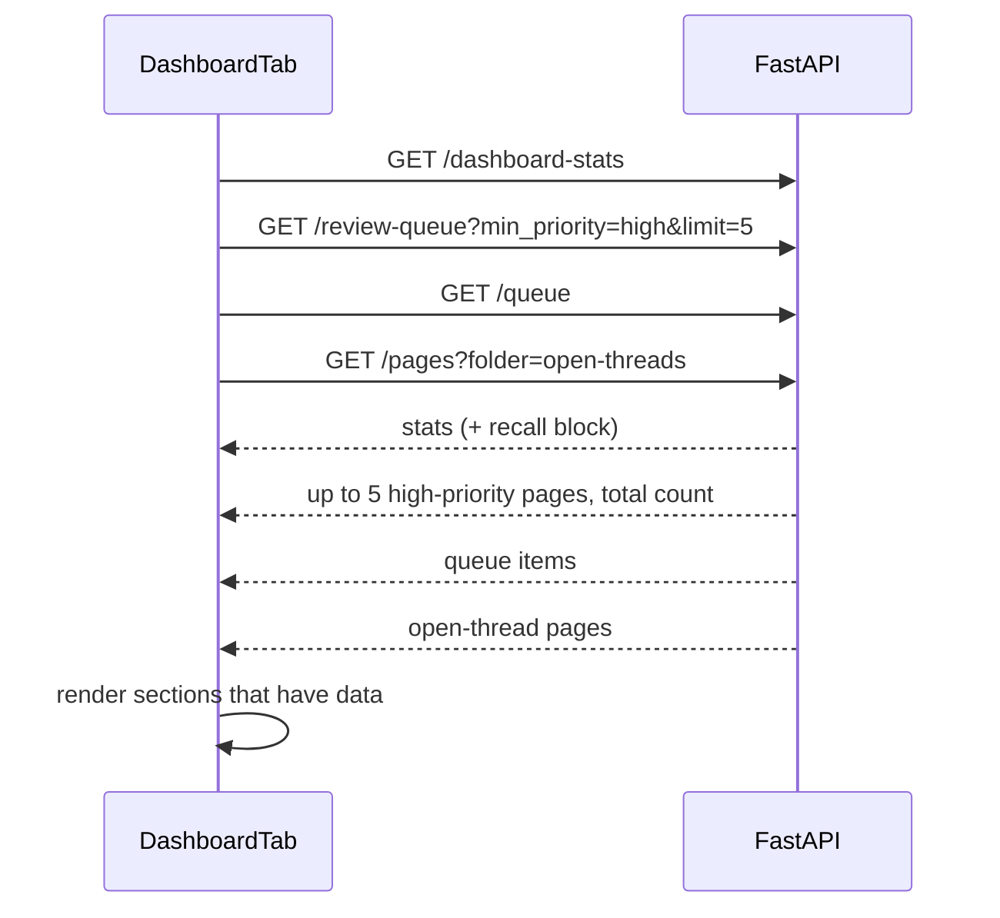
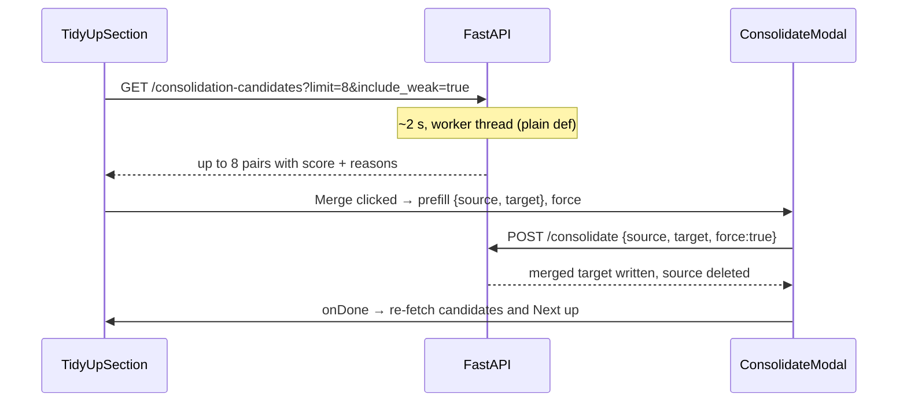

# Dashboard Refocus — Logic Flow

## 1. Loading the Dashboard tab



*Caption: four independent read-only calls run in parallel with
`Promise.all`. None writes anything.*

Step by step:

1. On mount, `DashboardTab` starts `/review-queue` on its own, and the other three together with `Promise.all`. Next up fills in when the slower ranking returns, so it never delays the tiles.
2. `/dashboard-stats` is **required**. If it fails, the tab shows the existing
   "Failed to load dashboard stats." message, as today.
3. The other three are **optional**. Each is wrapped in `.catch(() => null)`. A
   failure hides that one section and leaves the rest of the tab working. This
   matches how the old tab treated `/operations-overview`.
4. Rendering, top to bottom:
   - **Waiting chips**, if queue count > 0 or open-thread count > 0. The queue
     chip calls `onGoCapture()`. The threads chip calls `onNavigateToConcept()`,
     which opens Browse.
   - **Next up**, if `/review-queue` returned any pages. The header shows the
     `total` from the response. Each row shows the page name and its
     `suggested_action`. Clicking a row opens the page in Browse.
   - **Four tiles**: approved, pages read, questions asked, and approval rate.
     All cover the stats period (30 days).
   - **Heatmap**, unchanged.

There is no polling. The tab loads once per visit, as it does today.

## 2. Computing `recall` in `/dashboard-stats`

`_recall_stats(reads, context_events, now, period_days)` is a pure function.
It takes already-parsed rows, so tests can pass lists directly.

```
cutoff = now - period_days

pages_read:
  for each read event:
    ts   = event["ts"]            (fall back to "timestamp")
    page = event["concept"]       (fall back to "page")
    skip if ts unparseable, ts <= cutoff, or page empty
  pages_read        = count of kept events
  unique_pages_read = count of distinct pages among kept events

questions_asked:
  for each context event with event_type in {"chat_context", "interview_context"}:
    skip if ts unparseable or ts <= cutoff
  chat_questions      = count where event_type == "chat_context"
  interview_questions = count where event_type == "interview_context"
  questions_asked     = chat_questions + interview_questions
```

Both key spellings are accepted on read events because two spellings exist on
disk: `/log-read` writes `concept`/`ts`, and `active_review` also accepts
`page`/`timestamp`. Accepting both costs nothing and avoids repeating the
`/review-due` bug.

Timestamps go through the existing `_parse_iso_datetime`, which converts
tz-aware values to naive local time. `/log-read` writes `datetime.utcnow()`
(naive UTC) while the cutoff uses local `now`. For a 30-day window, that
difference of a few hours at the edge is accepted (see open questions).

## 3. File reading in the endpoint

`GET /dashboard-stats`:

1. Read `traces.jsonl` as today → `_dashboard_stats_from_traces(traces)`.
2. Read `reads.jsonl` if it exists, skipping blank and malformed lines.
3. Read context events via `telemetry.read_context_events()`.
4. Merge: `{**trace_stats, "recall": _recall_stats(...)}`.

A missing file counts as zero rows, not an error. A malformed line is skipped,
the same rule the trace parser already follows.

## 4. Failure behavior

| Failure | Result |
|---|---|
| `reads.jsonl` missing | `pages_read = 0`, `unique_pages_read = 0` |
| Telemetry file missing | `questions_asked = 0` |
| Malformed JSONL line | That line is skipped |
| `/review-queue` errors | Next up is hidden, the rest renders |
| `/queue` or `/pages` errors | That chip is hidden |
| `/dashboard-stats` errors | Whole tab shows the error message (unchanged) |

## 5. Deleting `/review-due`

1. Remove the `GET /review-due` route and its function from `main.py`.
2. Remove `ReviewDueSection` from `App.jsx`.
3. `grep` for `review-due` across `backend/`, `frontend/src/`, and the docs, and
   update any mention.

No data migration. `/review-due` wrote nothing.

## Open questions

- **UTC vs local timestamps** in `reads.jsonl` (see section 2). Fine for a 30-day
  window. Worth normalizing if a "today" metric is ever added.

---

# Round 2 flows

## Trends

```
now        = datetime.now()
current    = stats(now,                  window = period_days)
previous   = stats(now − period_days,    window = period_days, until = now − period_days)
response   = {...current, "previous": pick(previous)}
```

`pick` keeps four fields: approved, approval rate, pages read and questions
asked. The frontend shows `current − previous` with ↑, ↓, or "same", and hides
the line when `previous` is missing.

## Tidy up



*Caption: the dashboard only reads until you click Merge. The merge is the
one step that writes, and it goes through the existing, unchanged endpoint.*

`/consolidation-candidates` is `async def` today with blocking work inside, so
it gets the same plain-`def` change as `/review-queue`. Otherwise its multi-second
scan would freeze the rest of the dashboard.

Failure: if the candidate request fails, the card is hidden. If a merge fails,
the modal shows the error, as it already does.
