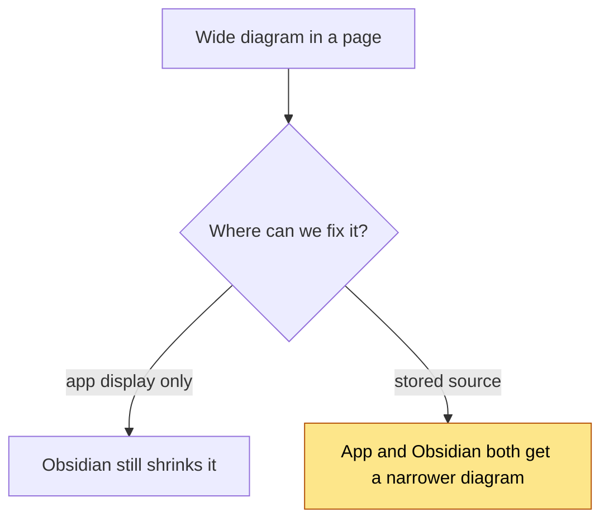
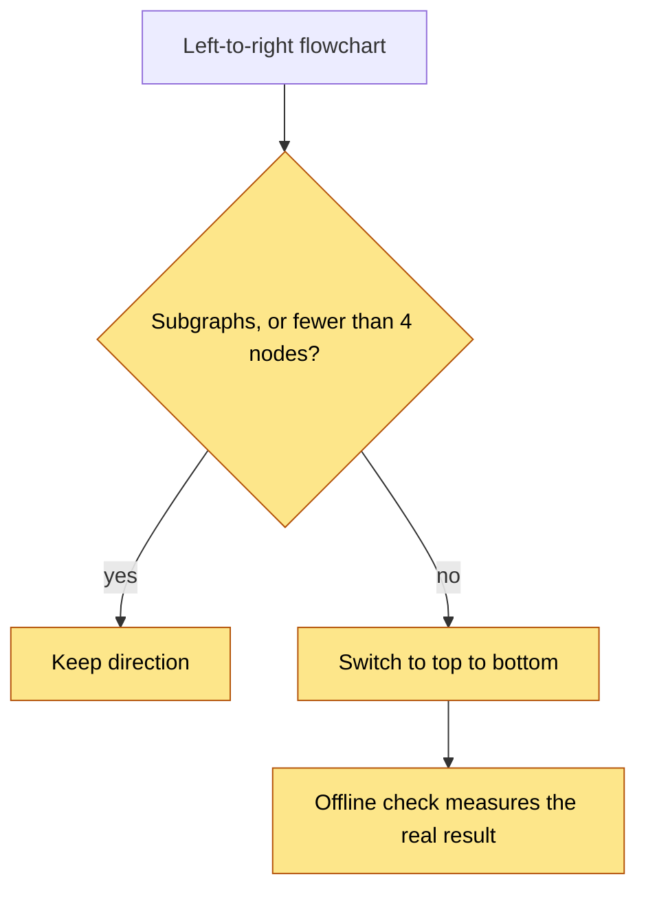
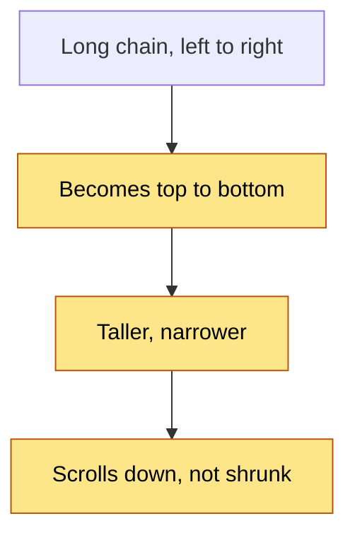
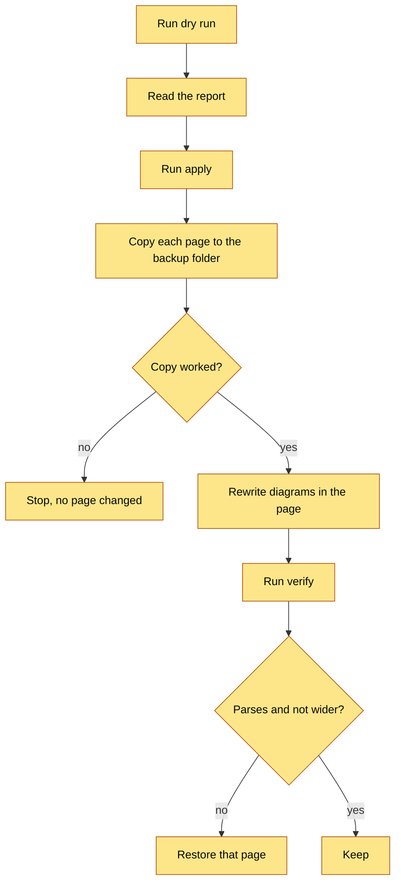
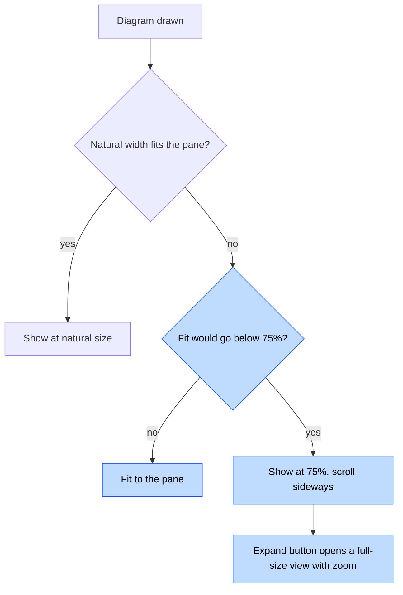
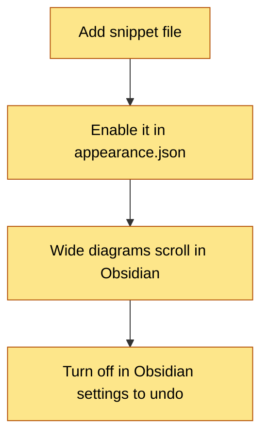

# Diagram Fit — Decisions

Each ADR lists what was given up.

## ADR 1 — Rewrite the stored diagram, not only the display

### Visual Level

Yellow marks the chosen path.

**Context.** You open wide diagrams in Obsidian because the app shows them too small. Obsidian draws the text stored in the page. Nothing the app does at display time reaches Obsidian.

**Options.** (a) Fix only how the app draws diagrams. (b) Fix the stored source. (c) Both.

**Choice.** (c), with (b) as the main fix. A narrower diagram helps both viewers. The app display change (ADR 5) covers diagrams that cannot be made narrow.

**Consequences.** The page text changes. Old pages are changed by a one-time script with a backup (ADR 4).

**Given up.** The diagram in the page is no longer exactly what the LLM or you wrote.

## ADR 2 — A rule decides the direction, calibrated on measured data

### Visual Level

Yellow steps are all new.

**Context.** The server cannot render Mermaid, so it cannot measure a width before saving. I measured all 106 left-to-right flowcharts in your vault, with and without the switch. The switch made 75 of them at least 10% narrower. It left 31 the same or wider. Almost every failure has subgraphs: with a subgraph, the top-to-bottom layout often gets wider.

**Options.** (a) Switch every left-to-right flowchart. (b) Switch by node count. (c) Switch only when there are no subgraphs and at least 4 nodes. (d) Render in a browser at write time.

**Choice.** (c). On the vault it switches 81 diagrams. 71 get narrower and 10 do not (88%). Node count alone did not predict anything: a threshold of 3 to 6 nodes got 70 to 75 right and 30 to 31 wrong. Option (d) would be exact but needs a browser inside the server. The offline check (`measure_diagrams.py`) gives exact numbers for the migration and for tuning the rule.

**Amendment after the first vault run.** The first version of the rule (no subgraph, at least 4 nodes) made 9 of the 122 changed pages wider. I looked for a feature that predicts those. The largest number of edges leaving one node does: in top-to-bottom, the children of a node with 3 or more outgoing edges sit side by side. The rule now also requires that no node has more than 2 outgoing edges (`MAX_FANOUT_FOR_TD = 2`). On the 81 candidates: 62 are switched, 58 get narrower and 3 get wider (95%). It gives up 13 of the 71 wins. After the vault run with this rule, 3 diagrams were still wider and were reverted by block (ADR 4).

**Consequences.** For the vault migration, the check reverts any diagram where the result is wider, so the miss rate does not apply there. For new diagrams, about 1 in 8 switched diagrams may get wider. The scroll and Expand view handles those.

**Given up.** Exactness at ingest time. A diagram with subgraphs that is too wide stays too wide.

## ADR 3 — Top to bottom is the default for long chains

### Visual Level

Yellow steps are new.

**Context.** A tall diagram scrolls down at full size. A wide diagram is shrunk. On the 100 left-to-right flowcharts wider than 700 px, the switch brings 59 to 700 px or less. The median width of the 106 drops from 1095 px to 572 px.

**Options.** (a) Keep left to right and rely on scrolling. (b) Switch long chains to top to bottom. (c) Wrap labels only.

**Choice.** (b), plus label wrapping. Labels longer than 28 characters get a line break at a space near 24 characters. Wrapping alone cut little: the count below 75% size went from 111 to 94. The switch alone went to 59, and both together to 52.

**Consequences.** Reading order changes from left to right to top to bottom.

**Given up.** The wide, flat look of the original. Taller nodes from wrapped labels.

## ADR 4 — The vault rewrite is a dry run first, with a backup and a restore

### Visual Level

Yellow steps are all new.

**Context.** The vault is not a git repository. A page rewritten wrongly cannot be undone from history. Some pages may be notes you wrote by hand.

**Options.** (a) Rewrite in place. (b) Rewrite with a backup. (c) Write fitted copies next to the originals.

**Choice.** (b). `--dry-run` is the default and writes nothing. It lists each page and the planned change. `--apply` copies each page to `_wiki/meta/diagram-backup/<timestamp>/` before it changes it. `--restore <timestamp>` puts the backed-up pages back. Only text inside a fenced `mermaid` block can change. `_wiki/inbox` (raw captured clips) and `_wiki/meta` (generated reports) are skipped.

**Amendment.** Undo is also available per diagram: `measure_diagrams.py --pair <timestamp> --revert` restores only the diagrams that failed to parse or got wider. A page with two diagrams can keep one fitted diagram and revert the other.

**Consequences.** Backups stay until you delete them.

**Given up.** Disk space. A confirm step before the rewrite.

## ADR 5 — The app shows wide diagrams at no less than 75% size, and scrolls

### Visual Level

Blue steps change the existing display.

**Context.** `MermaidDiagram` applies `max-width: 100%` to the SVG. A 2000 px diagram is squeezed to about 35%.

**Choice.** Display width is `max(min(natural, pane), 0.75 × natural)`. Wider diagrams scroll sideways inside their box. An Expand button opens a modal at natural size with zoom in, zoom out, and fit. The same component is used in Browse, the capture preview, and the queue, so all three change.

**Consequences.** Some diagrams need a sideways scroll. Expand covers the rest.

**Given up.** The "everything visible at once" look for wide diagrams. The 75% floor is a starting value to tune by eye.

## ADR 6 — An Obsidian CSS snippet lets wide diagrams scroll

### Visual Level

Yellow steps are all new.

**Context.** Even after the fit, about 34 diagrams stay below 75% size in every layout I tried. Obsidian shrinks them like the app did.

**Amendment: the snippet alone cannot work.** Mermaid writes `<svg width="100%" style="max-width: Npx">`. The diagram always refills the pane, and CSS cannot read N. I checked with the real library: with `%%{init: {"flowchart": {"useMaxWidth": false}}}%%` as the first line, Mermaid writes `<svg width="N">` with a fixed pixel width and no `max-width`. So two things are needed:

1. Diagrams that are still wider than 700 px after the fit get that init line (`measure_diagrams.py --mark-wide`, backed up like any rewrite).
2. The snippet `.mermaid { overflow-x: auto; }` lets that fixed width scroll.

**Choice.** Add `.obsidian/snippets/wide-mermaid.css` and list it in `enabledCssSnippets` in `.obsidian/appearance.json`. The init line is added by `--mark-wide`, only to flowcharts wider than the pane.

**Consequences.** Reversible: turn the snippet off in Obsidian, or delete the file.

**Given up.** It changes your Obsidian settings, and wide pages gain one visible line (`%%{init: ...}%%`) in their diagram source. **I cannot run Obsidian here, so I cannot test the display.** I verified the Mermaid output (a fixed `width`), not Obsidian's container. If Obsidian clips the diagram instead of scrolling, the `.mermaid` selector needs changing: send a screenshot. New diagrams are not marked automatically: run `--mark-wide` again.

## Open questions

1. **Hand-written diagrams.** The rewrite touched all pages outside `_wiki/inbox` and `_wiki/meta` (my recommendation, taken because the question was not answered). It can be undone with `--restore`.
2. **Pasted diagrams.** Built as proposed: a pasted diagram is fitted, and you see the fitted version in the preview and can edit it. No button.
3. **Intake points.** Built: `_normalize_mermaid` now ends with `fit()`, and the pasted-clip path (`_stage_markdown_clip`) and the regenerate path now call it. `wiki_writer.py` writes diagrams at two places and does not call `fit()` again. A diagram you edit by hand in the preview is written as you typed it.
4. **Obsidian display.** Unverified in Obsidian (ADR 6). I need a screenshot of a wide diagram in Obsidian to confirm.
5. **Thresholds.** The 4-node minimum, the fan-out limit of 2, the 28-character wrap trigger and the 75% display floor are measured on this vault. Re-run `measure_diagrams.py` if the diagram style changes.
6. **Mind maps and sequence diagrams** (9 in the vault) are only syntax-repaired. They rendered at acceptable widths in the measurement.
