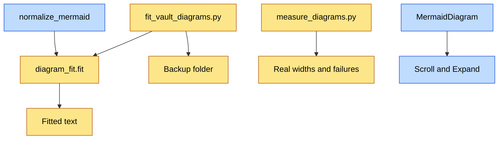

# Diagram Fit — API Contracts

## Visual Level



Yellow steps are new. Blue steps are existing code that gains behavior. There is no new HTTP route.

## Module: `backend/diagram_fit.py` (new)

```python
def fit(src: str) -> str:
    """Return a narrower, repaired version of a Mermaid diagram. Never raises.
    Pure function: no file, network or LLM access."""

def repair(src: str) -> str:
    """Syntax repair only (space before :::). Used by fit() and callable alone."""
```

Constants, module level: `MIN_NODES_FOR_TD = 4`, `WRAP_TRIGGER = 28`, `WRAP_AT = 24`.

Contract:

| Input | Output |
|---|---|
| Empty or whitespace text | Same text |
| Not `flowchart` or `graph` | `repair(src)` only |
| `flowchart LR`, no subgraph, 4 or more nodes | First line becomes `flowchart TD`. Labels wrapped |
| `flowchart LR` with `subgraph` | Direction kept. Labels wrapped |
| Already `TD` or `TB` | Direction kept. Labels wrapped |
| Any case where the result is empty | The original `src` |

Idempotent: `fit(fit(x)) == fit(x)`.

## Changed code

### `main._normalize_mermaid(diagram: str) -> str`

Calls `diagram_fit.fit()` on its result, after the existing repairs. Signature unchanged.

### `main._stage_markdown_clip`

The diagram taken from pasted markdown (`_extract_markdown_mermaid`) now passes through `_normalize_mermaid` before it is stored on the queue item.

## Script: `backend/fit_vault_diagrams.py` (new)

```text
python backend/fit_vault_diagrams.py [--dry-run]            # default. Writes nothing
python backend/fit_vault_diagrams.py --apply
python backend/fit_vault_diagrams.py --restore <timestamp>
```

| Flag | Effect |
|---|---|
| none or `--dry-run` | Print one line per changed page: path, old direction, new direction, blocks changed |
| `--apply` | Back up, then rewrite. Print a summary and the backup timestamp |
| `--restore <timestamp>` | Copy `_wiki/meta/diagram-backup/<timestamp>/` back over the vault |

Reads `VAULT_PATH` from the environment. Exit code 0 on success, 1 if the backup folder cannot be written or the timestamp does not exist.

Backup layout: `_wiki/meta/diagram-backup/<YYYYMMDD-HHMMSS>/<path relative to _wiki>`.

## Script: `backend/measure_diagrams.py` (new)

```text
python backend/measure_diagrams.py                     # measure the live vault
python backend/measure_diagrams.py --pair <timestamp>  # compare backup vs live, list regressions
```

Output (stdout, one section each): counts of diagrams, failures with file and message, median natural width, share below 75% and 50% at 700 px, and with `--pair` the list of pages that failed or got wider. Requires Google Chrome and `frontend/node_modules/mermaid`.

## Frontend contracts

`MermaidDiagram({ chart })` keeps its props. New behavior:

- Reads the SVG `viewBox` width `W` after render.
- Sets the SVG width to `max(min(W, boxWidth), 0.75 × W)` and the box to `overflow-x: auto`.
- Shows an Expand button when `W > boxWidth`.
- `DiagramModal({ svg, onClose })`: full-size SVG, zoom in, zoom out, fit, Esc to close.

## Obsidian snippet (new file in the vault)

`.obsidian/snippets/wide-mermaid.css`:

```css
.markdown-rendered .mermaid { overflow-x: auto; }
.markdown-rendered .mermaid svg { max-width: none !important; }
```

`.obsidian/appearance.json` gains `"enabledCssSnippets": ["wide-mermaid"]`. Unverified in Obsidian (ADR 6).

## Tests required before merge

1. `fit()` rule table: every row of the contract table.
2. `fit()` is idempotent on all 208 vault diagrams.
3. `fit()` keeps every node id and every edge: parse the node and edge set before and after, compare.
4. `D["a"] :::accent` becomes valid. The 5 failing vault diagrams parse after `fit()`.
5. A pasted clip with a wide LR diagram is stored fitted on the queue item.
6. Migration: `--dry-run` leaves every file byte-identical. `--apply` writes the backup first. `--restore` returns every page byte-identical.
7. Migration stops with exit code 1 when the backup folder is read-only, and changes no page.
8. `measure_diagrams.py --pair` lists a page whose fitted diagram is wider.
