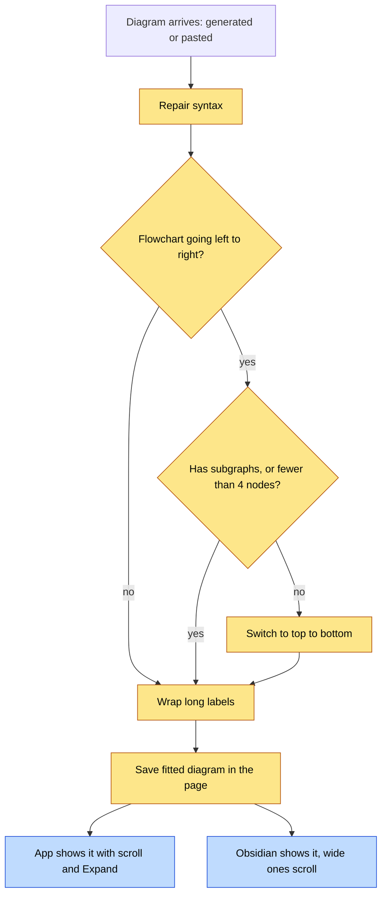

# Diagram Fit — Architecture

## Visual Level



Yellow steps are new. Blue steps are display changes. Today a diagram goes from "arrives" to "saved" almost as written. Pasted diagrams get no cleanup. Both the app and Obsidian then shrink a wide diagram until the text is tiny.

## Status

Proposed. No implementation code until you approve these four documents.

## Complexity tier

**Single-process tool, plus one offline script.** The fixer is one Python module inside the existing FastAPI process. The vault rewrite is one script you run once, with a backup. The app change is one React component. The check that measures real diagram sizes is a test tool. It is not part of the running app. No new service is needed.

## Problem

The vault has 208 Mermaid diagrams in 165 files. I rendered every one with the same Mermaid version the app uses (11.14), at a pane width of 700 px, which is close to the app's content area and to an Obsidian note.

| Finding | Number |
|---|---|
| Diagrams that fail to draw | 5 |
| Median natural width | 962 px |
| Diagrams shrunk below 75% of natural size | 111 of 208 |
| Diagrams shrunk below 50% (text about 8 px) | 37 of 208 |
| Widest diagram | 2790 px, one line |

The 5 failures have one cause. The generator writes `D["label"] :::accent` with a space before `:::`. Mermaid rejects that.

The width problem has one main cause. 106 diagrams are `flowchart LR` (left to right) with long labels. A left-to-right chain gets as wide as all its labels added up. The app and Obsidian then scale it to fit the pane, and the text shrinks with it.

Pasted markdown diagrams skip even the existing cleanup. `_stage_markdown_clip` takes the diagram from the pasted text as written. Generated diagrams already pass through `_normalize_mermaid` in `backend/main.py`.

## Goal

Diagrams are readable at normal size in the app and in Obsidian, with no manual fix. Diagrams that cannot be made narrow stay readable by scrolling, not by shrinking.

## Terms

- **Natural width**: the width Mermaid draws a diagram at before any shrinking.
- **Fit**: rewrite a diagram's source so its natural width is smaller, without changing what it says.
- **LR and TD**: flowchart direction. `LR` is left to right. `TD` is top to bottom.
- **CSS snippet**: a small file of display rules that Obsidian loads from `.obsidian/snippets/`.

## Components and data flow

```text
intake points (all go through one function)
  generated diagram  -> _normalize_mermaid()  -+
  pasted markdown    -> _normalize_mermaid()  -+--> diagram_fit.fit(src)  [new, backend/]
  regenerated        -> _normalize_mermaid()  -+       1. repair syntax
                                                       2. direction rule
                                                       3. wrap long labels
  -> queue preview shows the fitted diagram (you can still edit it)
  -> wiki_writer writes it into the page

vault migration:  backend/fit_vault_diagrams.py  --dry-run | --apply | --restore
  reads pages -> diagram_fit.fit() -> backup original -> write -> (optional) verify

verification tool: backend/measure_diagrams.py
  headless Chrome + the app's Mermaid library -> real widths before and after

display:  MermaidDiagram (App.jsx)    scale floor 75%, scroll, Expand modal
          .obsidian/snippets/wide-mermaid.css   wide diagrams scroll
```

The vault stays the source of truth. `fit()` is a pure function: text in, text out. It never reads the vault.

## Boundaries

| Part | Owns | Must not |
|---|---|---|
| `diagram_fit.py` | Repair, direction rule, label wrapping | Touch files, call an LLM, render |
| `_normalize_mermaid` | Calls `fit()` after its existing repairs | Decide direction itself |
| `fit_vault_diagrams.py` | Reading pages, backup, writing, restore | Change anything except fenced `mermaid` blocks |
| `measure_diagrams.py` | Real rendering and numbers | Run inside the app |
| `MermaidDiagram` | Display only | Rewrite the source |

## Key tradeoffs

- **Rewrite the source, not only the display.** Obsidian shows the stored text, and the app cannot change how Obsidian draws it. See ADR 1.
- **Rules, not rendering, at write time.** The server has no browser. A rule can be wrong. The rule was measured on your 208 diagrams: see ADR 2.
- **Direction changes the reading order.** A diagram that read left to right now reads top to bottom. See ADR 3.

## Failure modes

| Failure | Result |
|---|---|
| `fit()` raises or returns empty text | The original diagram is kept. A warning is logged. |
| A fitted diagram no longer parses | Migration: the page is restored from backup and listed in the report. Ingest: the check runs in the preview, so you see the raw fallback and can edit. |
| The direction rule widens a diagram | Migration `--verify` finds it and restores that page. At ingest, about 12% of switched diagrams may get wider (ADR 2). The scroll and Expand view still works. |
| Backup folder cannot be written | Migration stops before it changes any file. |

## Out of scope

Mind maps and sequence diagrams (9 in the vault) are only syntax-repaired, not re-laid out. No change to what the LLM is asked to produce. No change to the diagram-regeneration flow beyond passing through `_normalize_mermaid`. No Obsidian plugin.

## Open questions

See `adr.md`, section "Open questions".
