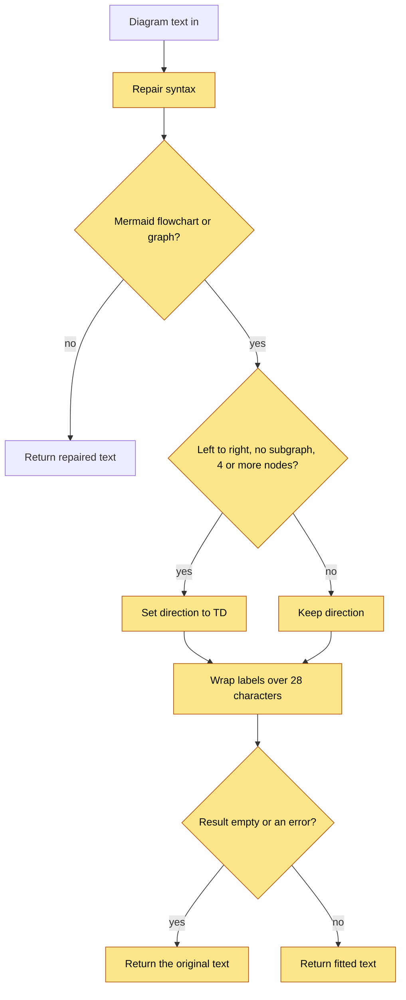

# Diagram Fit — Logic Flow

## Visual Level



Yellow steps are all new. The failure path is the empty-result check: the original diagram is returned and nothing is lost.

## Path 1 — `fit(src)`

Input: the text inside a `mermaid` fence. Output: text. The function never raises.

1. **Repair.** Remove spaces between a closing bracket and `:::`. `D["a"] :::accent` becomes `D["a"]:::accent`. Handles `]`, `)`, `}` and a closing quote.
2. **Type check.** Read the first non-blank, non-comment line. If it does not start with `flowchart` or `graph`, return the repaired text. Mind maps, sequence diagrams and others stop here.
3. **Direction rule.** Switch `LR` or `RL` to `TD` only when all three hold:
   - the diagram has no `subgraph` line,
   - it has at least 4 distinct nodes,
   - the first line is not `TD` or `TB` already.
   Count nodes as distinct ids that appear before a bracket, an arrow, or a pipe, outside quoted text.
4. **Label wrap.** For each quoted node label (`["..."]`) that has no `<br`, and is longer than 28 characters, break at the space nearest 24 characters, and repeat for the rest. Join with `<br/>`. Edge labels are not changed.
5. **Safety check.** If the result is empty, or fewer lines than the input have survived, return the original text.

## Path 2 — Ingest

1. An LLM diagram or a pasted diagram reaches `_normalize_mermaid`. Existing repairs run first. Then `fit()` runs.
2. The queue preview renders the fitted diagram. The existing render check shows a raw-text fallback if Mermaid rejects it.
3. You can edit the diagram in the existing editor before you approve.
4. `wiki_writer` writes the diagram you approved. It does not call `fit()` again.

For pasted markdown, `_stage_markdown_clip` now calls `_normalize_mermaid` on the diagram it takes from the clip.

## Path 3 — Vault migration (`fit_vault_diagrams.py`)

```text
--dry-run (default): list pages with a mermaid block, show before/after line count and direction. Write nothing.
--apply:
  1. Create _wiki/meta/diagram-backup/<timestamp>/. If this fails, stop.
  2. For each page: copy it to the backup (same relative path), then replace each mermaid block with fit(block).
  3. Write the page atomically. Print one line per page.
--restore <timestamp>: copy every file in that backup folder back to its original path.
```

Only the text between the opening ` ```mermaid ` line and the closing ` ``` ` changes. A page with no change is not copied and not rewritten.

## Path 4 — Verify (`measure_diagrams.py`)

1. Collect all mermaid blocks from the vault, or from a backup folder and the live vault as a pair.
2. Open a local HTML page in headless Chrome with the app's Mermaid library. Parse and render each block.
3. Print: failures, natural width, share below 75% and 50% at a 700 px pane.
4. With `--pair <timestamp>`: for every page, compare the backup width with the live width. Print pages that fail to parse or got wider. These are the pages to restore.

## Path 5 — Display

`MermaidDiagram` reads the SVG `viewBox` width as the natural width. It sets the box to scroll sideways and sets the SVG width to `max(min(natural, pane), 0.75 × natural)`. The Expand button opens a modal that shows the SVG at natural size with zoom controls.

## Failure and retry behavior

| Step | Failure | Behavior |
|---|---|---|
| `fit()` | Exception or empty result | Original text returned. Warning logged. |
| Ingest render check | Fitted diagram does not parse | Raw-text fallback in the preview. You edit or approve as is. |
| Migration backup | Cannot write the backup folder | Stop before any page changes. |
| Migration write | One page fails | That page is restored from backup. The run continues. The page is listed in the report. |
| Verify | Chrome not found | Print a clear message. No change to any page. |

No automatic retry. Run `--restore <timestamp>` at any time.

## Invariants

1. `fit()` only changes the direction word, spaces before `:::`, and `<br/>` breaks inside quoted labels. It never adds, removes or renames a node or an edge.
2. Migration changes only text inside mermaid fences.
3. No migrated page exists without a backup copy first.
4. A diagram that fails to parse after fitting is reported, never silently kept as the only copy.
