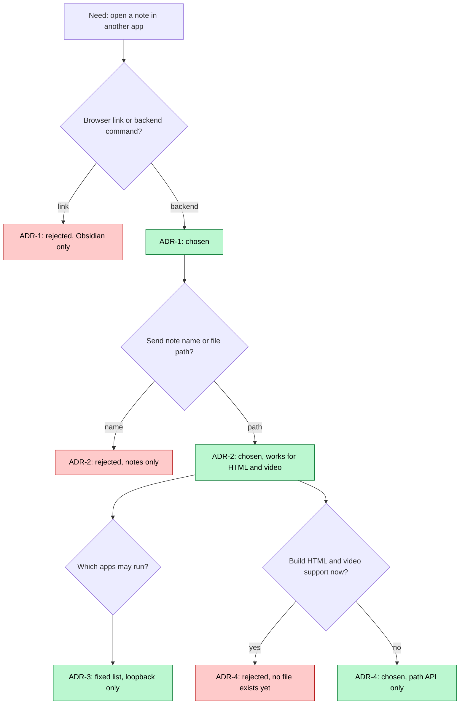
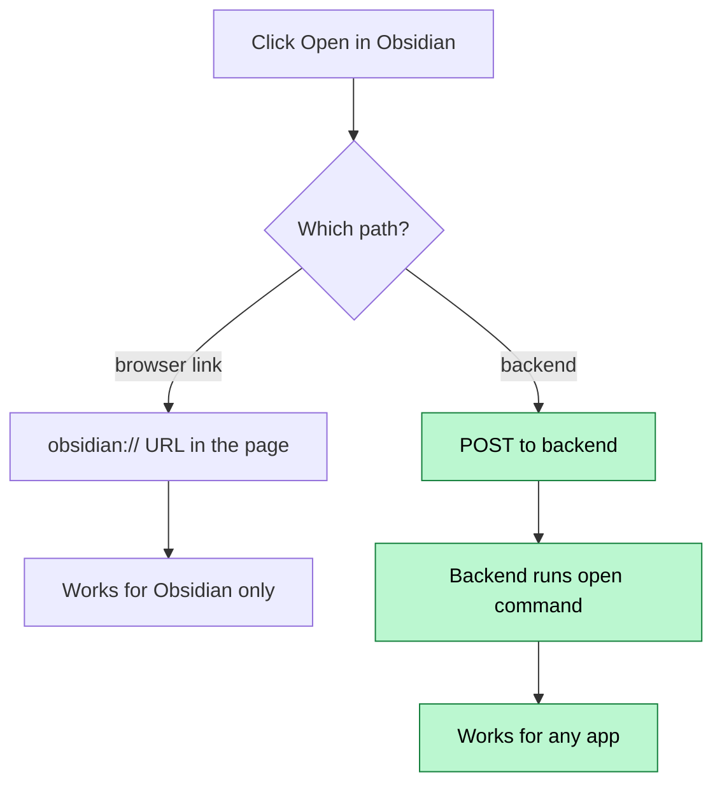
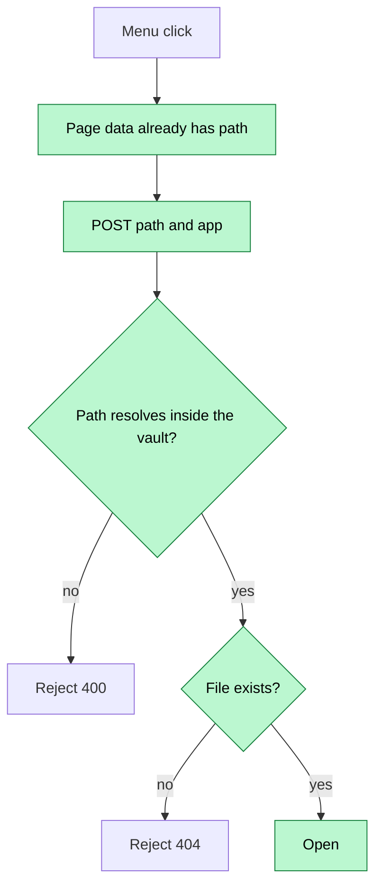
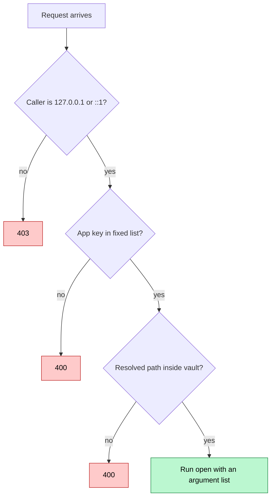
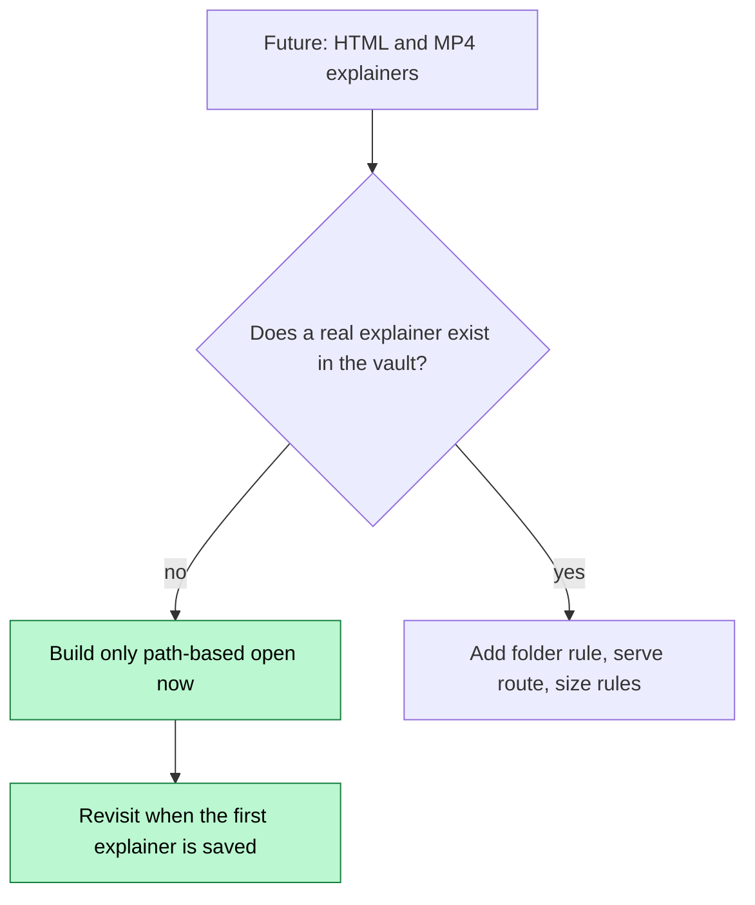

# Open in App — Decisions

> Explainer levels 3 and 4 (HTML page and narrated video) are skipped for this change. It is one click and one command, with no flow over time. Level 2 (the flowcharts) is kept.

## Visual Level

Green boxes are the choices. Red boxes are the options I rejected. Four decisions, all small.

## ADR-1 — Open the app from the backend, not from a browser link

### Visual Level

**Context.** The Mac app wraps a web page in a `WKWebView`. Its navigation code sends any non-local URL to `NSWorkspace.open`. So a plain `<a href="obsidian://...">` link would probably work with no backend change.

**Options.**
1. An `obsidian://` link in the page. No backend code.
2. A backend route that runs `open`.

**Choice.** Option 2.

**Consequences.** One route and one menu cover Obsidian, VS Code and the default app. The same route opens HTML and video later. The backend must run on the same Mac as the apps. That is true today.

**Given up.** Option 1 is less code and has no security surface. I give that up. The new route can launch apps, so it needs the checks in ADR-3. Option 1 also cannot open VS Code. If you only ever want Obsidian, Option 1 is the better choice. Tell me and I change the plan.

## ADR-2 — The route takes a vault-relative file path, not a note name

### Visual Level

**Context.** Pages are found by name through alias rules in `identity.resolve_slug`. A name does not tell you the folder (`cs`, `science`, `insights`, ...). Obsidian's deep link needs the folder path.

**Options.**
1. Send the note name. The backend finds the file.
2. Send the vault-relative path. `GET /page/{name}` returns it.

**Choice.** Option 2. `GET /page/{name}` gains a `path` field.

**Consequences.** The route does not care about the file type. An `.html` or `.mp4` file works with no change. The backend must validate the path with care (see ADR-3). Both call sites already load page data, so the menu needs no extra request.

**Given up.** The frontend now holds a file path. If the vault layout changes after the page loads, the path may be stale, and the click returns 404. I accept this because the data reloads on each page open.

## ADR-3 — Fixed app list, loopback callers only, no shell

### Visual Level

**Context.** CORS is `*`, and the comment says the backend serves a mobile upload page on the LAN. A route that launches apps must not be a remote control for other devices or for a web page in another tab.

**Choice.**
- The client must be a loopback address. Otherwise 403.
- The request names an app by key (`obsidian`, `vscode`, `default`). The backend maps the key to a fixed command. The request never carries a command or app name.
- The path is resolved with `Path.resolve()`. It must stay inside the resolved vault path. This also blocks `..` and symlinks that leave the vault.
- The command is a Python list passed to `subprocess.run`. There is no shell, so no quoting problem.
- `open` returns when the app is launched, so the route waits for it with a short timeout.

**Consequences.** A web page in a browser on this Mac can still send a cross-origin POST to the loopback address. The worst result is that an existing vault file opens in an allowed app. The request carries no data to a third party.

**Given up.** You cannot add any app from the menu without a code change. You also cannot use this route from your phone. I accept both. A phone cannot run Obsidian on the Mac anyway.

## ADR-4 — Do not build HTML and video vault support yet

### Visual Level

**Context.** Your CLAUDE.md already creates HTML and MP4 explainers per change, but they go into `docs/visuals/` in the repo. None go into the vault. You asked if the vault must be ready for them later.

**Options.**
1. Build now: a `_wiki/visuals/` rule, a safe static file route, iframe display, size limits, backup rules.
2. Build only what this change needs: a path-based open route. Write the rest down.

**Choice.** Option 2. The "Future: HTML and video" table in `architecture.md` lists what to add and when.

**Consequences.** This change stays small. The route works for any vault file, so the first explainer can be opened on day one. Nothing blocks the later work.

**Given up.** Without the static route, an HTML explainer opens in the browser outside SakethWiki. It does not show inside the reader. You also still have no size or backup rule for video. The vault has no git history, so a deleted video is gone. Decide this before you save the first MP4.

## Amendment to ADR-3 (2026-10-08) — the loopback check now covers every route

**Context.** The backend listens on `0.0.0.0:8001`, so the check on the two new routes left the other 65 routes open to the LAN. The phone needs only `GET /mobile` and `POST /ingest`.

**Choice.** One HTTP middleware (`loopback_only` in `backend/main.py`) refuses any non-loopback caller with 403, except those two method-and-path pairs. It sits inside the CORS layer, so the refusal still carries CORS headers. `_require_loopback` stays on the open-in-app routes as a second check.

**Given up.** The phone can no longer use `/qr-code`, `/queue-url` or any other route. A new route that the phone should reach must be added to `_LAN_ALLOWED`. The desktop app, the Mac wrapper and the Vite dev server all call from 127.0.0.1, so they are not affected. A tool on another machine (for example curl from a laptop) is now refused.
