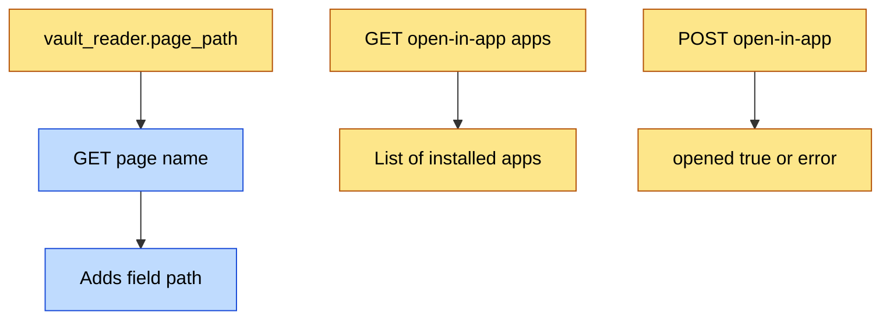

# Open in App — API Contracts

## Visual Level



Yellow items are new. Blue items are existing and gain one field. Three interfaces change in total.

## `vault_reader.page_path` (new)

```python
def page_path(page_name: str) -> Optional[str]:
    """Return the vault-relative path (for example "_wiki/cs/attention.md")
    of the file read_page() would read, or None if no file matches.
    Uses the same candidate and folder order as read_page()."""
```

Invariant: if `read_page(n)` returns text, `page_path(n)` returns the path of the file that text came from.

## `GET /page/{page_name}` (changed)

Adds one key to the existing response.

| Field | Type | Meaning |
|---|---|---|
| `path` | `string \| null` | Vault-relative path of the note. `null` only if the file vanished between two reads. |

All other fields (`name`, `content`, `parsed`, `backlinks`) are unchanged.

## `GET /open-in-app/apps` (new)

Response `200`:

```json
{"apps": [
  {"key": "obsidian", "label": "Obsidian"},
  {"key": "vscode",   "label": "VS Code"},
  {"key": "default",  "label": "Default app"}
]}
```

| Rule | Detail |
|---|---|
| `default` | Always present, always last. |
| `obsidian`, `vscode` | Present only if the `.app` bundle exists in `/Applications` or `~/Applications`. |
| Caller | Loopback only. Otherwise `403`. |

## `POST /open-in-app` (new)

Request body:

```json
{"path": "_wiki/cs/attention.md", "app": "obsidian"}
```

| Field | Type | Rule |
|---|---|---|
| `path` | string | Vault-relative. Resolved path must be inside the resolved vault path. File must exist. Any file type. |
| `app` | string | One of `obsidian`, `vscode`, `default`. |

Responses:

| Status | Body | When |
|---|---|---|
| 200 | `{"opened": true, "app": "obsidian"}` | The `open` command exited 0. |
| 400 | `{"detail": "..."}` | Unknown app key, or path outside the vault. |
| 403 | `{"detail": "local requests only"}` | Caller is not loopback. |
| 404 | `{"detail": "file not found"}` | File does not exist. |
| 409 | `{"detail": "app not installed"}` | Bundle is missing. |
| 500 | `{"detail": "<first line of stderr>"}` | `open` exited with a non-zero code, or timed out after 5 seconds. |

Invariants:
- The route never writes, moves or deletes a file.
- The route never runs a command built from request text. Only the validated absolute path, the fixed vault folder name, and a fixed command per app key enter the command.
- The command runs as an argument list. No shell.

## Frontend: `OpenInMenu` (new)

```jsx
<OpenInMenu path={data.path} />   // path: string | null
```

Renders a button. When `path` is `null`, the button is disabled. It calls the two routes above. It stores the app list in a module-level variable for the session. It stores nothing else.

Used in two places: the Browse page header and the `PageReaderModal` header.

## Tests (planned)

| Test | Checks |
|---|---|
| `page_path` returns the file `read_page` reads | Invariant above |
| Path `../x` and a symlink out of the vault | Return 400 |
| Non-loopback client | Returns 403 |
| Unknown app key | Returns 400 |
| `subprocess.run` is patched | Command is the exact argument list in the table in `logic_flow.md` |
| Missing file | Returns 404 |

Tests patch `subprocess.run`, so no app opens during the test run. This follows the vault-isolation rule from PR 9: tests use a temporary `VAULT_PATH`.
