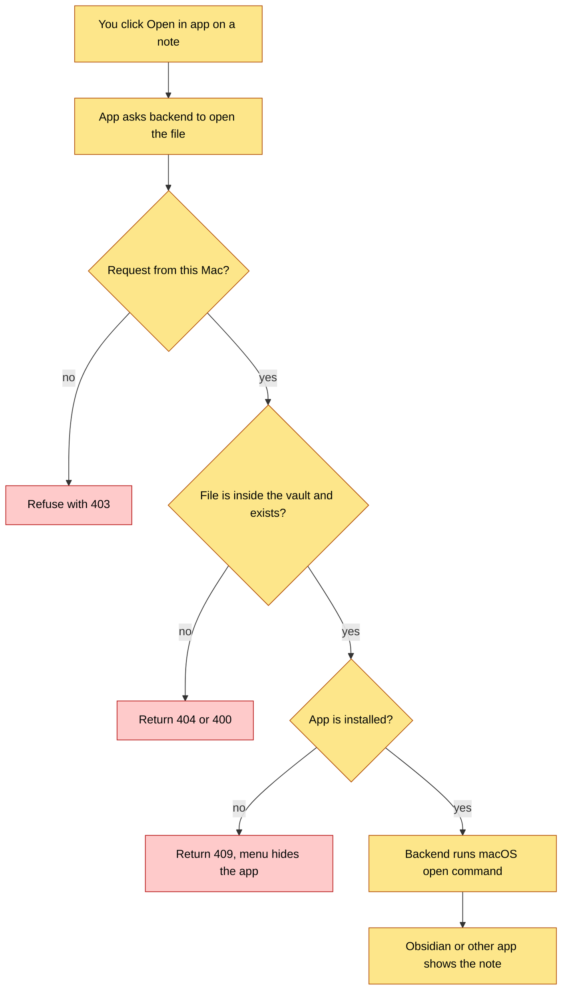

# Open in App — Architecture

## Visual Level

Yellow steps are new. Red steps are the refusal paths. Today a note can only be read and edited inside SakethWiki. With this change, one click opens the same file in Obsidian, VS Code, or the Mac default app.

## Status

Implemented on branch `open-in-app`. Design approved 2026-10-08.

## Complexity tier

**Single-process tool.** One new FastAPI route in the existing backend, one new field on an existing route, and one small menu in the React app. No new service, no new dependency. A higher tier is not needed. A lower tier (only an `obsidian://` link in the browser, no backend) is possible. ADR-1 explains why I did not choose it.

## Before / Change / Fixes

**Before.** A note lives as a Markdown file in `~/SakethVault/_wiki/...`. SakethWiki shows it in Browse and in the reader pop-up. To see the same note in Obsidian, you open Obsidian and find the note by hand.

**Change.** Add an "Open in…" menu to the note header. The menu lists Obsidian, VS Code and "Default app". Only apps that are installed appear. A click makes the backend run the macOS `open` command on that file.

**Fixes.** You jump from reading a note to editing it in Obsidian in one click. You also get Obsidian's own graph, backlinks and plugins for that note. The same path-based route will work for HTML and video files later (see "Future: HTML and video").

## Concepts

**Deep link.** A URL such as `obsidian://open?vault=SakethVault&file=...` that a native app registers with macOS. When something opens that URL, macOS starts the app and passes the request to it. Obsidian needs the vault name and the file path inside the vault. It does not need the absolute path.

**`open` command.** A macOS command-line tool. `open <file>` uses the default app for the file type. `open -a "Visual Studio Code" <file>` forces a named app. `open "<url>"` hands a deep link to the app that owns the URL scheme.

**Why the backend does the opening.** The browser cannot start a local app by itself, except through a deep link. The backend already runs on your Mac and can run `open`. This also covers VS Code, which has no vault concept.

## Data flow

1. `GET /page/{name}` now also returns `path`, the file path relative to the vault (for example `_wiki/cs/attention.md`). The vault reader already finds this file to read it. It now returns the path too.
2. `GET /open-in-app/apps` returns which of the known apps are installed.
3. The menu shows those apps. A click sends `POST /open-in-app` with `{path, app}`.
4. The backend checks the caller, checks the path, builds the command, and runs it. It returns `{opened: true}`.

## Components

| Component | Change | Where |
|---|---|---|
| `vault_reader.page_path()` | New. Returns the vault-relative path for a page name. | `backend/vault_reader.py` |
| `GET /page/{name}` | Adds one field, `path`. | `backend/main.py` |
| `GET /open-in-app/apps` | New. | `backend/main.py` |
| `POST /open-in-app` | New. | `backend/main.py` |
| `OpenInMenu` component | New. Used in Browse and in `PageReaderModal`. | `frontend/src/App.jsx` |

The Swift wrapper in `macapp/main.swift` does not change. It already lets the web page call the local API.

## Future: HTML and video

You asked whether the vault must hold HTML and video explainers later. The short answer: yes, but not yet, and this change prepares the one part that is cheap to prepare now.

**Today.** The vault holds Markdown, 33 PNG files, and some JSON and database files. `_wiki/assets/` is 34 MB of the vault's 47 MB. The vault is not a git repo, so these files have no history. Obsidian shows `.md`, images, PDF, audio and video (`![[clip.mp4]]`). Obsidian does not render `.html`. It lists the file and opens it in the browser.

**What a visual wiki needs later.**

| Need | Why | Cost now |
|---|---|---|
| A folder for explainers, for example `_wiki/visuals/<page>/` | Keeps each page's HTML and MP4 next to each other. Keeps `assets/` for pasted images. | None. A naming rule only. |
| A link from the note to its explainer | The note stays the entry point. Use `![[page-flow.mp4]]` for video and a normal link for HTML. | None. A convention only. |
| Open any vault file by path | An HTML file opens in the browser. An MP4 opens in Obsidian or QuickTime. | **This change.** The route takes a path, not a note name. |
| Serve HTML inside SakethWiki | Show an explainer in the reader in an iframe. | Later. Needs a static route and a path guard. |
| Size and backup rules | An MP4 can be 5 to 20 MB. The vault has no git history. | Later. Decide when the first video exists. |
| Lint and orphan checks skip non-Markdown files | Avoids false "orphan" reports. | Later. Check at that time. |

I recommend: build only the path-based route now. Add the rest when the first real explainer lands in the vault. See ADR-4.

## Failure modes

| Failure | Result |
|---|---|
| Request is not from this Mac | 403. Nothing runs. |
| Path escapes the vault, or file is missing | 400 or 404. Nothing runs. |
| App is not installed | 409. The menu does not list the app, so this happens only if you uninstall the app while the page is open. |
| `open` exits with an error | 500 with the error text. |
| Obsidian does not know the vault | Obsidian shows its own "vault not found" message. The menu does not detect this. See open questions. |

## Open questions

1. **Vault name.** Obsidian's registry shows the vault at `/Users/sakethv7/SakethVault`, so the name is `SakethVault`. The backend should read the folder name from `VAULT_PATH`. Confirm this is right if you ever rename the folder.
2. **Other apps.** Is the list Obsidian, VS Code and Default app enough? Typora, iA Writer, Zed and others are one line each to add.
3. **LAN exposure.** `main.py` sets CORS to `*` "for mobile upload". If the backend listens on all interfaces, any device on the network can reach it. The new route refuses non-loopback callers. I did not check how the backend binds. Confirm before build.
4. **Code contradicts a doc?** `ARCHITECTURE.md` at the repo root does not mention an "open" action. No contradiction found. I did not read all of it.
