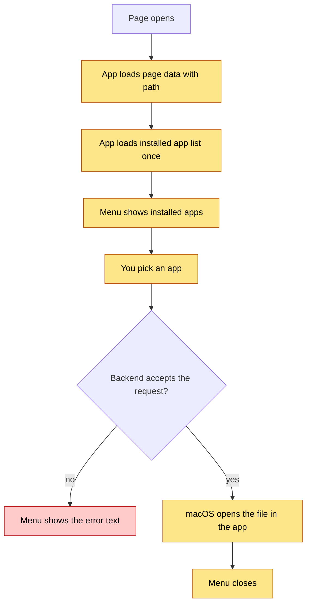

# Open in App — Logic Flow

## Visual Level

Yellow steps are new. The red step is the failure path. The whole flow is one request and one command. There is no retry and no stored state.

## Flow 1 — Show the menu

1. The page view loads `GET /page/{name}`. The response includes `path`.
2. The first time any menu is shown, the app calls `GET /open-in-app/apps` and keeps the answer in memory for the session. The backend checks `/Applications` and `~/Applications` for `Obsidian.app` and `Visual Studio Code.app`. The `default` entry is always present.
3. The menu lists one row per installed app.
4. If the call in step 2 fails, the menu shows only "Default app". It does not block the page.

## Flow 2 — Open the file

1. You click a row. The app sends `POST /open-in-app` with `{path, app}`.
2. The backend checks, in order:
   1. The client address is loopback. If not, return 403.
   2. `app` is one of the known keys. If not, return 400.
   3. `(vault / path).resolve()` is inside `vault.resolve()`. If not, return 400.
   4. The file exists. If not, return 404.
   5. The app is installed (not for `default`). If not, return 409.
3. The backend builds the command from the app key (table below) and runs it with a 5 second timeout.
4. Exit code 0: return `{"opened": true, "app": "<key>"}`. Any other code: return 500 with the first line of stderr.
5. The app shows the error text under the menu on any non-200 reply. On success the menu closes.

| App key | Command (argument list) |
|---|---|
| `obsidian` | `open obsidian://open?vault=<vault folder name>&file=<path without .md, URL-encoded>` |
| `vscode` | `open -a "Visual Studio Code" <absolute path>` |
| `default` | `open <absolute path>` |

For `obsidian`, a non-Markdown file keeps its extension in the `file` value, because Obsidian needs it to find the file.

## State transitions

The menu has three states: closed, open, and error. Click on the button moves closed to open. A click outside moves open to closed. A failed request moves open to error. The next click moves error to open. Nothing is saved to disk or to local storage.

## Failure and retry

There is no automatic retry. A failed open is safe to repeat, because the route changes no file. Click again to retry.

## Edge cases

| Case | Behavior |
|---|---|
| Page has no file on disk (new, unsaved) | `path` is `null`. The menu is disabled. |
| Note name changes after alias merge | `GET /page/{name}` returns the current path. |
| Two pages share a stem in different folders | `read_page` already returns the first match. `page_path` uses the same order, so the menu opens the file you see. |
| Vault folder renamed | Obsidian shows "vault not found". See open question 1 in `architecture.md`. |
